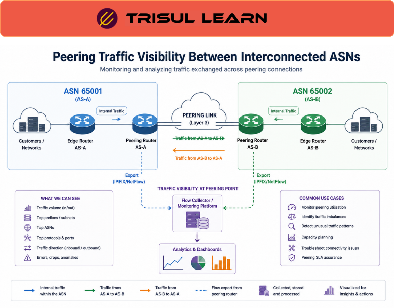

# What is Peering Traffic Analysis?

Peering Traffic Analysis is the process of monitoring and analyzing traffic exchanged between different networks, service providers, cloud platforms, or Autonomous Systems (ASNs) across peering connections.

Peering allows networks to exchange traffic directly instead of routing through third-party transit providers.

Peering traffic analysis helps organizations define inter-network communication roles by identifying:

- traffic exchanged between ASNs
- bandwidth utilization
- routing behavior
- cloud traffic patterns
- application distribution
- congestion trends
- interconnect performance

It is especially important in:

- ISP infrastructures
- telecom networks
- internet exchanges (IXPs)
- cloud providers
- large enterprises
- CDN environments

---

## **How Peering Traffic Analysis Works**

Networks exchange traffic through:

- private peering links
- internet exchange points (IXPs)
- cloud interconnects
- BGP routing relationships

Monitoring systems collect visibility using:

- NetFlow
- IPFIX
- BGP analytics
- ASN enrichment
- traffic metadata
- packet analysis

A typical workflow looks like this:

ASN A ↔ Peering Link ↔ ASN B  
                ↓  
Traffic Analytics Platform

Analytics platforms then:

- identify traffic exchanged between networks
- analyze bandwidth usage and trends
- correlate routing behavior
- visualize interconnect performance

Peering visibility may include:

- top ASNs
- traffic ratios
- ingress vs egress traffic
- protocol distribution
- application traffic
- congestion behavior

---

## **Why Peering Traffic Analysis Matters**

Large-scale networks depend heavily on peering relationships for:

- internet connectivity
- cloud access
- CDN delivery
- traffic optimization
- performance efficiency

Without peering visibility, organizations may struggle to:

- analyze interconnect utilization
- troubleshoot routing issues
- detect congestion
- optimize traffic engineering
- monitor cloud exchange traffic
- manage peering costs

Peering traffic analysis helps teams:

- optimize interconnect performance
- improve routing efficiency
- analyze traffic trends
- identify bandwidth imbalances
- troubleshoot peering issues
- improve network planning

It is especially important in:

- ISPs
- telecom operators
- IXPs
- cloud providers
- CDN infrastructures
- hyperscale environments

Humanity built a global interconnected internet and immediately started negotiating who pays for whose packets. Civilization distilled into bandwidth invoices and BGP policies.

---

## **Common Operational Use Cases**

### ASN Traffic Visibility

Analyze traffic exchanged between autonomous systems.

### IXP Monitoring

Monitor traffic across internet exchange points.

### Traffic Engineering

Optimize routing and bandwidth distribution across peers.

### Cloud Connectivity Analysis

Monitor traffic exchanged with cloud providers.

### Peering Capacity Planning

Track interconnect growth and utilization trends.

---

## **Peering Traffic Analysis vs General Traffic Monitoring**

| Feature | Peering Traffic Analysis | General Traffic Monitoring |
|---|---|---|
| Focus Area | Inter-network traffic exchange | Overall network traffic |
| ASN Visibility | Strong | Moderate |
| Routing Context | Advanced | Limited |
| Peering Optimization | Supported | Minimal |
| ISP Relevance | Critical | Important |

Peering analytics focuses specifically on traffic exchanged between interconnected networks.

---

## **How Trisul Handles Peering Traffic Analysis**

Trisul provides scalable ASN-aware traffic analytics for enterprise and ISP environments.

Combined with:

- ASN Peering
- BGP Peering Analytics
- Top-K Analyticsᵀ
- Contextᵀ
- Flow Analysis
- Multigraph Analyticsᵀ

Trisul helps teams:

- analyze ASN communication patterns
- monitor peering bandwidth usage
- investigate routing anomalies
- visualize interconnect relationships
- optimize traffic engineering
- monitor cloud exchange traffic

Trisul can also integrate:

- ASN
- BGP Peering Analytics
- ISP Traffic Analytics

workflows for deeper peering visibility.

---

## **Related Terms**

- ASN
- ASN Peering
- BGP Peering Analytics
- ISP Traffic Analytics
- Bandwidth Monitoring
- Flow Analysis

---

## **FAQ**

### What is peering traffic?

Peering traffic is network traffic exchanged directly between different networks or autonomous systems.

### What is Peering Traffic Analysis?

Peering Traffic Analysis is the process of monitoring and analyzing traffic exchanged across peering connections.

### Why is peering analysis important?

It helps organizations optimize routing, monitor interconnect utilization, and troubleshoot peering issues.

### What technologies are used for peering analytics?

Common technologies include NetFlow, IPFIX, BGP analytics, ASN enrichment, and traffic metadata analysis.

### Why is peering visibility important for ISPs?

ISPs rely on peering visibility to optimize internet connectivity, reduce transit costs, and improve performance.

### Can peering traffic analysis help cloud connectivity monitoring?

Yes. It helps analyze traffic exchanged with cloud providers and internet exchange infrastructures.