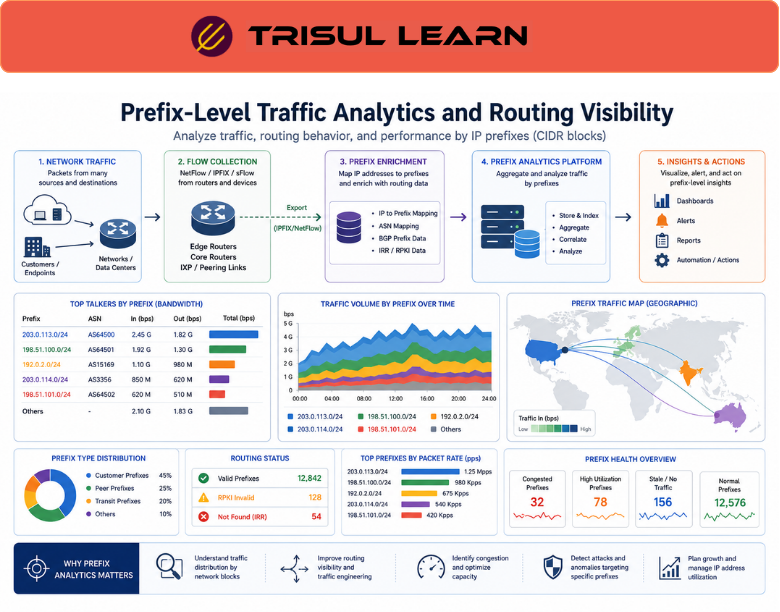

# What is Prefix Analytics?

Prefix Analytics is the process of analyzing network traffic, routing behavior, and communication patterns based on IP prefixes.

An IP prefix represents a block of IP addresses grouped together using CIDR notation.

For example:

192.168.0.0/24

Prefix analytics may reveal:

- high-traffic prefixes
- congested network blocks
- routing anomalies
- DDoS targets
- cloud traffic patterns
- peering traffic distribution

---

## Why Prefix Analytics Matters

Large-scale networks manage traffic across thousands or millions of IP addresses.

Without prefix-level visibility, organizations may struggle to:

- analyze routing behavior
- monitor subnet utilization
- optimize traffic engineering
- investigate routing anomalies
- analyze peering traffic
- identify targeted attacks

Prefix analytics helps teams:

- improve routing visibility
- analyze traffic distribution
- optimize peering relationships
- troubleshoot network paths
- identify abnormal traffic patterns
- support capacity planning

It is especially important in:

- ISPs
- telecom operators
- cloud providers
- IXPs
- enterprise backbones
- multi-site infrastructures

---

## Common Operational Use Cases

### BGP Routing Visibility

Analyze traffic associated with advertised prefixes.

### Traffic Engineering

Optimize traffic distribution across network paths.

### DDoS Analysis

Identify attacked or congested prefixes.

### Peering Optimization

Monitor prefix-level traffic exchanged with peers.

### Capacity Planning

Analyze subnet utilization and growth trends.

---

## Prefix Analytics vs Host-Level Analytics

| Feature | Prefix Analytics | Host-Level Analytics |
|---|---|---|
| Visibility Scope | Network ranges | Individual IPs |
| Routing Context | Strong | Limited |
| Scalability | High | Moderate |
| ISP Relevance | Critical | Important |
| Traffic Engineering Support | Advanced | Minimal |

Prefix analytics focuses on network-wide routing and traffic behavior rather than individual hosts alone.

---

## How Trisul Handles Prefix Analytics

Trisul provides scalable prefix-aware traffic analytics for enterprise and ISP environments.

Combined with:

- ASN Analytics
- BGP Peering Analytics
- Top-K Analyticsᵀ
- Flow Analysis
- Contextᵀ
- Multigraph Analyticsᵀ

Trisul helps teams:

- analyze traffic distribution by prefix
- monitor routing behavior
- investigate congested network blocks
- visualize ASN and peering relationships
- optimize traffic engineering
- identify abnormal prefix activity

Trisul can also integrate:

- ASN
- BGP
- Peering Traffic Analysis

workflows for deeper routing visibility.

---

## Related Terms

- ASN
- BGP
- CIDR
- Peering Traffic Analysis
- BGP Peering Analytics
- ISP Traffic Analytics

---

## FAQ

### What is an IP prefix?

An IP prefix is a block of IP addresses grouped together using CIDR notation.

### What is Prefix Analytics?

Prefix Analytics is the process of analyzing traffic and routing behavior based on IP address ranges or prefixes.

### Why is Prefix Analytics important?

It helps organizations analyze routing visibility, optimize traffic engineering, and monitor network utilization.

### Who commonly uses Prefix Analytics?

ISPs, telecom providers, cloud operators, and large enterprises commonly use prefix-level analytics.

### How does Prefix Analytics help security monitoring?

It helps identify suspicious traffic patterns, attacked prefixes, and abnormal routing behavior.

### Can Prefix Analytics improve peering visibility?

Yes. It helps analyze traffic exchanged across prefixes and ASN relationships.