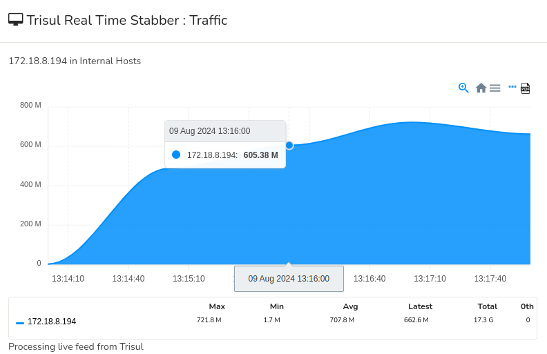

# What is Real-Time Traffic Monitoring?

Real-Time Traffic Monitoring is the process of continuously observing and analyzing active network traffic as communication occurs across the network.

Instead of relying only on historical reports or delayed analytics, real-time monitoring provides immediate visibility into:
- traffic behavior
- bandwidth usage
- application activity
- congestion events
- suspicious communication
- operational anomalies
- network performance

Real-time visibility helps organizations define operational roles by enabling rapid identification and response to ongoing network events.

It is widely used for:
- troubleshooting
- security monitoring
- bandwidth analysis
- DDoS detection
- application visibility
- operational monitoring

## **How Real-Time Traffic Monitoring Works**

Monitoring platforms continuously collect visibility data from:
- flow exporters
- packet capture systems
- routers
- switches
- firewalls
- DPI engines
- cloud telemetry

The platform then:
1. processes traffic instantly
2. updates dashboards continuously
3. analyzes communication behavior in real time
4. generates alerts for anomalies or threshold violations

A typical workflow looks like this:

Live Traffic → Real-Time Analytics → Dashboards and Alerts → Investigation

For example:

- A sudden bandwidth spike occurs
- Monitoring systems detect abnormal traffic immediately
- Analysts identify the source in real time
- Mitigation or troubleshooting begins quickly

Real-time visibility may include:

- top talkers
- active applications
- live bandwidth graphs
- protocol activity
- ASN traffic
- suspicious communication
- interface utilization

---

## **Why Real-Time Traffic Monitoring Matters**

Modern networks change constantly and generate massive traffic volumes.

Without real-time visibility, organizations may struggle to:

- detect active incidents quickly
- troubleshoot outages
- identify congestion immediately
- monitor cloud application behavior
- respond to security threats rapidly

Real-time traffic monitoring helps teams:

- improve operational awareness
- reduce incident response time
- detect anomalies faster
- troubleshoot live issues
- monitor application performance
- improve network reliability

It is especially important in:

- NOC environments
- SOC operations
- enterprise WANs
- ISP infrastructures
- cloud deployments
- real-time communication networks

Because apparently humans cannot tolerate waiting five minutes to discover the network is on fire. Everything must be “real-time” now, including panic.

---

## **Common Operational Use Cases**

### Live Troubleshooting

Identify active congestion, outages, or communication failures.

### Security Monitoring

Detect suspicious traffic and ongoing attacks immediately.

### Application Visibility

Monitor live application and cloud traffic behavior.

### Bandwidth Monitoring

Track active bandwidth consumption and spikes.

### DDoS Detection

Identify traffic floods and abnormal traffic behavior in real time.

---

## **Real-Time Monitoring vs Historical Traffic Analysis**

| Feature | Real-Time Monitoring | Historical Traffic Analysis |
|---|---|---|
| Visibility Scope | Current activity | Past activity |
| Incident Response Speed | Fast | Slower |
| Trend Analysis | Limited | Strong |
| Operational Focus | Immediate awareness | Retrospective analysis |
| Troubleshooting Use | Active issues | Historical investigations |

Real-time monitoring focuses on current network activity, while historical analysis focuses on previously recorded traffic behavior.

---

## **How Trisul Handles Real-Time Traffic Monitoring**

Trisul provides scalable real-time traffic analytics for enterprise and ISP environments.

Combined with:

- Key Dashboardᵀ
- Top-K Analyticsᵀ
- Flow Analysis
- Conversation View
- Contextᵀ
- Multigraph Analyticsᵀ

Trisul helps teams:

- monitor live traffic behavior
- analyze active bandwidth usage
- investigate anomalies quickly
- visualize application activity
- detect suspicious communication
- troubleshoot operational issues faster

Trisul can also integrate:

- Live Traffic Monitoring
- Bandwidth Monitoring
- Application Visibility

workflows for deeper operational visibility.

---

## **Related Terms**

- Live Traffic Monitoring
- Bandwidth Monitoring
- Application Visibility
- Flow Monitoring
- Traffic Investigation
- Key Dashboardᵀ

---

## **FAQ**

### What is real-time traffic monitoring?

Real-time traffic monitoring is the continuous analysis of active network traffic as communication occurs.

### Why is real-time traffic monitoring important?

It helps organizations detect issues quickly, troubleshoot active problems, and improve operational awareness.

### What can be monitored in real time?

Applications, bandwidth usage, protocols, suspicious traffic, user activity, and network anomalies can all be monitored in real time.

### How does real-time monitoring help security operations?

It helps detect attacks, suspicious communication, and abnormal traffic behavior immediately.

### What's the difference between real-time and historical traffic monitoring?

Real-time monitoring focuses on current activity, while historical analysis focuses on past traffic behavior.

### Is real-time traffic monitoring useful for ISPs?

Yes. ISPs use real-time visibility to monitor backbone traffic, subscriber activity, and operational health continuously.