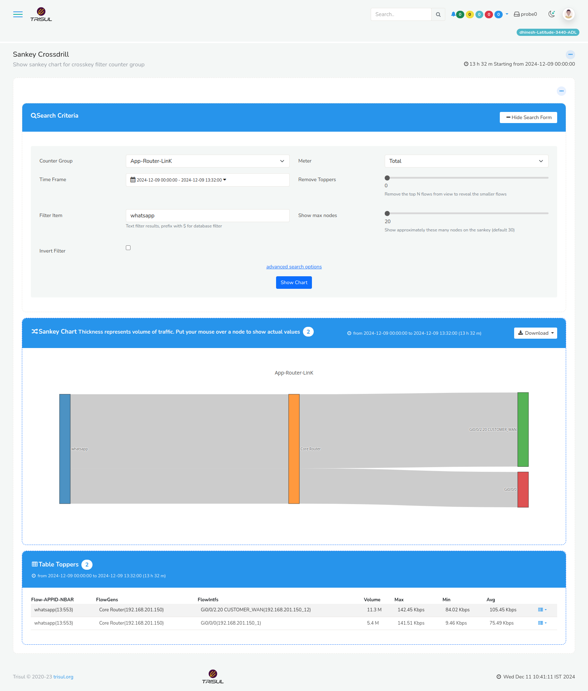

# What is Sankey Traffic Visualization?

Sankey Traffic Visualization is a graphical method of displaying network traffic flows using Sankey diagrams, where the width of each flow represents the amount of traffic moving between sources, destinations, applications, or network entities.

Sankey diagrams help organizations define communication flow roles by visually representing:
- bandwidth distribution
- application traffic flows
- source-to-destination communication
- protocol usage
- traffic concentration
- network relationships
- flow direction

The wider the flow path, the greater the traffic volume.

Sankey visualizations are commonly used for:
- traffic investigation
- bandwidth analysis
- ISP analytics
- application visibility
- network mapping
- traffic engineering

## **How Sankey Traffic Visualization Works**

Monitoring platforms collect traffic visibility data from:

- flow records
- packet analysis
- application metadata
- ASN analytics
- traffic telemetry

The platform then:

1. identifies traffic relationships
2. maps communication paths visually
3. sizes the flow paths based on traffic volume
4. displays traffic movement between entities

A typical workflow looks like this:

Users → Applications → Cloud Services

The Sankey diagram may visually show:

- which applications consume the most bandwidth
- how traffic moves across networks
- where congestion occurs
- which destinations dominate communication

---

## **Why Sankey Traffic Visualization Matters**

Traditional charts and tables can make large-scale traffic relationships difficult to understand.

Without visual flow mapping, organizations may struggle to:

- analyze traffic distribution intuitively
- identify dominant communication paths
- investigate bandwidth concentration
- visualize complex traffic relationships
- understand traffic engineering patterns

Sankey traffic visualization helps teams:

- simplify traffic analysis
- visualize communication behavior
- identify top traffic flows
- analyze bandwidth distribution
- improve troubleshooting workflows
- strengthen operational visibility

It is especially important in:

- enterprise networks
- ISP infrastructures
- cloud environments
- data centers
- SOC operations
- WAN analytics

Humans saw spreadsheets full of traffic data and decided, “what if bandwidth looked like rivers instead?” Honestly, one of the better decisions your species has made.

---

## **Common Operational Use Cases**

### Bandwidth Flow Analysis

Visualize which systems or applications consume the most traffic.

### Application Visibility

Map communication between users, applications, and cloud services.

### ISP Traffic Analytics

Analyze subscriber and backbone traffic distribution.

### Traffic Engineering

Visualize routing and traffic concentration patterns.

### Security Investigations

Identify unusual communication flows and suspicious traffic paths.

---

## **Sankey Visualization vs Traditional Charts**

| Feature | Sankey Visualization | Traditional Charts |
|---|---|---|
| Traffic Relationship Visibility | Strong | Moderate |
| Flow Direction Representation | Visual | Limited |
| Bandwidth Distribution Insight | Advanced | General |
| Complex Traffic Mapping | Excellent | Moderate |
| Operational Clarity | High | Moderate |

Sankey diagrams focus on showing traffic movement and relationships visually rather than only displaying numeric metrics.

---

## **How Trisul Uses Sankey Traffic Visualization**

Trisul provides advanced traffic visualization workflows for enterprise and ISP environments.

Combined with:

- Multigraph Analyticsᵀ
- Contextᵀ
- Top-K Analyticsᵀ
- Flow Analysis
- Conversation View
- Retro Analysisᵀ

Trisul helps teams:

- visualize traffic relationships
- analyze bandwidth distribution
- investigate application communication
- identify traffic concentration
- monitor flow behavior
- improve operational analytics visibility

Trisul can also integrate:

- Flow Analysis
- Application Visibility
- Traffic Investigation

workflows for deeper traffic visualization.

---

## **Related Terms**

- Flow Analysis
- Application Visibility
- Bandwidth Monitoring
- Traffic Investigation
- Multigraph Analyticsᵀ
- Conversation View

---

## **FAQ**

### What is a Sankey diagram in networking?

A Sankey diagram is a visualization that represents traffic flows using lines whose widths indicate traffic volume.

### What is Sankey Traffic Visualization?

It is the use of Sankey diagrams to visualize network traffic relationships and bandwidth distribution.

### Why is Sankey visualization useful?

It helps organizations visually understand communication paths, traffic concentration, and bandwidth usage.

### What types of traffic can Sankey diagrams visualize?

They can visualize application traffic, bandwidth flows, ASN communication, cloud traffic, and source-to-destination relationships.

### How does Sankey visualization help troubleshooting?

It helps quickly identify abnormal traffic concentration, dominant communication paths, and unusual traffic behavior.

### Is Sankey visualization useful for ISPs?

Yes. ISPs use Sankey diagrams to analyze subscriber traffic distribution, peering flows, and backbone utilization.