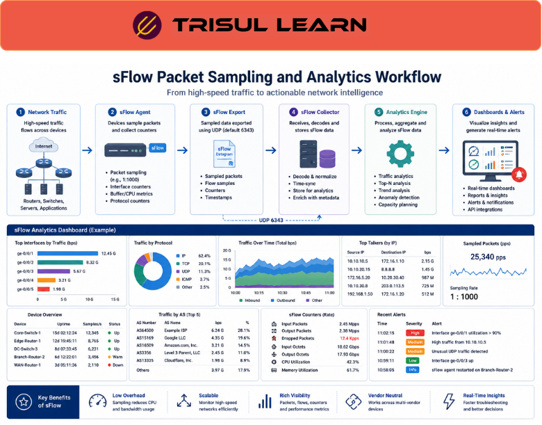

# What is sFlow?

sFlow is a network traffic monitoring technology that uses packet sampling and interface statistics to provide scalable visibility into network traffic behavior.

Unlike traditional flow technologies that track every flow individually, sFlow uses statistical sampling to reduce monitoring overhead while still providing meaningful traffic analytics.

sFlow helps organizations define traffic visibility roles by monitoring:
- bandwidth usage
- application traffic
- traffic trends
- interface utilization
- top talkers
- congestion behavior
- communication patterns

It is widely used for:
- high-speed traffic monitoring
- data center visibility
- ISP analytics
- cloud monitoring
- capacity planning
- performance monitoring

## **How sFlow Works**

sFlow-enabled devices such as:

- switches
- routers
- servers
- virtual switches

sample packets at configurable intervals and export traffic metadata to an sFlow collector.

A typical workflow looks like this:

Network Traffic → Packet Sampling → sFlow Export → sFlow Collector → Analytics

The exported data may include:

- sampled packets
- interface counters
- bandwidth statistics
- protocol information
- source and destination addresses
- VLAN information

For example:

Sampling Ratio: 1:1000

This means:

1 out of every 1,000 packets is sampled and analyzed.

sFlow is designed for scalable monitoring in high-volume environments where monitoring every packet or flow may be impractical.

---

## **Why sFlow Matters**

Modern networks generate enormous traffic volumes that can overwhelm monitoring systems.

Without scalable visibility approaches, organizations may struggle to:

- monitor high-speed traffic efficiently
- analyze distributed environments
- maintain visibility at scale
- optimize storage and CPU usage
- monitor cloud-native infrastructures

sFlow helps teams:

- scale traffic monitoring
- reduce monitoring overhead
- analyze bandwidth trends
- monitor distributed traffic
- maintain operational visibility
- improve traffic analytics efficiency

It is especially important in:

- ISP infrastructures
- data centers
- cloud environments
- hyperscale networks
- enterprise backbones
- virtualized infrastructures

Humans looked at impossible traffic volumes and decided, “what if we just sampled a few packets and hoped statistics handled the rest?” Disturbingly effective, honestly.

---

## **Common Operational Use Cases**

### High-Speed Traffic Monitoring

Monitor multi-gigabit and terabit traffic environments efficiently.

### Data Center Visibility

Analyze east-west traffic and server communication.

### Cloud Traffic Analytics

Monitor distributed cloud workloads and virtual networks.

### Capacity Planning

Track long-term traffic growth and interface utilization.

### DDoS Visibility

Detect large-scale traffic spikes and volumetric attacks.

---

## **sFlow vs NetFlow**

| Feature | sFlow | NetFlow |
|---|---|---|
| Monitoring Method | Packet sampling | Flow-based tracking |
| Scalability | Very high | High |
| Resource Usage | Lower | Higher |
| Visibility Precision | Approximate | More detailed |
| High-Speed Suitability | Excellent | Strong |

sFlow prioritizes scalability and lightweight monitoring, while NetFlow provides more detailed flow visibility.

---

## **How Trisul Handles sFlow Analytics**

Trisul provides scalable traffic analytics for sFlow-enabled environments.

Combined with:

- Flow Analysis
- Top-K Analyticsᵀ
- Multigraph Analyticsᵀ
- Contextᵀ
- Retro Analysisᵀ
- Long-Term Traffic Retention

Trisul helps teams:

- analyze sampled traffic behavior
- monitor interface utilization
- identify bandwidth consumers
- investigate anomalies
- visualize distributed traffic patterns
- optimize monitoring workflows

Trisul can also integrate:

- Flow Sampling
- NetFlow
- ISP Traffic Analytics

workflows for broader traffic visibility.

---

## **Related Terms**

- Flow Sampling
- NetFlow
- IPFIX
- Bandwidth Monitoring
- ISP Traffic Analytics
- Flow Analysis

---

## **FAQ**

### What is sFlow?

sFlow is a network monitoring technology that uses packet sampling to provide scalable traffic visibility and analytics.

### Why is sFlow important?

It helps organizations monitor high-speed traffic environments efficiently with lower monitoring overhead.

### How does sFlow work?

Devices sample packets and export traffic metadata and interface statistics to an sFlow collector.

### What's the difference between sFlow and NetFlow?

sFlow uses statistical packet sampling, while NetFlow tracks flow records more directly and in greater detail.

### Is sFlow suitable for high-speed networks?

Yes. sFlow is designed specifically for scalable monitoring in large and high-speed environments.

### Can sFlow help detect DDoS attacks?

Yes. sFlow can identify abnormal traffic spikes and volumetric traffic behavior efficiently.