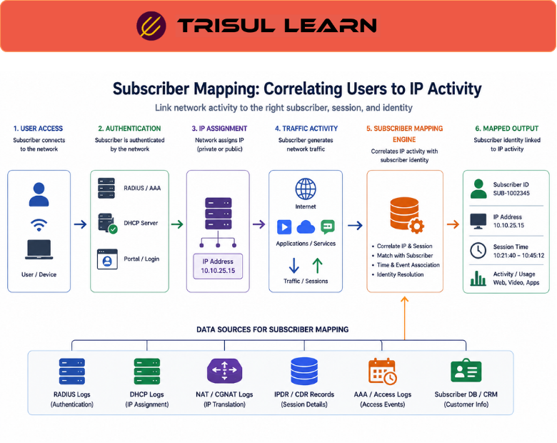

export const jsonLd = {
  "@context": "https://schema.org",
  "@type": "FAQPage",
  "mainEntity": [
    {
      "@type": "Question",
      "name": "What is subscriber mapping?",
      "acceptedAnswer": {
        "@type": "Answer",
        "text": "Subscriber mapping associates IP addresses with subscriber identities using RADIUS, DHCP, or authentication logs. It enables per-subscriber traffic analysis for ISPs providing visibility into individual user bandwidth and usage patterns. Mapping converts IP addresses to subscriber names."
      }
    },
    {
      "@type": "Question",
      "name": "How does subscriber mapping work?",
      "acceptedAnswer": {
        "@type": "Answer",
        "text": "Subscriber mapping correlates IP addresses with subscriber identities from authentication logs. RADIUS logs provide username and IP mapping. DHCP logs provide lease information. Flow records are classified by subscriber enabling per-subscriber analytics."
      }
    },
    {
      "@type": "Question",
      "name": "Why is subscriber mapping important?",
      "acceptedAnswer": {
        "@type": "Answer",
        "text": "Subscriber mapping is critical for ISPs providing per-subscriber billing, capacity planning, and security monitoring. Without mapping, traffic appears as IP addresses only. With mapping, traffic is attributed to specific subscribers enabling chargeback and abuse tracking."
      }
    },
    {
      "@type": "Question",
      "name": "What are subscriber mapping use cases?",
      "acceptedAnswer": {
        "@type": "Answer",
        "text": "Subscriber mapping use cases include per-subscriber billing and chargeback, bandwidth quota enforcement, abuse tracking and enforcement, capacity planning by subscriber, security monitoring detecting anomalous subscriber behavior, and customer support troubleshooting subscriber issues."
      }
    }
  ]
};

# What is subscriber mapping?

Subscriber mapping associates IP addresses with subscriber identities using RADIUS, DHCP, or authentication logs. It enables per-subscriber traffic analysis for ISPs providing visibility into individual user bandwidth and usage patterns. Mapping converts IP addresses to subscriber names.

---

## How subscriber mapping works

Subscriber mapping correlates IP addresses with subscriber identities from authentication logs. RADIUS logs provide username and IP mapping during authentication. DHCP logs provide lease information mapping IPs to MAC addresses and subscribers.

Flow records are classified by subscriber. Traffic volumes are aggregated per subscriber. Upstream and downstream traffic is tracked separately per subscriber. Real-time and historical subscriber traffic is available.

---

## Subscriber mapping in network operations

In the NOC, use subscriber mapping to track per-subscriber bandwidth usage. Top subscribers by bandwidth are identified. Security teams detect anomalous subscriber behavior indicating compromised accounts. Billing systems use subscriber mapping for chargeback.

Capacity planning uses per-subscriber bandwidth averages to plan for subscriber growth. Understanding typical per-subscriber usage enables accurate capacity forecasts.

---

## Subscriber mapping sources

| Source | What it provides |
|---|---|
| RADIUS logs | Username and IP mapping during authentication |
| DHCP logs | IP lease information with MAC address |
| Authentication logs | User login events with IP |
| PPPoE logs | PPPoE session mapping |
| IPAM | IP address management records |

---

## What makes subscriber mapping work in practice

Log accuracy determines mapping quality. RADIUS logs must be complete and accurate. Missing authentication logs mean unmapped IPs. Ensure all authentication flows through RADIUS and logs are collected reliably.

Dynamic IP addressing complicates mapping. IPs change as subscribers reconnect. Mapping must track IP changes over time. Historical mapping requires correlating IP changes with subscriber identity.

---

## How Trisul handles subscriber mapping

Trisul provides subscriber mapping through RADIUS logging correlation mapping IP addresses to usernames. Flow records are classified by subscriber enabling per-subscriber traffic analysis. Real-time and historical subscriber traffic is tracked. Subscriber analytics shows per-subscriber upstream and downstream usage. Full documentation is at https://docs.trisul.org/docs/ug/flow/.

---

## Related terms

- [What is RADIUS logging?](/docs/glossary/radius-logging)
- [What is ISP traffic analytics?](/docs/glossary/isp-traffic-analytics)
- [What is subscriber analytics?](/docs/glossary/subscriber-analytics)
- [What is user traffic analytics?](/docs/glossary/user-traffic-analytics)
- [What is DHCP?](/docs/glossary/dhcp)

---

## Frequently asked questions

### What is subscriber mapping?

Subscriber mapping associates IP addresses with subscriber identities using RADIUS, DHCP, or authentication logs. It enables per-subscriber traffic analysis for ISPs providing visibility into individual user bandwidth and usage patterns. Mapping converts IP addresses to subscriber names.

### How does subscriber mapping work?

Subscriber mapping correlates IP addresses with subscriber identities from authentication logs. RADIUS logs provide username and IP mapping. DHCP logs provide lease information. Flow records are classified by subscriber enabling per-subscriber analytics.

### Why is subscriber mapping important?

Subscriber mapping is critical for ISPs providing per-subscriber billing, capacity planning, and security monitoring. Without mapping, traffic appears as IP addresses only. With mapping, traffic is attributed to specific subscribers enabling chargeback and abuse tracking.

### What are subscriber mapping use cases?

Subscriber mapping use cases include per-subscriber billing and chargeback, bandwidth quota enforcement, abuse tracking and enforcement, capacity planning by subscriber, security monitoring detecting anomalous subscriber behavior, and customer support troubleshooting subscriber issues.