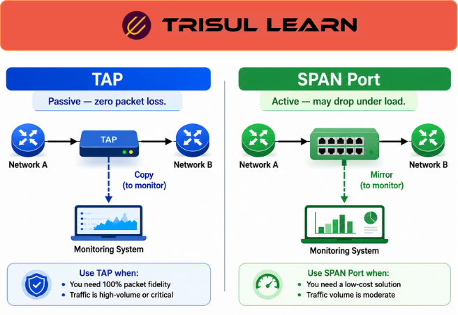

export const jsonLd = {
  "@context": "https://schema.org",
  "@type": "FAQPage",
  "mainEntity": [
    {
      "@type": "Question",
      "name": "What is the difference between TAP and SPAN port?",
      "acceptedAnswer": {
        "@type": "Answer",
        "text": "Network TAPs (Test Access Points) passively split optical or electrical signals providing lossless packet copy. SPAN ports (Switched Port Analyzer) use switch port mirroring which may drop packets under load. TAPs are passive and guaranteed lossless. SPAN ports are active and may lose packets."
      }
    },
    {
      "@type": "Question",
      "name": "When should you use a TAP?",
      "acceptedAnswer": {
        "@type": "Answer",
        "text": "Use a TAP when you need guaranteed lossless packet capture for forensic investigation, security monitoring requiring complete traffic, high-speed links where no packets can be dropped, or critical links where monitoring reliability is essential. TAPs are ideal for packet capture."
      }
    },
    {
      "@type": "Question",
      "name": "When should you use a SPAN port?",
      "acceptedAnswer": {
        "@type": "Answer",
        "text": "Use a SPAN port when you need quick deployment without extra hardware, flow monitoring where some packet loss is acceptable, budget constraints preventing TAP purchase, or temporary monitoring. SPAN ports are acceptable for flow monitoring and bandwidth estimation."
      }
    },
    {
      "@type": "Question",
      "name": "What are the pros and cons of TAP vs SPAN?",
      "acceptedAnswer": {
        "@type": "Answer",
        "text": "TAP pros: lossless capture, passive (no network impact), works at line rate. TAP cons: requires per-link hardware, cost, physical installation. SPAN pros: no extra hardware, easy configuration, no additional cost. SPAN cons: may drop packets under load, consumes switch CPU, may impact switch performance."
      }
    }
  ]
};

# What is TAP vs SPAN port?

TAP vs SPAN port compares two methods for network traffic observation. Network TAPs provide passive, lossless packet copy while SPAN ports use switch port mirroring which may drop packets under load. Both provide observation points for monitoring.

---

## How TAP and SPAN work

Network TAPs passively split optical or electrical signals copying all traffic to monitoring ports. TAPs are passive devices requiring no power for passive optical TAPs. All packets are copied without loss. TAPs provide complete visibility into wire traffic.

SPAN ports use switch port mirroring to copy traffic from source ports to destination monitoring ports. The switch CPU processes mirrored traffic. Under heavy load, SPAN ports may drop packets without indicating loss. SPAN ports consume switch resources.

---

## TAP vs SPAN in network operations

In the NOC, choose TAP for packet capture requiring complete traffic and SPAN for flow monitoring where some loss is acceptable. Security teams prefer TAPs for forensic investigation ensuring complete evidence. NOC teams use SPAN ports for bandwidth monitoring where trends matter more than exact packets.

Capacity planning uses TAP data for accurate traffic measurement. SPAN ports are acceptable for capacity planning when loss is minimal. Critical links should use TAPs for reliable monitoring.

---

## TAP vs SPAN comparison

| Aspect | Network TAP | SPAN Port |
|---|---|---|
| Packet loss | None (lossless) | May drop under load |
| Power requirement | Passive (no power) or active | Requires switch power |
| Hardware cost | Per-link hardware cost | No extra hardware |
| Switch impact | None (passive) | Consumes switch CPU |
| Installation | Physical installation required | Configuration only |
| Best for | Packet capture, forensics | Flow monitoring, bandwidth |

---

## What makes TAP vs SPAN work in practice

Observation point placement determines coverage. TAPs must be installed at critical links during network design. SPAN ports can be configured on-demand but require available switch ports. Plan observation points strategically.

Speed matching is critical. TAPs must match link speed (1G, 10G, 40G, 100G). SPAN ports must have sufficient egress bandwidth. Oversubscribing SPAN ports causes packet drops. Ensure monitoring link speed matches or exceeds source speed.

---

## How Trisul handles TAP vs SPAN

Trisul accepts traffic from both TAPs and SPAN ports for packet capture and flow monitoring. Passive TAPs provide lossless observation for packet capture. SPAN ports provide observation for flow monitoring where some loss is acceptable. Trisul packet capture uses passive TAPs or SPAN ports for observation. Full documentation is at https://docs.trisul.org/docs/ug/caps/.

---

## Related terms

- [What is network TAP?](/docs/glossary/network-tap)
- [What is SPAN port?](/docs/glossary/span-port)
- [What is packet capture?](/docs/glossary/packet-capture)
- [What is observation point?](/docs/glossary/observation-point)
- [What is passive network monitoring?](/docs/glossary/passive-network-monitoring)

---

## Frequently asked questions

### What is the difference between TAP and SPAN port?

Network TAPs (Test Access Points) passively split optical or electrical signals providing lossless packet copy. SPAN ports (Switched Port Analyzer) use switch port mirroring which may drop packets under load. TAPs are passive and guaranteed lossless. SPAN ports are active and may lose packets.

### When should you use a TAP?

Use a TAP when you need guaranteed lossless packet capture for forensic investigation, security monitoring requiring complete traffic, high-speed links where no packets can be dropped, or critical links where monitoring reliability is essential. TAPs are ideal for packet capture.

### When should you use a SPAN port?

Use a SPAN port when you need quick deployment without extra hardware, flow monitoring where some packet loss is acceptable, budget constraints preventing TAP purchase, or temporary monitoring. SPAN ports are acceptable for flow monitoring and bandwidth estimation.

### What are the pros and cons of TAP vs SPAN?

TAP pros: lossless capture, passive (no network impact), works at line rate. TAP cons: requires per-link hardware, cost, physical installation. SPAN pros: no extra hardware, easy configuration, no additional cost. SPAN cons: may drop packets under load, consumes switch CPU, may impact switch performance.