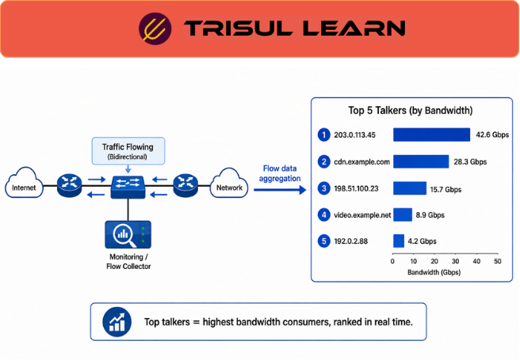

export const jsonLd = {
  "@context": "https://schema.org",
  "@type": "FAQPage",
  "mainEntity": [
    {
      "@type": "Question",
      "name": "What are top talkers?",
      "acceptedAnswer": {
        "@type": "Answer",
        "text": "Top talkers are the hosts or conversations consuming the most bandwidth. Top talkers analysis identifies highest bandwidth users for capacity planning, security monitoring, and traffic optimization. Top talkers show which IPs, conversations, or applications use most bandwidth."
      }
    },
    {
      "@type": "Question",
      "name": "How are top talkers identified?",
      "acceptedAnswer": {
        "@type": "Answer",
        "text": "Top talkers are identified by aggregating flow data by source IP, destination IP, conversation, or application. Traffic volumes are summed and sorted. The highest volume entries are top talkers. Top-N lists show top 10, 20, or 100 talkers."
      }
    },
    {
      "@type": "Question",
      "name": "Why analyze top talkers?",
      "acceptedAnswer": {
        "@type": "Answer",
        "text": "Top talker analysis identifies bandwidth hogs for capacity planning. Security teams detect compromised hosts through unusual top talker patterns. Network optimization targets top talkers for traffic engineering. Top talkers show what consumes most bandwidth."
      }
    },
    {
      "@type": "Question",
      "name": "What are top talker use cases?",
      "acceptedAnswer": {
        "@type": "Answer",
        "text": "Top talker use cases include capacity planning identifying heavy bandwidth users, security monitoring detecting compromised hosts, traffic optimization reducing bandwidth consumption, policy enforcement identifying policy violators, and billing showing top bandwidth consumers."
      }
    }
  ]
};

# What are top talkers?

Top talkers are the hosts or conversations consuming the most bandwidth. Top talkers analysis identifies highest bandwidth users for capacity planning, security monitoring, and traffic optimization. Top talkers show which IPs, conversations, or applications use most bandwidth.

---

## How top talkers work

Flow data is aggregated by source IP, destination IP, conversation (5-tuple), or application. Traffic volumes (bytes, packets) are summed for each group. Lists are sorted by volume descending. Top-N lists show top 10, 20, or 100 entries.

Real-time top talkers show current bandwidth consumers. Historical top talkers show trends over time. Top talkers can be filtered by time range, interface, application, or other criteria.

---

## Top talkers in network operations

In the NOC, top talkers identify bandwidth hogs consuming most capacity. When links approach saturation, top talkers show what causes congestion. Capacity planning targets top talkers for optimization.

Security teams detect compromised hosts through unusual top talker patterns. A host suddenly appearing in top talkers with high outbound traffic may be infected. Top talkers enable rapid identification of security incidents.

---

## Top talker categories

| Category | Description |
|---|---|
| Top source IPs | Hosts sending most traffic |
| Top destination IPs | Hosts receiving most traffic |
| Top conversations | Source-destination pairs with most traffic |
| Top applications | Applications consuming most bandwidth |
| Top ASN | Autonomous systems with most traffic |
| Top countries | Countries with most traffic |

---

## What makes top talkers work in practice

Top-K efficiency enables fast queries. Top-N lists are pre-computed at write time using Top-K algorithms. Without pre-computation, queries must scan all flows and sort. Pre-computed top talkers enable instant dashboards even with millions of flows.

Time window selection affects results. Short windows (1 minute) show current top talkers. Long windows (24 hours) show sustained top talkers. Different time windows reveal different insights. Real-time and historical top talkers complement each other.

---

## How Trisul handles top talkers

Trisul provides top talkers through real-time and historical analysis showing top sources, destinations, conversations, and applications by bandwidth. Top talkers are pre-computed at write time enabling instant access. Top-N views show top 10, 20, or 100 talkers. Login as user to view top talkers dashboards. Full documentation is at https://docs.trisul.org/docs/ug/cg/tasks/.

---

## Related terms

- [What is bandwidth monitoring?](/docs/glossary/bandwidth-monitoring)
- [What is flow monitoring?](/docs/glossary/flow-monitoring)
- [What is traffic analysis?](/docs/glossary/network-traffic-analysis)
- [What is Top-K Analyticsᵀ?](/docs/glossary/top-k-analytics)
- [What is traffic pattern analysis?](/docs/glossary/traffic-pattern-analysis)

---

## Frequently asked questions

### What are top talkers?

Top talkers are the hosts or conversations consuming the most bandwidth. Top talkers analysis identifies highest bandwidth users for capacity planning, security monitoring, and traffic optimization. Top talkers show which IPs, conversations, or applications use most bandwidth.

### How are top talkers identified?

Top talkers are identified by aggregating flow data by source IP, destination IP, conversation (5-tuple), or application. Traffic volumes are summed and sorted. The highest volume entries are top talkers. Top-N lists show top 10, 20, or 100 talkers.

### Why analyze top talkers?

Top talker analysis identifies bandwidth hogs for capacity planning. Security teams detect compromised hosts through unusual top talker patterns. Network optimization targets top talkers for traffic engineering. Top talkers show what consumes most bandwidth.

### What are top talker use cases?

Top talker use cases include capacity planning identifying heavy bandwidth users, security monitoring detecting compromised hosts, traffic optimization reducing bandwidth consumption, policy enforcement identifying policy violators, and billing showing top bandwidth consumers.