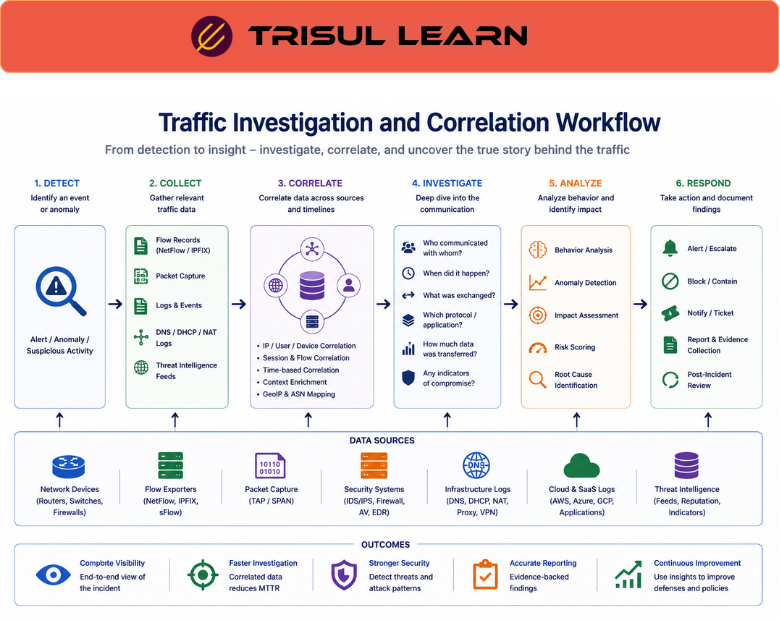

export const jsonLd = {
  "@context": "https://schema.org",
  "@type": "FAQPage",
  "mainEntity": [
    {
      "@type": "Question",
      "name": "What is traffic investigation?",
      "acceptedAnswer": {
        "@type": "Answer",
        "text": "Traffic investigation analyzes network traffic data to understand what happened during security incidents, performance problems, or anomalies. It combines flow data, packet capture, and logs for forensic analysis. Traffic investigation answers who, what, when, where, and how much."
      }
    },
    {
      "@type": "Question",
      "name": "How does traffic investigation work?",
      "acceptedAnswer": {
        "@type": "Answer",
        "text": "Traffic investigation starts with an alert or symptom. Investigators use query-based search to find related flows. Flow data shows conversation details. Packet capture provides packet-level evidence. Logs provide context. Investigation traces the full timeline."
      }
    },
    {
      "@type": "Question",
      "name": "What does traffic investigation reveal?",
      "acceptedAnswer": {
        "@type": "Answer",
        "text": "Traffic investigation reveals affected systems, attack timeline, data exfiltration volume, communication patterns, malware behavior, application performance issues, congestion causes, and policy violations. Investigation provides evidence for incident response."
      }
    },
    {
      "@type": "Question",
      "name": "Why is traffic investigation important?",
      "acceptedAnswer": {
        "@type": "Answer",
        "text": "Traffic investigation is critical for incident response determining scope and impact. Without investigation, analysts cannot understand what happened. Investigation enables rapid containment limiting damage. Investigation provides evidence for post-incident reporting."
      }
    }
  ]
};

# What is traffic investigation?

Traffic investigation analyzes network traffic data to understand what happened during security incidents, performance problems, or anomalies. It combines flow data, packet capture, and logs for forensic analysis. Traffic investigation answers who, what, when, where, and how much.

---

## How traffic investigation works

Traffic investigation starts with an alert or symptom. Investigators use query-based search to find related flows by IP, port, application, or pattern. Flow data shows conversation details including source, destination, bytes, and time.

Packet capture provides packet-level evidence showing payload content. Logs provide context including authentication events and configuration changes. Investigation traces the full timeline from initial compromise to containment.

---

## Traffic investigation in network operations

In the SOC, traffic investigation is the forensic layer. Flow data or IDS alerts tell you something suspicious happened. Packet capture tells you what was exchanged: commands issued, files transferred, credentials passed. For incident confirmation, packet capture is the definitive record.

Security analysts investigate alerts using flow data to identify affected systems and PCAP to examine content. Investigation determines incident scope, affected data, and attack timeline. Investigation guides containment and remediation.

---

## Investigation workflow

| Step | Action |
|---|---|
| 1. Alert | Receive alert or detect symptom |
| 2. Search | Query flows by IP, port, or pattern |
| 3. Analyze flows | Identify affected systems and conversation details |
| 4. Retrieve PCAP | Get packet capture for evidence |
| 5. Correlate logs | Add context from authentication and system logs |
| 6. Document | Record findings for incident report |

---

## What makes traffic investigation work in practice

Per-flow indexing enables fast investigation. Without indexing, investigators load large capture files into Wireshark and filter by hand. That manual process works at small scale but breaks down when the archive spans terabytes. With indexing, investigators click from an alert directly to matching packets.

Data correlation accelerates investigation. Flow data, PCAP, and logs must be correlated. From any flow, analysts must pivot to PCAP. From any alert, analysts must find related flows. Without correlation, investigation requires manual file searching.

---

## How Trisul handles traffic investigation

Trisul provides traffic investigation through integrated flow data and packet capture enabling rapid forensic analysis. From any alert, topper, or flow in the dashboard, analysts pivot directly to matching PCAP without manual file correlation. Trisul builds per-flow index enabling fast PCAP retrieval. Query-based investigation finds related traffic instantly. Full documentation is at https://docs.trisul.org/docs/ug/caps/.

---

## Related terms

- [What is network forensics?](/docs/glossary/network-forensics)
- [What is packet capture?](/docs/glossary/packet-capture)
- [What is flow monitoring?](/docs/glossary/flow-monitoring)
- [What is query based traffic investigation?](/docs/glossary/query-based-traffic-investigation)
- [What is incident response?](/docs/glossary/incident-response)

---

## Frequently asked questions

### What is traffic investigation?

Traffic investigation analyzes network traffic data to understand what happened during security incidents, performance problems, or anomalies. It combines flow data, packet capture, and logs for forensic analysis. Traffic investigation answers who, what, when, where, and how much.

### How does traffic investigation work?

Traffic investigation starts with an alert or symptom. Investigators use query-based search to find related flows. Flow data shows conversation details. Packet capture provides packet-level evidence. Logs provide context. Investigation traces the full timeline.

### What does traffic investigation reveal?

Traffic investigation reveals affected systems, attack timeline, data exfiltration volume, communication patterns, malware behavior, application performance issues, congestion causes, and policy violations. Investigation provides evidence for incident response.

### Why is traffic investigation important?

Traffic investigation is critical for incident response determining scope and impact. Without investigation, analysts cannot understand what happened. Investigation enables rapid containment limiting damage. Investigation provides evidence for post-incident reporting.