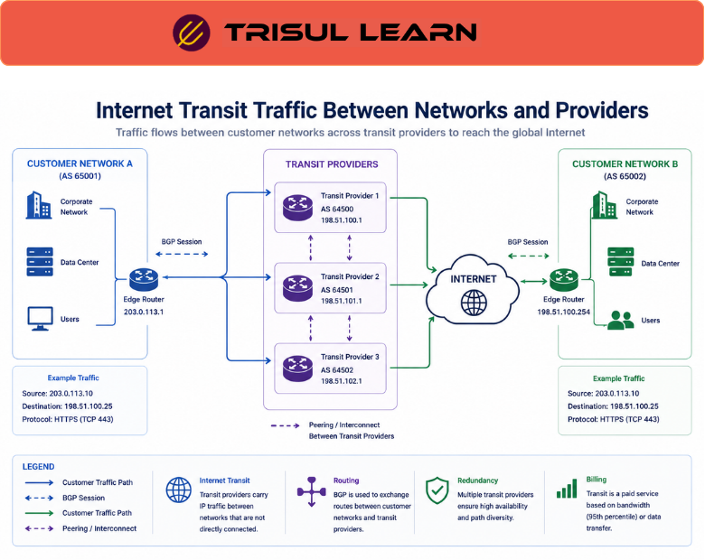

# What is Transit Traffic?

Transit Traffic refers to network traffic that passes through a provider’s network to reach another destination network rather than originating from or terminating within the provider’s own infrastructure.

In internet and ISP environments, transit traffic commonly involves:
- ISPs carrying customer traffic
- backbone providers forwarding internet traffic
- upstream providers routing global communication
- carriers transporting inter-network traffic

Transit traffic helps organizations define routing and interconnect roles by enabling communication between different networks and autonomous systems (ASNs).

It is especially important in:
- ISP infrastructures
- telecom backbones
- cloud providers
- internet exchanges
- enterprise WANs
- carrier-grade networks

## **How Transit Traffic Works**

When a network cannot directly reach a destination, traffic is forwarded through transit providers.

A simplified workflow looks like this:

Customer Network → Transit Provider → Destination Network

Transit providers use:

- BGP routing
- peering relationships
- backbone infrastructure
- interconnect links

to carry traffic between networks.

For example:

- A user accesses a website hosted in another country
- Multiple transit providers carry the traffic across backbone networks
- The traffic reaches the destination network
- Responses return through routing paths

Transit traffic visibility may include:

- bandwidth utilization
- ASN communication
- routing behavior
- peering relationships
- application traffic
- congestion patterns

---

## **Why Transit Traffic Matters**

Transit connectivity is essential for global internet communication.

Without transit visibility, organizations may struggle to:

- analyze backbone utilization
- troubleshoot routing issues
- optimize peering relationships
- monitor bandwidth costs
- investigate congestion
- analyze inter-network communication

Transit traffic analysis helps teams:

- improve routing visibility
- optimize traffic engineering
- monitor backbone usage
- analyze network performance
- troubleshoot connectivity issues
- strengthen operational awareness

It is especially important in:

- ISPs
- telecom operators
- cloud providers
- internet exchanges
- enterprise backbones
- CDN environments

The internet is basically millions of networks borrowing roads from each other and charging rent for the privilege. Humanity reinvented highways, but for packets and billing disputes.

---

## **Common Operational Use Cases**

### ISP Backbone Monitoring

Analyze traffic moving across provider backbone networks.

### Peering Optimization

Compare transit usage against peering traffic.

### Traffic Engineering

Optimize routing paths and interconnect utilization.

### Capacity Planning

Analyze long-term transit bandwidth growth.

### Congestion Troubleshooting

Identify overloaded transit links and bottlenecks.

---

## **Transit Traffic vs Peering Traffic**

| Feature | Transit Traffic | Peering Traffic |
|---|---|---|
| Traffic Purpose | Routed through providers | Direct network exchange |
| Cost Model | Usually paid | Often settlement-free |
| Routing Path | Indirect | Direct |
| Operational Dependency | Transit provider | Peer relationship |
| Internet Reachability | Broad | Limited to peers |

Transit traffic uses upstream providers for internet reachability, while peering traffic is exchanged directly between networks.

---

## **How Trisul Handles Transit Traffic Analytics**

Trisul provides scalable inter-network traffic visibility and routing analytics for enterprise and ISP environments.

Combined with:

- Peering Traffic Analysis
- ASN Analytics
- BGP Peering Analytics
- Top-K Analyticsᵀ
- Flow Analysis
- Multigraph Analyticsᵀ

Trisul helps teams:

- analyze transit bandwidth usage
- monitor inter-network traffic
- investigate routing anomalies
- optimize traffic engineering
- visualize ASN relationships
- improve backbone visibility

Trisul can also integrate:

- Peering Traffic Analysis
- BGP
- ISP Traffic Analytics

workflows for deeper routing visibility.

---

## **Related Terms**

- Peering Traffic Analysis
- BGP
- ASN
- ISP Traffic Analytics
- Traffic Engineering
- Bandwidth Monitoring

---

## **FAQ**

### What is transit traffic?

Transit traffic is traffic carried through a provider’s network to reach another destination network.

### Why is transit traffic important?

It enables internet connectivity between networks and supports global communication.

### Who commonly handles transit traffic?

ISPs, telecom providers, backbone operators, and cloud providers commonly handle transit traffic.

### What's the difference between transit traffic and peering traffic?

Transit traffic uses upstream providers for connectivity, while peering traffic is exchanged directly between networks.

### How does transit traffic affect ISP operations?

It impacts bandwidth costs, routing performance, backbone utilization, and inter-network connectivity.

### Can transit traffic analytics improve routing optimization?

Yes. It helps organizations analyze traffic paths, optimize interconnect usage, and troubleshoot congestion.