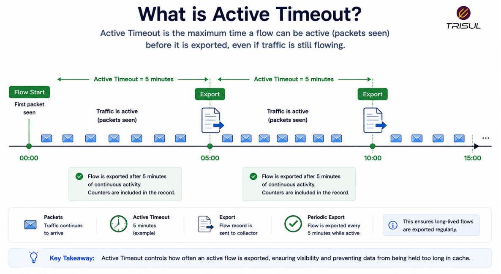
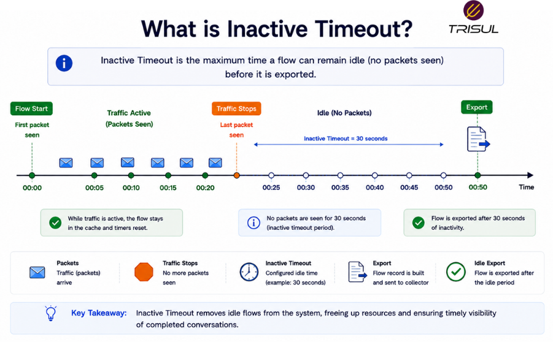
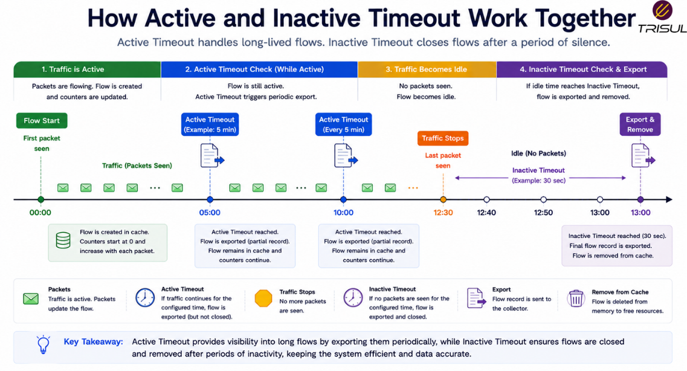

# Active vs Inactive Timeout

Active timeout and inactive timeout are two flow timeout mechanisms used in NetFlow and IPFIX to control when flow records are exported. Active timeout exports long-running flows periodically, while inactive timeout exports flows after they have been idle for a defined period.

---

## Active and Inactive Timeout In Simple Terms

Think of it like taking notes during a meeting.

**Active timeout** means you send updates every few minutes even if the meeting is still going.

**Inactive timeout** means you send the notes only after the meeting stops.

Both exist for a reason:

- one keeps visibility fresh  
- one cleans up idle flows  

Networks, like meetings, can drag on longer than anyone wants.

---

## What is Active Timeout?

Active timeout forces a flow exporter to export a flow record at regular intervals even if the flow is still active.

This is useful for:

- long-running connections  
- live traffic monitoring  
- streaming visibility  

Example:

If active timeout is 5 minutes and a flow lasts 20 minutes, the exporter will send:

- one record at 5 minutes  
- one at 10 minutes  
- one at 15 minutes  
- one at 20 minutes  

This keeps traffic analytics fresh.

  

---

## What is Inactive Timeout?

Inactive timeout exports a flow record after no new packets are seen for a configured period.

This is useful for:

- short-lived connections  
- cleaning idle flows  
- freeing cache resources  

Example:

If inactive timeout is 30 seconds and no traffic appears for 30 seconds, the flow is exported.

This removes stale flow entries.

  

---

## Key Differences Between Active and Inactive Timeout

| Feature | Active Timeout | Inactive Timeout |
|---|---|---|
| Trigger | Time interval while active | Idle period |
| Purpose | Periodic export | Close idle flows |
| Best for | Long-lived traffic | Idle traffic cleanup |
| Export frequency | Regular | Event-driven |
| Visibility freshness | High | Lower |

They solve different problems.

---

## How Active and Inactive Timeout Work Together

1. Traffic creates a flow  
2. Packets continue updating the flow  
3. Active timeout checks elapsed time  
4. Inactive timeout checks idle time  
5. Either condition triggers export  
6. Flow cache updates or clears  

This ensures balanced flow lifecycle management.

  

---

## Why Active Timeout Matters

-### Better live visibility

Improves freshness of analytics.

- ### Better long-session tracking

Useful for VPNs, streaming, and large transfers.

- ### Better traffic granularity

Splits long sessions into smaller visible segments.

---

## Why Inactive Timeout Matters

- ### Cleans idle flows

Prevents cache buildup.

- ### Improves cache efficiency

Frees resources faster.

- ### Handles short-lived traffic efficiently

Exports completed flows quickly.

---

## Typical Timeout Settings

| Timeout Type | Common Range |
|---|---|
| Active Timeout | 1–5 minutes |
| Inactive Timeout | 15–60 seconds |

Settings vary by environment.

Shorter settings improve freshness but increase export volume.

Longer settings reduce overhead but delay visibility.

A timeless tradeoff. Speed versus sanity.

---

## Active Timeout vs Inactive Timeout: When to Tune

### Reduce active timeout when:

- you need fresher dashboards  
- monitoring long-lived sessions  
- investigating live incidents  

---

### Reduce inactive timeout when:

- you want faster cleanup of idle flows  
- handling many short-lived connections  
- reducing cache occupancy  

---

### Increase timeouts when:

- reducing exporter load  
- reducing storage growth  
- lowering flow export volume  

---

## Impact on Flow Analytics

Timeout settings affect:

- traffic visibility freshness  
- flow record volume  
- storage requirements  
- dashboard latency  
- historical granularity  

Poor timeout tuning can distort analytics.

Because a bad timeout setting is just a bug with plausible deniability.

---

## How Trisul Handles Timeout-Based Flow Records

Trisul processes flow records generated by active and inactive timeout policies and reconstructs traffic behavior for real-time and historical analysis.

This enables:

- fresher traffic visibility  
- better historical accuracy  
- long-session visibility  
- anomaly detection  
- top talker analytics  

This ensures reliable traffic intelligence regardless of timeout strategy.

---

## Frequently Asked Questions

1) ### Which is more important: active timeout or inactive timeout?

Both are important because they handle different flow lifecycle conditions.

---

2) ### Does shorter active timeout increase storage?

Yes. More exports create more flow records.

---

3) ### Does inactive timeout affect visibility?

Yes. Longer inactive timeout delays export of completed flows.

---

4) ### Should timeout settings be the same for all traffic?

Not always. Different traffic patterns may benefit from different timeout settings.

---
