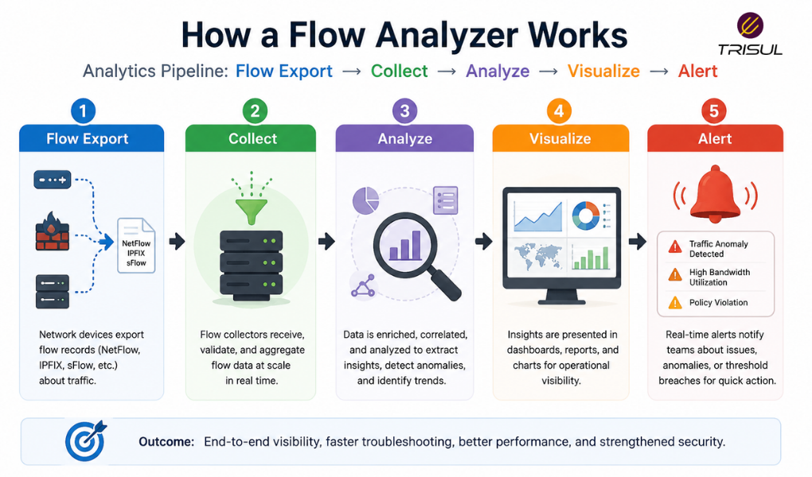

# What is a Flow Analyzer?

A flow analyzer is a network monitoring tool that processes and analyzes flow records collected from network devices to provide visibility into bandwidth usage, traffic patterns, application activity, top talkers, and network anomalies. It converts raw flow data into actionable insights through dashboards, reports, and alerts.

---

## Flow Analyzer In Simple Terms

A flow analyzer is the intelligence layer of flow monitoring.

If flow exporters generate the data and flow collectors store it, the flow analyzer explains what it means.

It helps answer questions like:

- Who is using the most bandwidth?
- Which applications are consuming traffic?
- Where is traffic going?
- Is something abnormal happening?

Without analysis, raw flow records are just numbers. Lots of numbers. Humans are remarkably bad at loving raw numbers.

---

## Technical Explanation

A flow analyzer processes flow records exported using protocols such as:

- NetFlow  
- IPFIX  
- sFlow  

It performs:

- Traffic aggregation  
- Application classification  
- Top talker analysis  
- Traffic trend analysis  
- Protocol analysis  
- Threshold alerting  
- Historical investigations  

It transforms traffic metadata into structured operational intelligence.

---

## How a Flow Analyzer Works

1. Flow exporters generate flow records  
2. Flow collectors receive and store flow records  
3. The flow analyzer processes the records  
4. Traffic is categorized by host, application, and protocol  
5. Dashboards visualize traffic behavior  
6. Alerts identify anomalies or threshold violations  

This creates operational visibility into network traffic.

  

---

## What Can a Flow Analyzer Show?

A flow analyzer can show:

| Metric | Description |
|---|---|
| Top Talkers | Highest bandwidth-consuming hosts |
| Top Applications | Most active applications |
| Traffic Volume | Total bytes and packets |
| Top Conversations | Communication between endpoints |
| Protocol Usage | TCP, UDP, ICMP distribution |
| Interface Utilization | Traffic by interface |
| ASN Traffic | Traffic by autonomous systems |
| Historical Trends | Long-term traffic patterns |

These insights help teams understand network behavior.

---

## Why Flow Analyzers Matter

### Improve traffic visibility

Provide deep insight into network traffic behavior.

### Speed up troubleshooting

Help identify traffic bottlenecks quickly.

### Improve bandwidth management

Identify traffic-heavy users and applications.

### Detect anomalies

Reveal unusual traffic spikes and suspicious behavior.

### Support security analysis

Help investigate attacks and abnormal communication.

---

## Common Flow Analyzer Use Cases

- Bandwidth monitoring  
- Application traffic analysis  
- Top talker identification  
- DDoS detection  
- Traffic forensics  
- ISP peering analytics  
- Capacity planning  
- SLA monitoring  

---

## Flow Analyzer vs Flow Collector

| Feature | Flow Analyzer | Flow Collector |
|---|---|---|
| Role | Interprets flow data | Receives flow data |
| Focus | Analytics and visualization | Ingestion and storage |
| Function | Insights and reporting | Data collection |

A flow collector stores the data. A flow analyzer explains the data.

---

## Flow Analyzer vs Packet Analyzer

| Feature | Flow Analyzer | Packet Analyzer |
|---|---|---|
| Data type | Metadata | Full payload |
| Storage overhead | Low | High |
| Scalability | High | Moderate |
| Visibility depth | Traffic-level | Packet-level |

Flow analyzers provide scalable traffic intelligence, while packet analyzers provide deeper inspection.

---

## Key Features of a Flow Analyzer

A modern flow analyzer should provide:

- Multi-protocol flow support  
- Real-time dashboards  
- Historical traffic analysis  
- Top talker analytics  
- Application visibility  
- Threshold alerts  
- ASN analytics  
- Traffic investigation tools  
- API integrations  
- Multi-tenancy  

These features improve operational efficiency.

---

## How Trisul Works as a Flow Analyzer

Trisul functions as a high-performance flow analyzer by processing NetFlow, IPFIX, and sFlow records into structured analytics.

It provides:

- Top-K analytics  
- Threshold Bands  
- ASN analytics  
- Historical retro analysis  
- DDoS detection  
- Traffic investigation tools  
- Multi-dimensional traffic analysis  

This converts raw flow data into actionable network intelligence.

---

## Frequently Asked Questions

1) ### Is a flow analyzer the same as a NetFlow analyzer?

A NetFlow analyzer is a type of flow analyzer focused on NetFlow records.

---

2) ### Does a flow analyzer capture packets?

No. It analyzes flow metadata only.

---

3) ### Can a flow analyzer detect DDoS attacks?

Yes. It can identify traffic spikes and abnormal flow patterns.

---

4) ### Is a flow analyzer useful for ISPs?

Yes. ISPs use flow analyzers for peering analytics, customer visibility, and traffic engineering.

---
