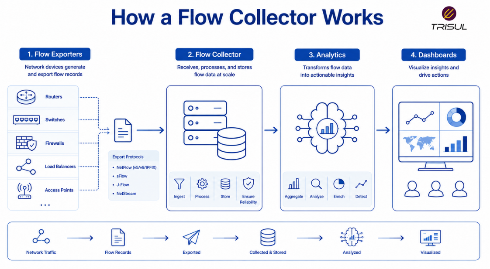

# What is a Flow Collector?

A flow collector is a system or software platform that receives, stores, and processes flow records exported by network devices such as routers, switches, and firewalls. It converts raw flow data into analytics, dashboards, reports, and alerts for network monitoring, troubleshooting, and security analysis.

---

## Flow Collector In Simple Terms

A flow collector is like the central inbox for network traffic summaries.

Network devices send their flow records to it, and the collector organizes and analyzes those records so you can understand:

- who is talking  
- where traffic is going  
- how much bandwidth is being used  
- which applications are active  
- whether traffic looks abnormal  

Without a collector, flow records are just exported into the void. A little like corporate emails nobody reads.

---

## Technical Explanation

A flow collector listens for incoming flow records from flow exporters.

These records may be sent using protocols such as:

- NetFlow  
- IPFIX  
- sFlow  

The collector performs:

- Flow ingestion  
- Flow parsing  
- Data normalization  
- Traffic aggregation  
- Historical storage  
- Query processing  
- Alerting  

It builds searchable traffic datasets for real-time and historical analysis.

---

## How a Flow Collector Works

1. Flow exporters observe traffic  
2. Flow records are generated  
3. Flow records are exported to the collector  
4. The collector parses and stores the records  
5. Traffic data is aggregated into analytics  
6. Dashboards and alerts provide operational visibility  

This enables traffic visibility across the network.

  

---

## What Does a Flow Collector Store?

A flow collector stores:

| Data Type | Description |
|---|---|
| Flow Records | Traffic metadata |
| Packet Counts | Total packets per flow |
| Byte Counts | Total bytes per flow |
| Timestamps | Flow start and end times |
| Protocol Data | TCP, UDP, ICMP |
| Interface Data | Traffic by interface |
| ASN Data | Traffic by autonomous system |
| Historical Trends | Long-term traffic behavior |

This creates a searchable history of network traffic.

---

## Why Flow Collectors Matter

### Centralized traffic visibility

Aggregates flow data from multiple exporters.

### Historical analysis

Stores traffic data for investigation and reporting.

### Faster troubleshooting

Helps identify network bottlenecks quickly.

### Better anomaly detection

Supports threshold-based alerts and behavior analysis.

### Security investigations

Helps analyze suspicious traffic patterns.

---

## Common Flow Collector Use Cases

- Bandwidth monitoring  
- Top talker analysis  
- Application traffic analysis  
- DDoS detection  
- ISP peering analytics  
- Traffic forensics  
- Capacity planning  
- Security investigations  

---

## Flow Collector vs Flow Exporter

| Feature | Flow Collector | Flow Exporter |
|---|---|---|
| Role | Receives flow records | Creates flow records |
| Location | Monitoring platform | Network device |
| Storage | Long-term storage | Temporary flow cache |
| Function | Analysis and reporting | Traffic observation |

Flow exporters generate flow data. Flow collectors process and analyze it.

---

## Flow Collector vs Packet Collector

| Feature | Flow Collector | Packet Collector |
|---|---|---|
| Data stored | Metadata | Full packet payload |
| Storage overhead | Low | High |
| Scalability | High | Moderate |
| Retention | Long-term | Limited |

Flow collectors provide scalable traffic analytics, while packet collectors provide deep inspection.

---

## Key Features of a Flow Collector

A modern flow collector should provide:

- High-speed flow ingestion  
- Multi-protocol support  
- Historical traffic retention  
- Top talker analysis  
- Application visibility  
- Threshold alerting  
- ASN analytics  
- Searchable traffic history  
- API integration  
- Multi-tenancy  

These features determine the collector’s operational value.

---

## How Trisul Works as a Flow Collector

Trisul functions as a high-performance flow collector by ingesting NetFlow, IPFIX, and sFlow records at scale.

It provides:

- Top-K analytics  
- Historical retro analysis  
- ASN analytics  
- DDoS detection  
- Threshold anomaly detection  
- Traffic investigation tools  
- Multi-dimensional analytics  

This converts raw flow data into actionable operational intelligence.

---

## Frequently Asked Questions

### Is a flow collector the same as a NetFlow collector?

A NetFlow collector is a type of flow collector specifically designed for NetFlow data.

---

### Can a flow collector process IPFIX?

Yes. Most modern flow collectors support IPFIX and other flow protocols.

---

### Does a flow collector store packet payloads?

No. It stores metadata only.

---

### Can a flow collector analyze historical traffic?

Yes. Historical traffic analysis is one of its primary functions.

---

