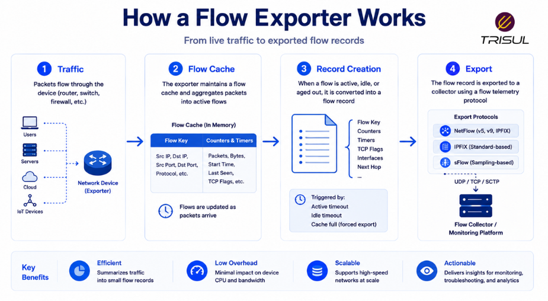
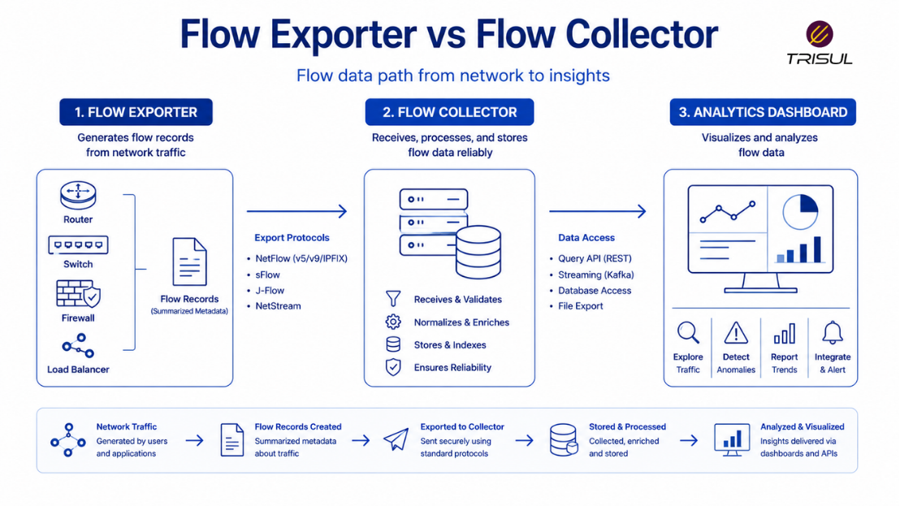

# What is a Flow Exporter?

A flow exporter is a network device or software component that observes network traffic, summarizes it into flow records, and exports those records to a flow collector for monitoring and analysis. Common flow exporters include routers, switches, firewalls, and virtual network appliances.

---

## Flow Exporter In Simple Terms

A flow exporter is like a note-taker for network traffic.

It watches communication between devices and writes down the important details:

- who communicated  
- where the traffic went  
- how much data was transferred  
- how long it lasted  

Then it sends those summaries to a collector for analysis.

It does the watching, not the thinking. Like many management structures.

---

## Technical Explanation

A flow exporter continuously observes packets traversing a network interface.

It groups related packets into flows based on shared attributes such as:

- Source IP  
- Destination IP  
- Source Port  
- Destination Port  
- Protocol  

It maintains counters for:

- packet count  
- byte count  
- timestamps  
- flags  

When the flow ends or times out, the exporter creates a flow record and exports it to a collector.

Common export protocols include:

- NetFlow  
- IPFIX  
- sFlow  

---

## How a Flow Exporter Works

1. Traffic passes through the device  
2. The device inspects packet headers  
3. Packets are grouped into flows  
4. Flow statistics are maintained  
5. Flow records are created  
6. Flow records are exported to a collector  

This enables efficient traffic summarization.

  

---

## What Does a Flow Exporter Export?

A flow exporter typically exports:

| Field | Description |
|---|---|
| Source IP | Sender address |
| Destination IP | Receiver address |
| Source Port | Sending application port |
| Destination Port | Receiving application port |
| Protocol | Traffic protocol |
| Packets | Number of packets |
| Bytes | Total bytes transferred |
| Start Time | Flow start time |
| End Time | Flow end time |
| Interface | Traffic interface |

Advanced exporters may also export:

- VLAN information  
- AS numbers  
- Application IDs  
- QoS values  

---

## Why Flow Exporters Matter

### Enable traffic visibility

They generate the raw data used for flow analytics.

### Reduce storage overhead

They summarize traffic instead of storing payloads.

### Improve scalability

Support large-scale traffic monitoring.

### Support traffic analysis

Provide data for troubleshooting and optimization.

### Improve security visibility

Help detect suspicious traffic patterns.

---

## Common Flow Exporter Types

### Routers

Most common source of flow records.

### Switches

Provide internal traffic visibility.

### Firewalls

Export security-relevant traffic flows.

### Virtual Appliances

Support cloud and virtualized environments.

### Hypervisors

Export east-west traffic visibility.

---

## Flow Exporter vs Flow Collector

| Feature | Flow Exporter | Flow Collector |
|---|---|---|
| Role | Creates flow records | Receives flow records |
| Location | Network device | Monitoring platform |
| Function | Observes traffic | Analyzes traffic |
| Storage | Temporary flow cache | Long-term storage |

The exporter generates flow data. The collector processes it.

  

---

## Flow Exporter vs Packet Capture Device

| Feature | Flow Exporter | Packet Capture Device |
|---|---|---|
| Data exported | Metadata | Full packets |
| Storage overhead | Low | High |
| Scalability | High | Moderate |
| Payload visibility | No | Yes |

Flow exporters summarize traffic, while packet capture devices record everything.

---

## Flow Export Protocols

Flow exporters use protocols such as:

### NetFlow

Widely used Cisco-originated export format.

### IPFIX

Standardized and extensible export format.

### sFlow

Sampling-based telemetry export.

Each protocol provides traffic visibility with different methods.

---

## How Trisul Uses Flow Export Data

Trisul collects and analyzes flow records exported by flow exporters using NetFlow, IPFIX, and sFlow.

This enables:

- Top-K traffic analytics  
- Application visibility  
- Historical traffic investigation  
- ASN analytics  
- Threshold anomaly detection  
- DDoS analytics  

This transforms exported flow data into actionable network intelligence.

---

## Frequently Asked Questions

### Is a flow exporter the same as a flow collector?

No. The exporter generates and sends flow records. The collector receives and analyzes them.

---

### Can a firewall be a flow exporter?

Yes. Many firewalls export NetFlow or IPFIX records.

---

### Does a flow exporter capture payload data?

No. It exports metadata only.

---

### Can virtual devices act as flow exporters?

Yes. Virtual appliances and hypervisors can export flow data.

---

