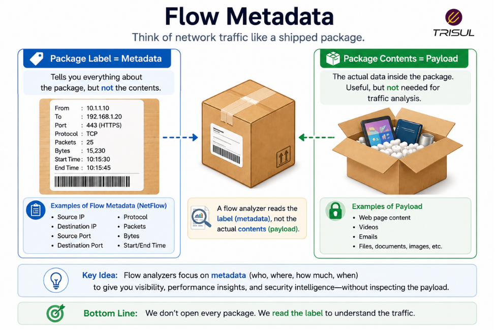
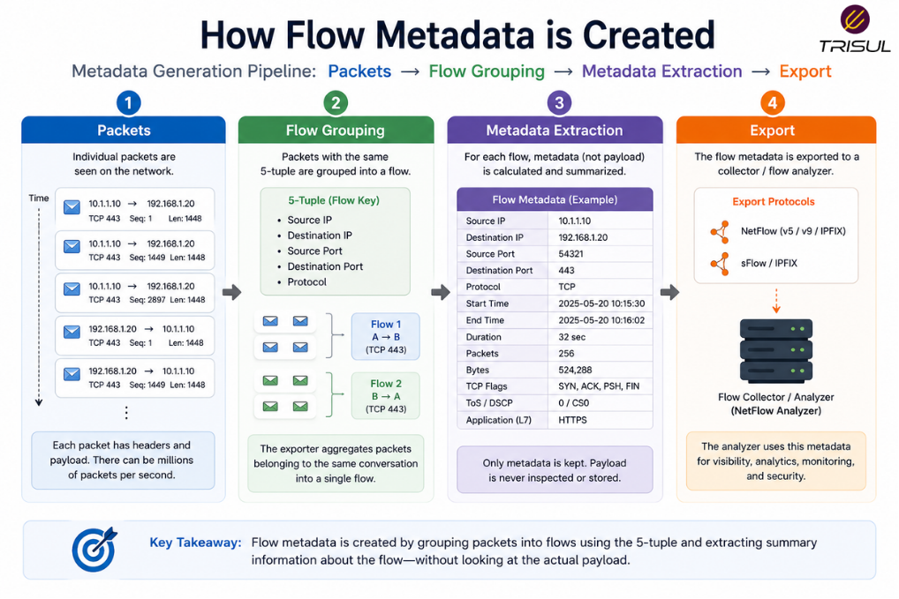

# What is Flow Metadata?

Flow metadata is the summarized information about network traffic flows, such as source IP, destination IP, ports, protocol, packet count, byte count, and timestamps. It describes how traffic behaves without including the actual packet payload.

---

## Flow Metadata In Simple Terms

Flow metadata is like the label on a package.

It tells you:

- where the package came from  
- where it is going  
- how big it is  
- when it was shipped  

But it does not tell you what is inside.

That’s exactly how flow metadata works.

It describes network communication without capturing the actual data content.

Efficient, privacy-friendly, and less nosy than packet inspection.

---

## Technical Explanation

Flow metadata is generated when network devices observe traffic and group packets into flows.

Instead of storing every packet, the device records summary information such as:

- Source IP address  
- Destination IP address  
- Source port  
- Destination port  
- Protocol type  
- Packet count  
- Byte count  
- Start time  
- End time  
- Interface information  

This metadata is exported using flow protocols such as:

- NetFlow  
- IPFIX  
- sFlow  

Collectors and analyzers use this metadata for traffic analytics.

---

## How Flow Metadata is Created

1. Packets pass through a network device  
2. The device groups related packets into a flow  
3. Flow attributes are tracked  
4. Counters and timestamps are maintained  
5. A flow record is created  
6. The metadata is exported to a collector  

This creates lightweight traffic visibility.

---

## What Does Flow Metadata Contain?

Typical flow metadata includes:

| Field | Description |
|---|---|
| Source IP | Traffic sender |
| Destination IP | Traffic receiver |
| Source Port | Sending application port |
| Destination Port | Receiving application port |
| Protocol | Communication protocol |
| Packet Count | Number of packets |
| Byte Count | Total bytes transferred |
| Start Time | Flow start timestamp |
| End Time | Flow end timestamp |
| Interface | Input/output interface |

Advanced flow metadata may include:

- VLAN IDs  
- AS numbers  
- QoS values  
- Application IDs  
- TCP flags  

---

## Why Flow Metadata Matters

### Enables scalable monitoring

Provides traffic insights without packet payload storage.

### Reduces storage requirements

Consumes far less storage than packet captures.

### Improves troubleshooting

Helps identify bottlenecks and unusual traffic patterns.

### Supports traffic analytics

Enables dashboards, reports, and historical analysis.

### Improves security visibility

Helps identify suspicious communication patterns.

---

## Common Use Cases of Flow Metadata

- Bandwidth monitoring  
- Top talker analysis  
- Application traffic analysis  
- Security investigations  
- Traffic engineering  
- DDoS detection  
- Historical traffic analysis  
- Capacity planning  

---

## Flow Metadata vs Packet Payload

| Feature | Flow Metadata | Packet Payload |
|---|---|---|
| Data type | Summary information | Actual content |
| Storage overhead | Low | High |
| Privacy impact | Lower | Higher |
| Scalability | High | Moderate |
| Visibility depth | Traffic behavior | Content inspection |

Flow metadata describes the traffic. Packet payload contains the traffic content.

---

## Flow Metadata vs Logs

| Feature | Flow Metadata | Logs |
|---|---|---|
| Source | Network devices | Applications or systems |
| Focus | Traffic behavior | Events and messages |
| Structure | Structured traffic summaries | Event records |

Flow metadata explains communication behavior, while logs explain system events.

---

## How Trisul Uses Flow Metadata

Trisul processes flow metadata from NetFlow, IPFIX, and sFlow exporters and converts it into actionable analytics.

This enables:

- Top-K traffic analytics  
- Application visibility  
- Historical traffic analysis  
- ASN analytics  
- Threshold anomaly detection  
- DDoS visibility  

This transforms simple metadata into operational intelligence.

---

## Frequently Asked Questions

### Is flow metadata the same as packet data?

No. Flow metadata describes packet behavior, not packet contents.

---

### Does flow metadata include payloads?

No. It includes summary information only.

---

### Is flow metadata useful for security?

Yes. It helps detect anomalies, scans, and suspicious communication patterns.

---

### Is flow metadata scalable?

Yes. It is far more scalable than packet capture because of lower storage requirements.

---
