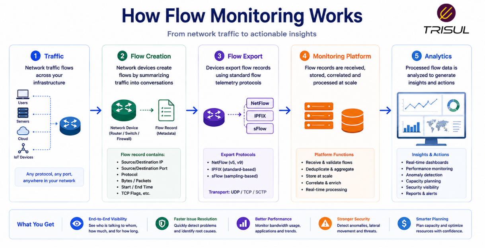
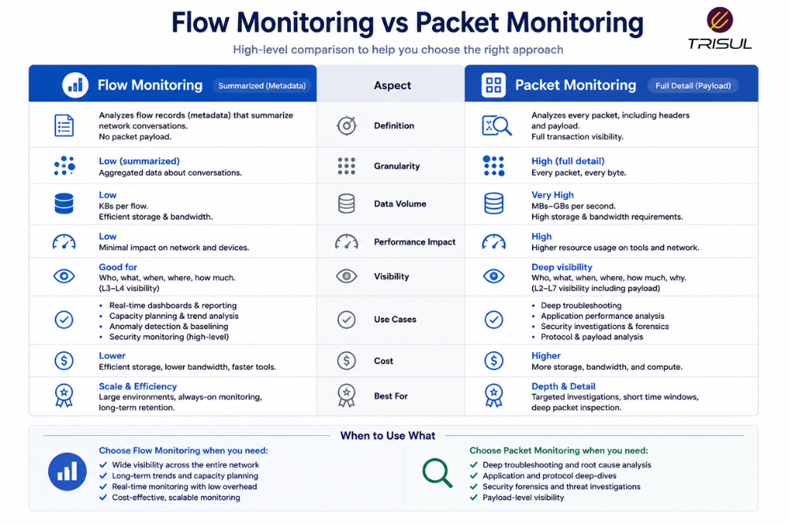

# What is Flow Monitoring?

Flow monitoring is the process of collecting, analyzing, and monitoring network flow data to understand traffic behavior, bandwidth usage, application activity, and communication patterns across a network. It helps organizations gain traffic visibility, troubleshoot issues, and detect anomalies without capturing packet payloads.

---

## Flow Monitoring In Simple Terms

Flow monitoring is like watching traffic on a highway.

You may not know what is inside every vehicle, but you can clearly see:

- where traffic is coming from  
- where it is going  
- how much traffic is moving  
- which routes are busiest  
- where congestion is happening  

That is what flow monitoring does for a network.

It tracks traffic behavior at scale without inspecting every packet. Efficient, practical, and far less obsessive than packet-level surveillance.

---

## Technical Explanation

Flow monitoring works by collecting flow records exported by network devices such as routers, switches, and firewalls.

A flow record summarizes traffic using attributes such as:

- Source IP  
- Destination IP  
- Source Port  
- Destination Port  
- Protocol  
- Packet count  
- Byte count  
- Timestamps  

These records are exported using protocols such as:

- NetFlow  
- IPFIX  
- sFlow  

Monitoring platforms process this data into analytics, dashboards, and alerts.

---

## How Flow Monitoring Works

1. Traffic passes through network devices  
2. Devices group packets into flows  
3. Flow records are created  
4. Flow records are exported to a collector  
5. The monitoring platform analyzes the records  
6. Dashboards and alerts provide traffic visibility  

This enables both live and historical traffic monitoring.

  

---

## What Does Flow Monitoring Show?

Flow monitoring can show:

| Metric | Description |
|---|---|
| Top Talkers | Highest bandwidth consumers |
| Top Applications | Most active applications |
| Traffic Volume | Total traffic transferred |
| Traffic Direction | Inbound and outbound traffic |
| Top Conversations | Communication between endpoints |
| Protocol Distribution | TCP, UDP, ICMP breakdown |
| Interface Utilization | Traffic by interface |
| Historical Trends | Long-term traffic patterns |

  

---

## Why Flow Monitoring Matters

### Improves network visibility

Provides detailed traffic behavior insights.

### Speeds up troubleshooting

Quickly identifies congestion and bottlenecks.

### Detects anomalies

Finds unusual traffic spikes and abnormal patterns.

### Optimizes bandwidth usage

Identifies bandwidth-heavy users and applications.

### Supports security monitoring

Improves threat detection and traffic investigation.

---

## Common Flow Monitoring Use Cases

- Bandwidth monitoring  
- Application traffic analysis  
- DDoS detection  
- Security investigations  
- ISP traffic analytics  
- WAN troubleshooting  
- Capacity planning  
- SLA monitoring  

---

## Flow Monitoring vs Packet Monitoring

| Feature | Flow Monitoring | Packet Monitoring |
|---|---|---|
| Data type | Metadata | Full payload |
| Storage overhead | Low | High |
| Scalability | High | Moderate |
| Retention | Long-term | Limited |
| Visibility depth | Traffic-level | Deep packet-level |

Flow monitoring provides scalable traffic insights, while packet monitoring provides deeper inspection.

  

---

## Flow Monitoring vs SNMP Monitoring

| Feature | Flow Monitoring | SNMP Monitoring |
|---|---|---|
| Traffic attribution | Strong | Weak |
| Application visibility | Yes | No |
| Historical analysis | Strong | Limited |
| Traffic conversations | Yes | No |

Flow monitoring provides richer traffic intelligence than interface monitoring.

---

## Key Benefits of Flow Monitoring

- Better traffic visibility  
- Faster troubleshooting  
- Lower storage requirements  
- Long-term traffic history  
- Improved anomaly detection  
- Better bandwidth optimization  
- Enhanced security monitoring  

These benefits make flow monitoring essential for modern networks.

---

## How Trisul Performs Flow Monitoring

Trisul performs flow monitoring by collecting NetFlow, IPFIX, and sFlow records and converting them into structured analytics.

This provides:

- Top-K analytics  
- Application visibility  
- ASN analytics  
- Historical traffic analysis  
- DDoS visibility  
- Threshold anomaly detection  

This helps organizations monitor traffic behavior at scale with high operational visibility.

---

## Frequently Asked Questions

### Is flow monitoring the same as NetFlow?

No. NetFlow is a protocol. Flow monitoring is the broader process of monitoring flow data.

---

### Does flow monitoring capture payloads?

No. It captures metadata only.

---

### Can flow monitoring detect DDoS attacks?

Yes. It helps identify unusual traffic spikes and attack patterns.

---

### Is flow monitoring useful for ISPs?

Yes. ISPs use flow monitoring for traffic engineering, peering analytics, and customer traffic visibility.

---
