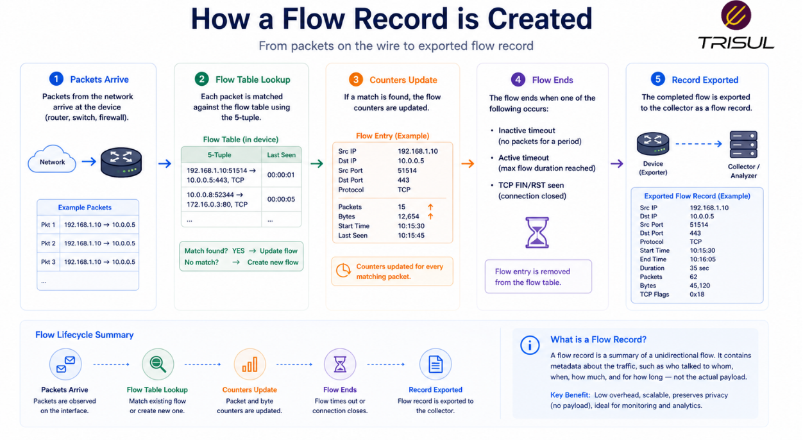
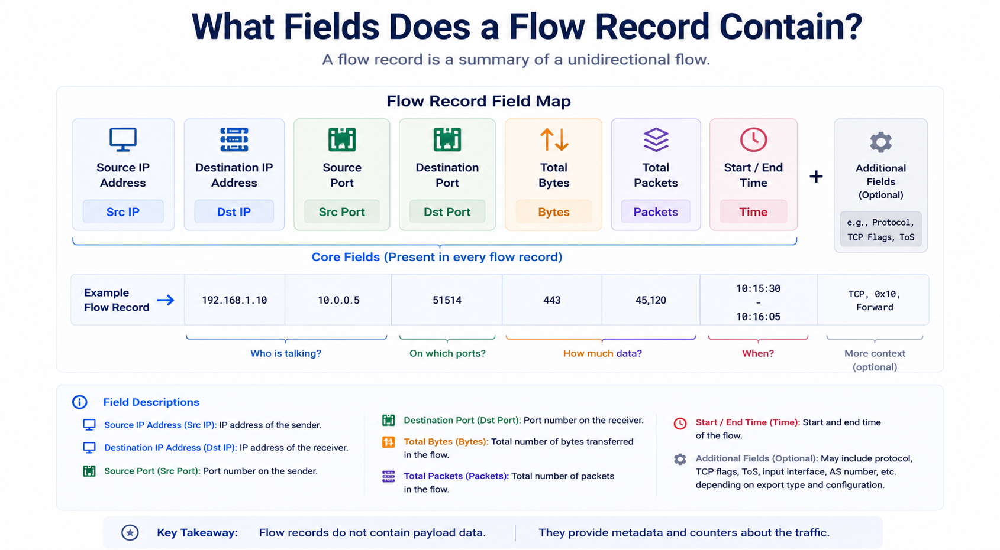
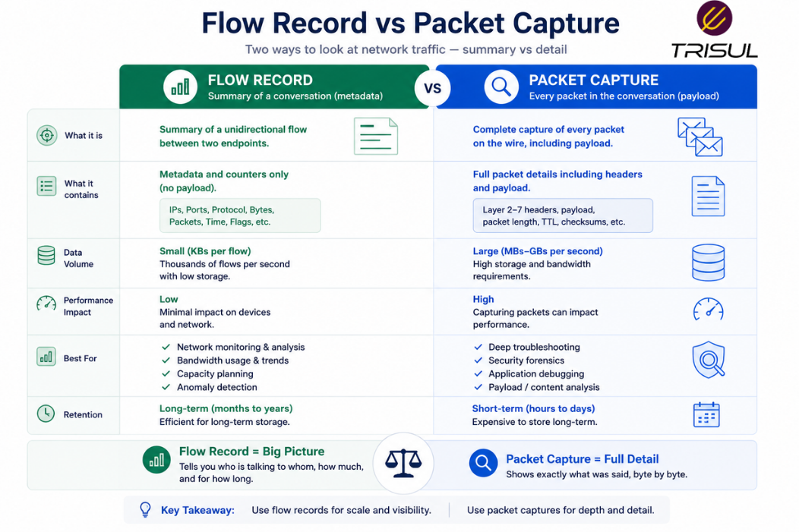

# What is a Flow Record?

A flow record is a summarized metadata entry describing a network flow between two endpoints. It contains key details such as source IP, destination IP, ports, protocol, packet count, byte count, and timestamps, allowing network teams to analyze traffic without storing full packet payloads.

---

## Flow Record In Simple Terms

A flow record is like a trip summary.

Imagine taking a taxi ride.

Instead of recording every turn, traffic light, and lane change, you keep a summary:

- where the trip started  
- where it ended  
- how long it took  
- how far it went  

That summary is like a flow record.

It captures the essential details of a network conversation without recording every packet.

---

## Technical Explanation

When a network device observes packets belonging to the same flow, it groups them together and maintains counters and metadata.

When the flow ends, times out, or reaches an export condition, the device creates a flow record.

A flow record typically includes:

- Source IP address  
- Destination IP address  
- Source port  
- Destination port  
- Protocol  
- Packet count  
- Byte count  
- Start time  
- End time  
- Interface information  

This record is exported to a collector for analysis.

---

## How a Flow Record is Created

1. Traffic enters a network device  
2. Packets are matched using flow keys  
3. Counters and metadata are updated  
4. Flow ends or times out  
5. Device exports the summarized flow record  

This reduces storage requirements compared to packet capture.

  

---

## What Fields Does a Flow Record Contain?

| Field | Description |
|---|---|
| Source IP | Sender IP address |
| Destination IP | Receiver IP address |
| Source Port | Sending application port |
| Destination Port | Receiving application port |
| Protocol | TCP, UDP, ICMP |
| Packets | Number of packets |
| Bytes | Total bytes transferred |
| Start Time | Flow start timestamp |
| End Time | Flow end timestamp |
| TCP Flags | Connection state indicators |
| Interface | Input/output interface |

Some advanced flow records may include:

- VLAN IDs  
- AS numbers  
- Application IDs  
- QoS markings  

  
---

## Why Flow Records Matter

- ### Reduce storage overhead

Flow records are far smaller than packet captures.

- ### Enable traffic visibility

Help analyze who communicated with whom.

- ### Support traffic analytics

Power dashboards, reports, and alerts.

- ### Improve troubleshooting

Help isolate bottlenecks and abnormal traffic.

- ### Support security monitoring

Reveal scans, traffic spikes, and suspicious behavior.

---

## Common Use Cases of Flow Records

- Bandwidth monitoring  
- Application traffic analysis  
- Top talker analysis  
- Security investigations  
- DDoS detection  
- ISP peering analytics  
- Historical traffic analysis  
- Capacity planning  

---

## Flow Record vs Packet Capture

| Feature | Flow Record | Packet Capture |
|---|---|---|
| Data stored | Metadata | Full payload |
| Storage size | Low | High |
| Retention | Long-term | Short-term |
| Visibility | Traffic summary | Deep packet inspection |
| Scalability | High | Lower |

Flow records provide scalable traffic visibility, while packet captures provide deep inspection.

  

---

## Flow Record vs Network Flow

| Feature | Flow Record | Network Flow |
|---|---|---|
| Type | Data entry | Traffic entity |
| Purpose | Stores metadata | Represents communication |
| Lifecycle | Created after flow completion | Exists during communication |

A network flow is the communication itself. A flow record is the summary of that communication.

---

## Flow Records in NetFlow and IPFIX

Flow records are the basic data units exported by:

- NetFlow  
- IPFIX  
- sFlow  

While formats vary, the purpose remains the same: summarize network communication for analysis.

---

## How Trisul Uses Flow Records

Trisul ingests flow records from NetFlow, IPFIX, and sFlow exporters and converts them into structured analytics.

This enables:

- Top-K traffic analytics  
- Application visibility  
- Historical traffic investigation  
- ASN analytics  
- DDoS visibility  
- Threshold-based anomaly detection  

This transforms simple flow records into operational intelligence.

---

## Frequently Asked Questions

1) ### Is a flow record the same as a packet?

No. A packet is a single data unit. A flow record summarizes many related packets.

---

2) ### Does a flow record contain payload data?

No. It contains metadata only.

---

3) ### When is a flow record exported?

Usually when the flow ends, times out, or reaches export thresholds.

---

4) ### Can flow records be used for security analysis?

Yes. They help detect abnormal traffic patterns, scans, and attacks.

---
