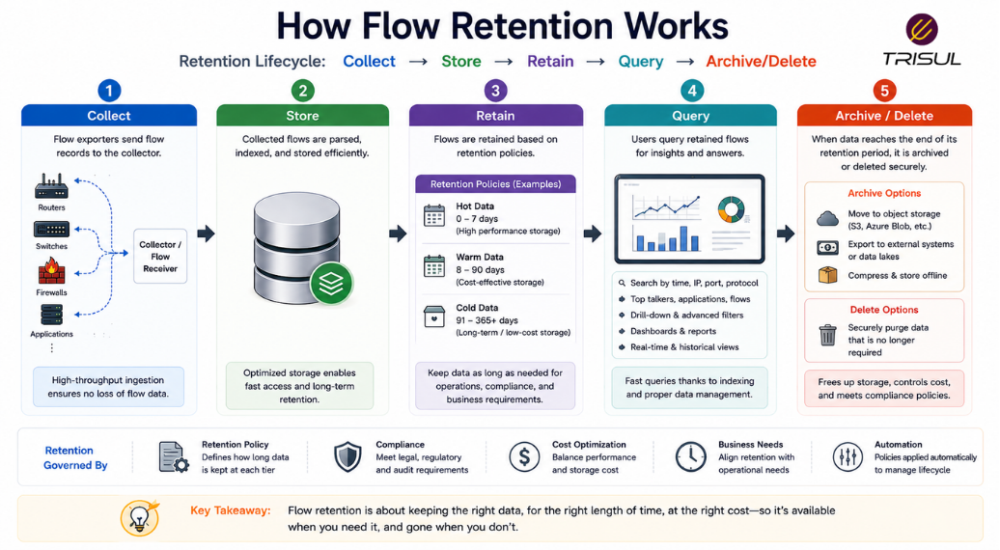
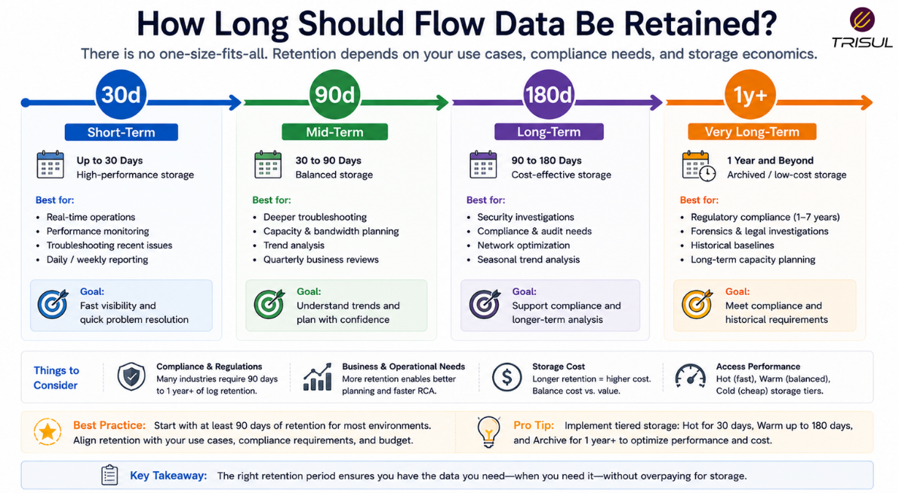

# What is Flow Retention?

Flow retention is the practice of storing network flow records for a defined period so they can be used for historical analysis, troubleshooting, capacity planning, and security investigations. It determines how long flow data remains available before it is deleted or archived.

---

## Flow Retention In Simple Terms

Flow retention is like keeping old traffic reports.

Instead of only seeing what is happening right now, retention lets you look back and answer questions like:

- What happened last week?
- When did traffic spike?
- Which host caused congestion?
- Was suspicious activity present before an incident?

Without retention, traffic history disappears. Networks forget. Humans forget too, but at least logs can be blamed.

---

## Technical Explanation

Flow retention refers to the duration flow records are preserved in storage systems.

Flow records usually contain:

- Source IP  
- Destination IP  
- Source Port  
- Destination Port  
- Protocol  
- Packet count  
- Byte count  
- Timestamps  

Retention policies determine:

- how long records are stored  
- when records are archived  
- when records are deleted  
- how storage is managed  

Longer retention improves historical visibility but increases storage requirements.

---

## How Flow Retention Works

1. Flow records are collected from exporters  
2. Records are stored in a flow storage system  
3. Retention policies are applied  
4. Older records are archived or deleted  
5. Historical queries access retained data  

This balances storage efficiency with historical visibility.

  

---

## Why Flow Retention Matters

### Historical investigations

Helps analyze past network events.

### Security forensics

Allows threat hunters to trace suspicious activity.

### Capacity planning

Supports long-term traffic trend analysis.

### Compliance requirements

Helps meet data retention policies.

### Root cause analysis

Makes it easier to investigate past incidents.

---

## Common Flow Retention Use Cases

- Incident response  
- Traffic forensics  
- Capacity planning  
- Compliance audits  
- SLA investigations  
- Trend analysis  
- ISP traffic history  
- Security investigations  

---

## How Long Should Flow Data Be Retained?

Retention depends on business needs.

Typical retention periods:

| Retention Period | Common Use Case |
|---|---|
| 7–30 days | Basic troubleshooting |
| 30–90 days | Performance analysis |
| 90–180 days | Security investigations |
| 6–12 months | Capacity planning |
| 1+ years | Compliance and historical analytics |

Longer retention improves visibility but increases storage requirements.

  

---

## Flow Retention vs Flow Storage

| Feature | Flow Retention | Flow Storage |
|---|---|---|
| Focus | How long data is kept | Where/how data is stored |
| Purpose | Historical availability | Data persistence |
| Decision type | Policy-based | Infrastructure-based |

Storage handles the data. Retention governs the lifespan.

---

## Flow Retention vs Packet Retention

| Feature | Flow Retention | Packet Retention |
|---|---|---|
| Data stored | Metadata | Full payload |
| Storage overhead | Low | High |
| Retention duration | Longer | Usually shorter |
| Scalability | High | Lower |

Flow retention scales better for long-term history.

---

## Challenges of Flow Retention

Common challenges include:

- storage growth  
- indexing performance  
- query speed  
- archival strategy  
- compliance requirements  

Retention planning must balance cost and visibility.

---

## How Trisul Handles Flow Retention

Trisul provides optimized long-term retention for NetFlow, IPFIX, and sFlow data through efficient storage and indexing.

This enables:

- Historical retro analysis  
- Long-term bandwidth trending  
- Security investigations  
- ASN traffic history  
- Capacity planning  
- Traffic forensics  

This ensures organizations can investigate traffic history over extended periods.

---

## Frequently Asked Questions

### Is flow retention the same as flow storage?

No. Storage refers to where data is stored. Retention refers to how long it is kept.

---

### How long should flow data be retained?

It depends on operational, security, and compliance needs.

---

### Is flow retention expensive?

Flow retention is much more storage-efficient than packet retention.

---

### Why is long-term flow retention useful?

It helps analyze past events, security incidents, and traffic trends.

---

