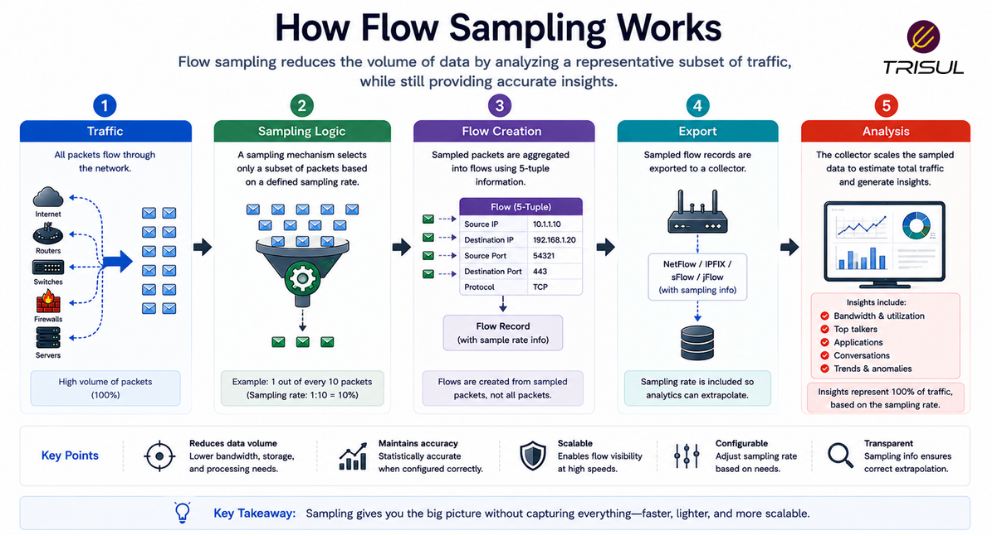

# What is Flow Sampling?

Flow sampling is the process of collecting and exporting only a subset of network traffic flows instead of every flow. It reduces processing and storage overhead while still providing useful traffic visibility, especially in high-speed or high-volume networks.

---

## Flow Sampling In Simple Terms

Flow sampling is like counting cars on a highway by checking every 100th car instead of every single one.

You do not capture everything, but you can still estimate:

- traffic volume  
- busiest applications  
- top talkers  
- traffic trends  

It trades perfect accuracy for scalability.

A deal engineers make daily, usually while muttering about budgets.

---

## Technical Explanation

In full flow monitoring, every eligible traffic flow is recorded and exported.

In flow sampling, only selected packets or flows are used to create flow records.

Sampling can be based on:

- packet intervals (for example, 1 out of 100 packets)  
- random selection  
- deterministic intervals  
- probabilistic models  

Protocols like sFlow use packet sampling by design, while some NetFlow implementations support configurable sampling.

This reduces exporter CPU usage and collector storage requirements.

---

## How Flow Sampling Works

1. Traffic passes through a network device  
2. Sampling logic selects certain packets or flows  
3. Selected traffic is grouped into flow records  
4. Flow records are exported to a collector  
5. The collector estimates traffic behavior using sampled data  

This enables scalable traffic monitoring.

  

---

## Types of Flow Sampling

### Packet Sampling

Only selected packets are analyzed.

Example:

1 packet out of every 100 packets.

---

### Flow Sampling

Only selected flows are exported.

Example:

1 flow out of every 50 flows.

---

### Random Sampling

Traffic is selected randomly.

---

### Deterministic Sampling

Traffic is selected at fixed intervals.

---

## Why Flow Sampling Matters

### Improves scalability

Makes monitoring practical in high-speed networks.

### Reduces exporter load

Lowers CPU and memory usage.

### Reduces storage requirements

Stores fewer flow records.

### Enables visibility in large environments

Useful for ISPs and data centers.

### Improves monitoring efficiency

Balances overhead and visibility.

---

## Common Flow Sampling Use Cases

- ISP backbone monitoring  
- Data center traffic monitoring  
- High-speed WAN links  
- Large enterprise traffic analysis  
- DDoS detection  
- Capacity planning  
- Traffic engineering  

---

## Flow Sampling vs Full Flow Capture

| Feature | Flow Sampling | Full Flow Capture |
|---|---|---|
| Data volume | Reduced | Full volume |
| Accuracy | Estimated | Exact |
| Storage overhead | Low | High |
| Scalability | High | Lower |
| Exporter load | Lower | Higher |

Flow sampling improves efficiency but reduces precision.

---

## Flow Sampling vs Packet Sampling

| Feature | Flow Sampling | Packet Sampling |
|---|---|---|
| Unit sampled | Flow records | Packets |
| Analytics type | Traffic summaries | Packet-level data |
| Storage overhead | Lower | Higher |

Both reduce data volume, but operate differently.

---

## Challenges of Flow Sampling

### Reduced accuracy

Small flows may be missed.

### Visibility gaps

Low-volume traffic can disappear.

### Security blind spots

Some threats may not appear in sampled data.

### Estimation complexity

Traffic estimates require interpretation.

Sampling is efficient, but imperfect. Like polling humans.

---

## How Trisul Handles Sampled Flow Data

Trisul ingests sampled flow data from protocols such as sFlow and sampled NetFlow and converts it into traffic analytics.

This enables:

- Top-K traffic analytics  
- Bandwidth trend analysis  
- Application visibility  
- ASN analytics  
- DDoS detection  
- Historical traffic investigation  

This provides scalable visibility even in very high-throughput environments.

---

## Frequently Asked Questions

### Is flow sampling accurate?

It is statistically useful but less accurate than full flow capture.

---

### Does sFlow use sampling?

Yes. sFlow is based on packet sampling.

---

### Can NetFlow use sampling?

Yes. Some NetFlow exporters support configurable sampling.

---

### Is flow sampling useful for DDoS detection?

Yes. It can detect large-scale traffic spikes, though fine details may be less precise.

---

