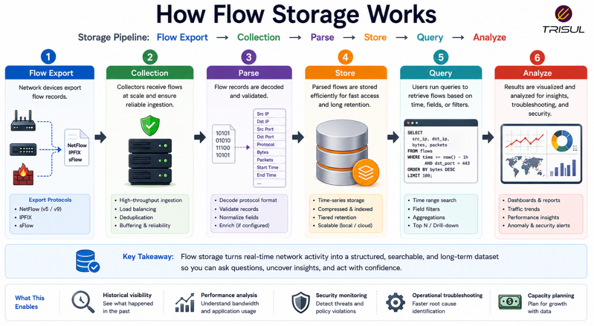
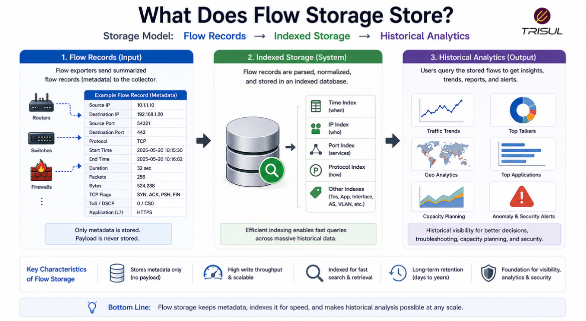

# What is Flow Storage?

Flow storage is the process of storing network flow records for real-time analysis, historical reporting, troubleshooting, and security investigations. It allows organizations to retain traffic metadata over time without the high storage costs of full packet capture.

---

## Flow Storage In Simple Terms

Flow storage is like keeping traffic records in a filing system.

Instead of saving every packet, it stores summarized traffic information such as:

- who communicated  
- where traffic went  
- how much data moved  
- how long communication lasted  

This makes it possible to investigate past network activity without storing massive packet captures.

Memory for networks, basically. Less emotional baggage, more timestamps.

---

## Technical Explanation

When network devices export flow records, a flow collector receives and stores them in a database or time-series storage system.

Stored flow records usually include:

- Source IP  
- Destination IP  
- Source Port  
- Destination Port  
- Protocol  
- Packet count  
- Byte count  
- Start time  
- End time  

Flow storage systems optimize for:

- high ingestion rates  
- efficient indexing  
- long-term retention  
- fast querying  
- traffic aggregation  

This enables scalable traffic analytics.
---This enables both live 
and retrospective analysis.

## How Flow Storage 
1. Network devices export flow records  
2. A flow collector receives thWorks
e records  
3. Records are parsed and normalized  
4. Metadata is indexed and stored  
5. Queries retrieve historical traffic data  
6. Analytics platforms visualize stored data    

  

---

## What Does Flow Storage Store?

Flow storage typically stores:

| Data Type | Description |
|---|---|
| Flow Records | Traffic summaries |
| Packet Counts | Packets per flow |
| Byte Counts | Data volume per flow |
| Timestamps | Flow timing data |
| Protocol Data | Traffic protocol information |
| Interface Data | Traffic by interface |
| ASN Data | Traffic by autonomous system |
| Application Data | Traffic classification |

This creates searchable traffic history.

  

---

## Why Flow Storage Matters

### Historical investigations

Allows teams to analyze past traffic activity.

### Long-term retention

Stores traffic summaries for extended periods.

### Lower storage costs

Uses less storage than packet capture.

### Faster troubleshooting

Enables retrospective traffic analysis.

### Better security visibility

Supports incident investigation and threat hunting.

---

## Common Flow Storage Use Cases

- Historical traffic analysis  
- Security investigations  
- Capacity planning  
- Traffic forensics  
- Compliance reporting  
- Bandwidth trend analysis  
- ISP peering analytics  
- SLA investigations  

---

## Flow Storage vs Packet Storage

| Feature | Flow Storage | Packet Storage |
|---|---|---|
| Data stored | Metadata | Full payload |
| Storage overhead | Low | High |
| Retention period | Long-term | Short-term |
| Scalability | High | Moderate |
| Investigation depth | Traffic-level | Packet-level |

Flow storage is optimized for long-term scalability.

---

## Flow Storage vs Log Storage

| Feature | Flow Storage | Log Storage |
|---|---|---|
| Focus | Traffic behavior | System events |
| Data type | Network metadata | Event messages |
| Analysis type | Traffic analytics | Event correlation |

Flow storage focuses on network communication history.

---

## Key Requirements for Flow Storage

A good flow storage system should provide:

- High write performance  
- Fast indexing  
- Efficient compression  
- Long-term retention  
- Fast historical queries  
- Scalable architecture  
- Multi-tenant support  
- Data aggregation  

These capabilities determine storage efficiency.

---

## How Trisul Handles Flow Storage

Trisul stores NetFlow, IPFIX, and sFlow records in an optimized analytics engine designed for high-speed ingestion and long-term retention.

This enables:

- Historical retro analysis  
- Top-K analytics  
- ASN analytics  
- DDoS investigations  
- Traffic forensics  
- Long-term bandwidth trending  

This turns stored flow data into actionable operational intelligence.

---

## Frequently Asked Questions

### Does flow storage store packet payloads?

No. It stores metadata only.

---

### Is flow storage more efficient than packet storage?

Yes. Flow records are much smaller than full packet captures.

---

### How long can flow data be stored?

Retention depends on storage capacity and policy, but flow storage is designed for long-term retention.

---

### Is flow storage useful for security investigations?

Yes. Historical flow data is valuable for incident response and traffic investigations.

---

