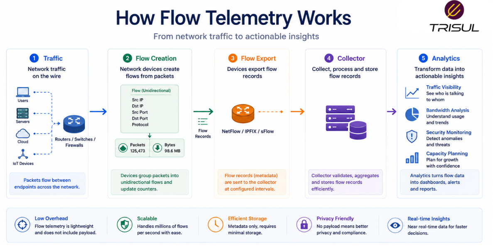
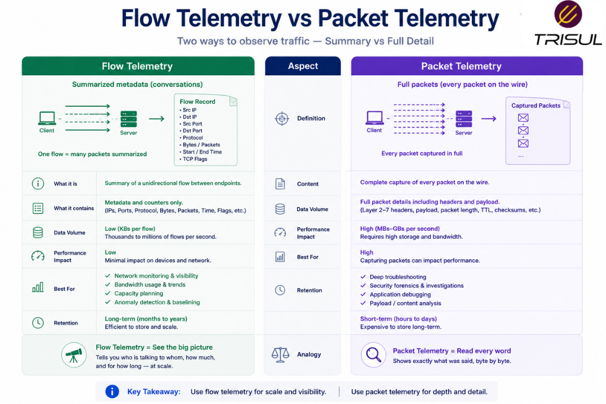
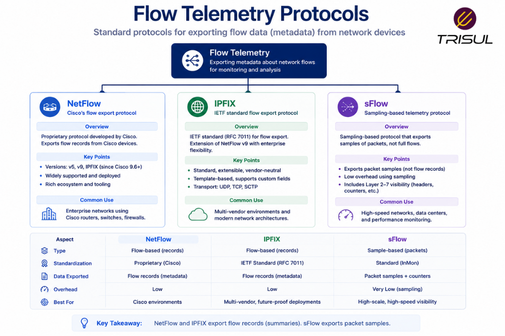

# What is Flow Telemetry?

Flow telemetry is the process of collecting summarized metadata about network traffic flows from devices such as routers, switches, and firewalls. It provides visibility into traffic patterns, bandwidth usage, application activity, and communication behavior without capturing full packet payloads.

---

## Flow Telemetry In Simple Terms

Flow telemetry is like traffic reporting for your network.

Instead of recording every vehicle in detail, it tracks:

- where traffic started  
- where it went  
- how much moved  
- how long it lasted  

It tells you how traffic behaves, not what the traffic contains.

This makes it efficient for monitoring large networks without massive storage overhead.

---

## Technical Explanation

Flow telemetry works by exporting flow records from network devices to a collector.

A flow record summarizes a communication stream based on shared attributes such as:

- Source IP  
- Destination IP  
- Source Port  
- Destination Port  
- Protocol  

This flow metadata is exported using protocols such as [NetFlow, IPFIX, sFlow, J-Flow, and NetStream](/flow-protocols)  

Collectors process this data for analytics, alerting, and investigation.

---

## How Flow Telemetry Works

1. Traffic passes through a network device  
2. Packets are grouped into flows  
3. Flow metadata is generated  
4. Flow records are exported to a collector  
5. The collector analyzes and stores telemetry data  
6. Dashboards and alerts provide visibility  

This enables both live and historical traffic analysis.

  

---

## What Data Does Flow Telemetry Capture?

Flow telemetry typically captures:

| Field | Description |
|---|---|
| Source IP | Sender address |
| Destination IP | Receiver address |
| Source Port | Sending application port |
| Destination Port | Receiving application port |
| Protocol | Communication protocol |
| Packets | Number of packets |
| Bytes | Amount of data transferred |
| Start Time | Flow start time |
| End Time | Flow end time |
| Interface | Traffic interface |

Some implementations also include:

- AS numbers  
- VLAN IDs  
- Application IDs  
- QoS values  

---

## Why Flow Telemetry Matters

### Scalable traffic visibility

Provides traffic insights without packet payload storage.

### Lower storage costs

Flow data is much smaller than packet captures.

### Better troubleshooting

Helps identify bottlenecks and unusual traffic patterns.

### Security visibility

Supports anomaly detection and attack investigation.

### Historical traffic intelligence

Allows long-term traffic retention and analysis.

---

## Common Flow Telemetry Use Cases

- Bandwidth monitoring  
- Application traffic analysis  
- Security monitoring  
- DDoS detection  
- Traffic engineering  
- ISP peering analytics  
- Capacity planning  
- Historical investigations  

---

## Flow Telemetry vs Packet Telemetry

| Feature | Flow Telemetry | Packet Telemetry |
|---|---|---|
| Data type | Metadata | Full payload |
| Storage overhead | Low | High |
| Scalability | High | Moderate |
| Visibility depth | Traffic-level | Packet-level |
| Retention | Long-term | Limited |

Flow telemetry provides scalable traffic visibility, while packet telemetry provides deeper inspection.

  

---

## Flow Telemetry vs SNMP Monitoring

| Feature | Flow Telemetry | SNMP Monitoring |
|---|---|---|
| Traffic attribution | Strong | Weak |
| Application visibility | Yes | No |
| Traffic direction | Detailed | Limited |
| Conversation visibility | Yes | No |

Flow telemetry offers deeper traffic intelligence than traditional interface monitoring.

---

## Flow Telemetry Protocols

Common flow telemetry protocols include:

### NetFlow

Widely used flow export protocol developed by Cisco.

### IPFIX

Standardized flow export protocol with flexible templates.

### sFlow

Sampling-based telemetry protocol for scalable monitoring.

Each protocol exports traffic summaries for analytics.

  

---

## How Trisul Uses Flow Telemetry

Trisul ingests flow telemetry from NetFlow, IPFIX, and sFlow exporters and converts it into structured analytics.

This enables:

- Top-K analytics  
- Application visibility  
- ASN analytics  
- Historical traffic investigation  
- DDoS detection  
- Threshold anomaly detection  

This transforms raw telemetry into actionable network intelligence.

---

## Frequently Asked Questions

### Is flow telemetry the same as NetFlow?

No. NetFlow is one protocol used to generate flow telemetry.

---

### Does flow telemetry capture packet contents?

No. It captures metadata only.

---

### Is flow telemetry useful for security?

Yes. It helps detect anomalies, attacks, and suspicious traffic patterns.

---

### Can flow telemetry scale for ISPs?

Yes. It is widely used by enterprises and service providers because of its low storage overhead.

---

