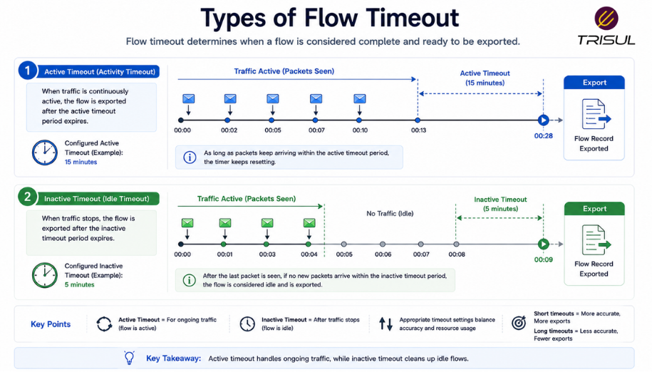
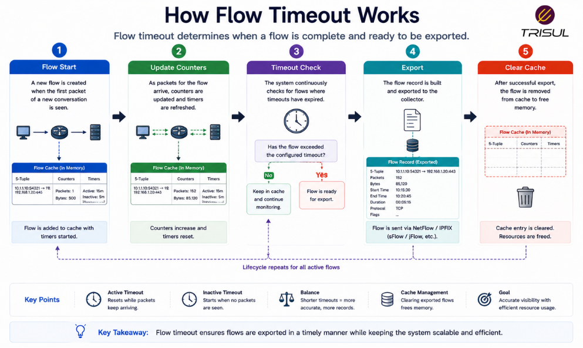
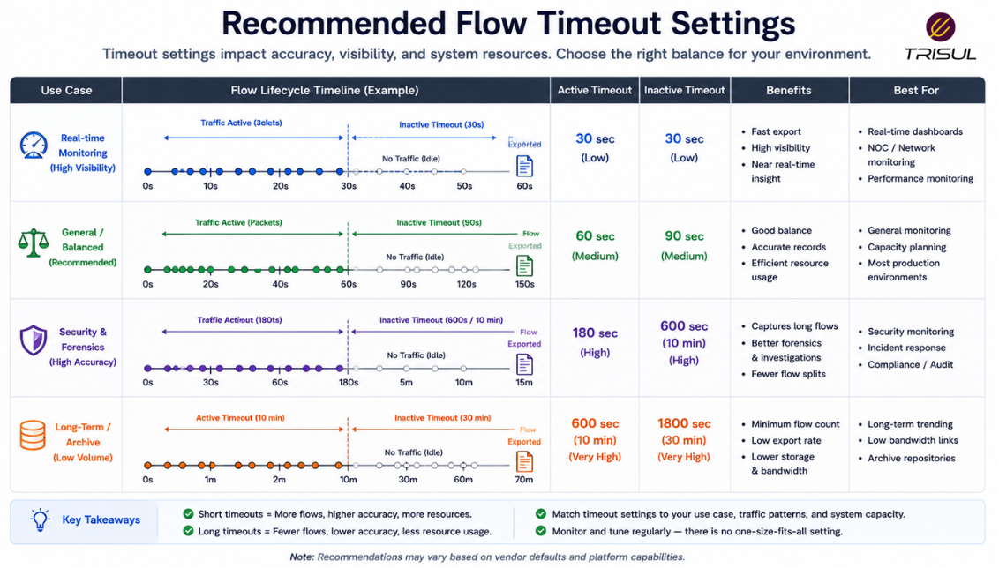

# What is Flow Timeout?

Flow timeout is the period after which a network device exports a flow record, either because the flow has ended or because it has remained active or idle for a configured amount of time. It helps manage flow cache resources and ensures timely traffic visibility.

---

## Flow Timeout In Simple Terms

Flow timeout is like deciding when to close a tab on a browser.

If activity stops for a while, you close it.

If it stays open too long, you may still close and summarize it.

That is how flow timeout works.

It tells a network device when to stop tracking a flow and export its record.

Without timeouts, some flows could remain open indefinitely. Much like browser tabs and human denial.

---

## Technical Explanation

Network devices maintain active flows in a flow cache.

A flow record is exported when:

- the communication session ends  
- the flow becomes inactive  
- the active timeout limit is reached  

There are two main timeout types:

- **Active Timeout**  
- **Inactive Timeout**  

These timeouts determine when flow metadata is exported to a collector.

Proper timeout settings affect:

- visibility freshness  
- storage volume  
- analytics granularity  
- exporter performance  

---

## Types of Flow Timeout

### Active Timeout

An active timeout forces long-running flows to be exported periodically, even if traffic is still ongoing.

Example:

A flow lasting 30 minutes with a 5-minute active timeout will be exported every 5 minutes.

This improves visibility into long-lived traffic.

  

---

### Inactive Timeout

An inactive timeout closes and exports a flow if no packets are seen for a configured period.

Example:

If no traffic is seen for 30 seconds, the flow is exported.

This cleans up idle flows.

---

## How Flow Timeout Works

1. Traffic creates a flow entry  
2. The flow remains in the device cache  
3. Activity updates flow counters  
4. Timeout conditions are checked  
5. Flow is exported when timeout occurs  
6. Cache resources are freed  

This keeps flow tracking efficient.

  

---

## Why Flow Timeout Matters

### Improves visibility freshness

Exports flow data faster for analysis.

### Controls cache usage

Prevents flow tables from growing indefinitely.

### Improves analytics granularity

Allows better visibility into long-running sessions.

### Supports real-time monitoring

Helps keep traffic dashboards updated.

### Reduces resource exhaustion

Prevents stale flow entries.

---

## Common Flow Timeout Use Cases

- NetFlow exports  
- IPFIX exports  
- Long-lived TCP sessions  
- Streaming traffic monitoring  
- VPN session monitoring  
- ISP traffic analysis  
- Security investigations  

---

## Active Timeout vs Inactive Timeout

| Feature | Active Timeout | Inactive Timeout |
|---|---|---|
| Trigger | Time-based while active | Idle-based |
| Use case | Long-lived flows | Idle flows |
| Export frequency | Periodic | Event-driven |

Both work together to manage flow lifecycle.

---

## Flow Timeout vs Session Timeout

| Feature | Flow Timeout | Session Timeout |
|---|---|---|
| Purpose | Export flow records | Close communication sessions |
| Scope | Monitoring layer | Connection layer |
| Focus | Metadata export | Connection management |

Flow timeout controls monitoring visibility, not application sessions.

---

## Recommended Flow Timeout Settings

Typical settings:

| Timeout Type | Common Range |
|---|---|
| Active Timeout | 1–5 minutes |
| Inactive Timeout | 15–60 seconds |

Settings depend on traffic type and visibility requirements.

Shorter timeouts improve freshness but increase export volume.

Longer timeouts reduce overhead but delay visibility.

Engineering, as always, is choosing which inconvenience you prefer.

  

---

## How Trisul Uses Flow Timeout Data

Trisul processes flow records exported based on active and inactive timeout policies to provide real-time and historical analytics.

This enables:

- Live traffic visibility  
- Historical traffic investigation  
- Top-K analytics  
- DDoS detection  
- Traffic trend analysis  
- Application monitoring  

This ensures accurate traffic insights across different flow lifecycles.

---

## Frequently Asked Questions

### What is active timeout in NetFlow?

Active timeout forces periodic export of long-running flows.

---

### What is inactive timeout in NetFlow?

Inactive timeout exports a flow after it becomes idle for a configured period.

---

### Does shorter timeout improve visibility?

Yes. It provides fresher traffic data but increases export volume.

---

### Can timeout settings affect storage?

Yes. Shorter timeouts generate more flow records, increasing storage requirements.

---

