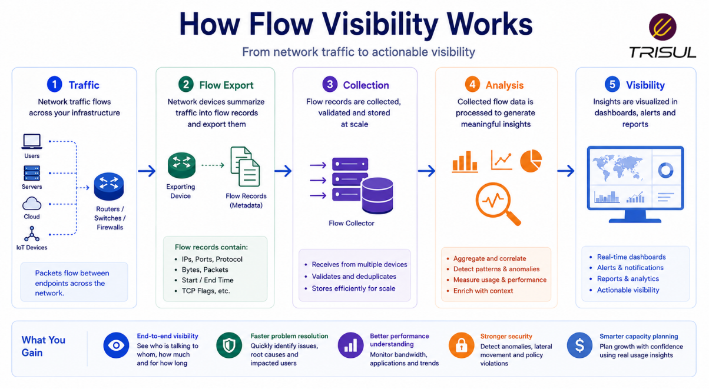
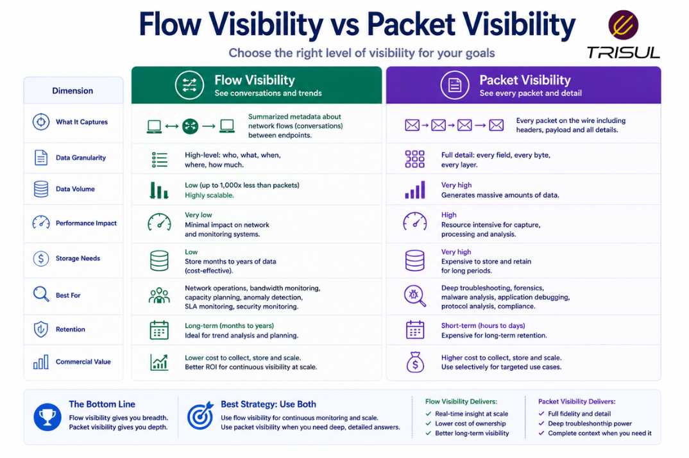

# What is Flow Visibility?

Flow visibility is the ability to observe, analyze, and understand network traffic behavior using flow data exported by network devices. It provides insights into who is communicating, how much data is being transferred, which applications are active, and where traffic is flowing across the network.

---

## Flow Visibility In Simple Terms

Flow visibility is like having traffic cameras for your network.

You can see:

- who is sending data  
- who is receiving data  
- how much data is moving  
- which applications are generating traffic  
- where traffic bottlenecks exist  

You do not inspect the contents of the traffic, but you can clearly see the movement and patterns.

That’s usually enough to find trouble. Like hearing glass break in the next room. You may not know which vase, but you know something went wrong.

---

## Technical Explanation

Flow visibility is achieved by collecting and analyzing flow telemetry from network devices.

Traffic is summarized into flow records based on attributes such as:

- Source IP  
- Destination IP  
- Source Port  
- Destination Port  
- Protocol  

These flow records are exported via:

- NetFlow  
- IPFIX  
- sFlow  

Flow visibility tools process this data to generate:

- traffic analytics  
- bandwidth reports  
- application visibility  
- anomaly detection  
- historical investigations  

---

## How Flow Visibility Works

1. Network devices observe live traffic  
2. Packets are grouped into flows  
3. Flow records are generated  
4. Flow data is exported to a collector  
5. Analytics platforms process the records  
6. Dashboards visualize traffic behavior  

This enables real-time and historical network visibility.

  

---

## What Can Flow Visibility Show?

Flow visibility can show:

| Insight | Description |
|---|---|
| Top Talkers | Highest bandwidth users |
| Top Applications | Most active applications |
| Traffic Direction | Inbound and outbound traffic |
| Top Conversations | Communication between endpoints |
| Protocol Usage | TCP, UDP, ICMP distribution |
| Interface Utilization | Traffic by interface |
| Traffic Trends | Historical usage patterns |
| ASN Traffic | Traffic by autonomous system |

  

---

## Why Flow Visibility Matters

### Improves network observability

Provides clear traffic-level visibility across the network.

### Speeds up troubleshooting

Helps identify where traffic problems occur.

### Detects anomalies faster

Reveals unusual spikes and suspicious behavior.

### Optimizes bandwidth usage

Shows who and what consumes bandwidth.

### Supports security monitoring

Improves threat detection and investigation.

---

## Common Flow Visibility Use Cases

- Bandwidth monitoring  
- Application visibility  
- Traffic troubleshooting  
- DDoS detection  
- Security investigations  
- ISP peering analytics  
- Capacity planning  
- User behavior analysis  

---

## Flow Visibility vs Packet Visibility

| Feature | Flow Visibility | Packet Visibility |
|---|---|---|
| Payload visibility | No | Yes |
| Storage overhead | Low | High |
| Scalability | High | Moderate |
| Historical retention | Long-term | Limited |
| Investigation depth | Traffic-level | Deep-level |

Flow visibility provides broad traffic intelligence, while packet visibility provides deeper packet inspection.

  

---

## Flow Visibility vs SNMP Monitoring

| Feature | Flow Visibility | SNMP Monitoring |
|---|---|---|
| Application visibility | Yes | No |
| Traffic attribution | Strong | Weak |
| Conversation analysis | Yes | No |
| Traffic behavior | Detailed | Limited |

Flow visibility provides deeper operational context than interface monitoring.

---

## Key Benefits of Flow Visibility

- Faster root cause analysis  
- Better traffic attribution  
- Lower monitoring overhead  
- Long-term traffic retention  
- Better anomaly detection  
- Improved capacity planning  

These benefits make flow visibility essential for modern network operations.

---

## How Trisul Delivers Flow Visibility

Trisul delivers flow visibility by ingesting NetFlow, IPFIX, and sFlow records and converting them into structured analytics.

This provides:

- Top-K traffic analytics  
- Application traffic insights  
- ASN visibility  
- Historical traffic investigation  
- Threshold-based anomaly detection  
- DDoS analytics  

This enables deep traffic visibility at scale.

---

## Frequently Asked Questions

### Is flow visibility the same as packet inspection?

No. Flow visibility uses summarized metadata, while packet inspection analyzes full packet payloads.

---

### Does flow visibility scale for large networks?

Yes. Flow-based monitoring scales efficiently because flow records are compact.

---

### Can flow visibility help detect security threats?

Yes. It helps detect anomalies, scans, and traffic spikes.

---

### Is flow visibility useful for ISPs?

Yes. ISPs use flow visibility for peering analytics, traffic engineering, and customer traffic monitoring.

---
