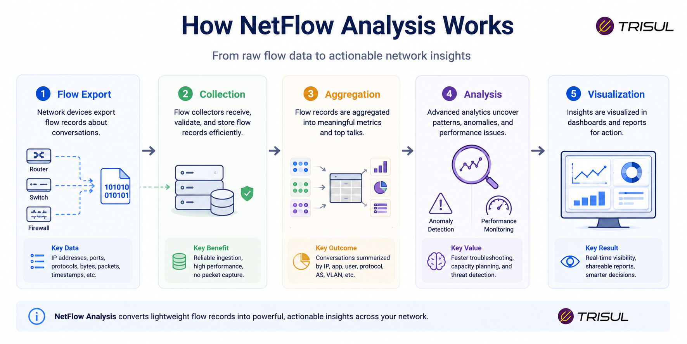
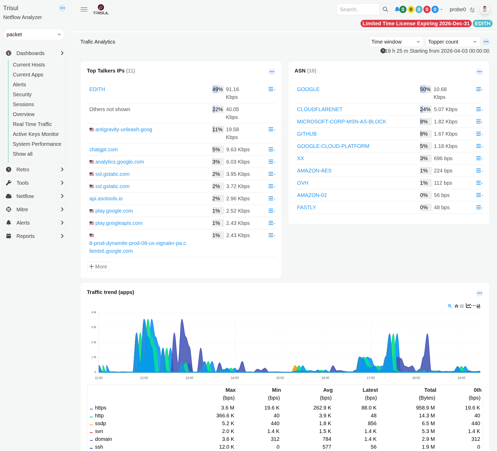
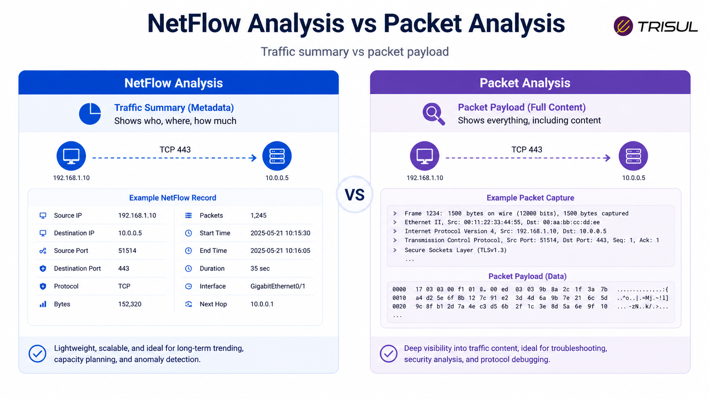

# What is NetFlow Analysis?

NetFlow Analysis is the process of collecting, examining, and interpreting network [flow records](/glossary/flow-record) to understand traffic behavior, bandwidth usage, application activity, and communication patterns across a network. It helps teams monitor performance, troubleshoot issues, detect anomalies, and improve network visibility.

---

## NetFlow Analysis In Simple Terms

NetFlow Analysis is like reading your network’s traffic diary.

Instead of looking at every packet individually, it studies summarized traffic records to understand:

- who is talking  
- who they are talking to  
- how much data is being transferred  
- how often communication happens  

Think of it like analyzing phone bills instead of listening to every call.

You still learn who called whom, for how long, and how often.

---

## Technical Explanation

NetFlow Analysis works by processing exported flow records from network devices.

A flow record typically contains:

- Source IP  
- Destination IP  
- Source Port  
- Destination Port  
- Protocol  
- Bytes  
- Packets  
- Start Time  
- End Time  

By aggregating and analyzing these records, organizations can identify:

- traffic distribution  
- application usage  
- user behavior  
- congestion points  
- abnormal traffic patterns  

This enables both real-time monitoring and historical investigation.

---

## How NetFlow Analysis Works

1. Network devices generate flow records  
2. Flow records are exported to a collector  
3. The analyzer aggregates traffic data  
4. Traffic is categorized by application, host, protocol, or interface  
5. Reports and dashboards visualize patterns  
6. Alerts identify anomalies or threshold violations  

This converts raw traffic metadata into operational intelligence.

  

---

## What Can NetFlow Analysis Reveal?

NetFlow Analysis can reveal:

| Insight | Description |
|---|---|
| Top Talkers | Highest bandwidth-consuming hosts |
| Top Applications | Most active applications |
| Top Conversations | Most active communication pairs |
| Traffic Direction | Inbound vs outbound traffic |
| Interface Utilization | Per-interface traffic usage |
| Traffic Spikes | Unusual bursts of traffic |
| Protocol Distribution | TCP, UDP, ICMP usage |
| Historical Trends | Traffic behavior over time |

  
---

## Why NetFlow Analysis Matters

- ### Improves network visibility

Provides a clear picture of traffic behavior.

- ### Helps troubleshoot faster

Pinpoints performance bottlenecks quickly.

- ### Detects anomalies

Identifies unusual traffic spikes and suspicious patterns.

- ### Supports security investigations

Helps analyze scans, DDoS events, and lateral movement.

- ### Optimizes bandwidth usage

Identifies inefficient or excessive traffic consumption.

---

## Common NetFlow Analysis Use Cases

- Bandwidth monitoring  
- Application traffic analysis  
- DDoS detection  
- ISP peering analytics  
- Traffic engineering  
- Security investigations  
- Capacity planning  
- SLA monitoring  

---

## NetFlow Analysis vs Packet Analysis

| Feature | NetFlow Analysis | Packet Analysis |
|---|---|---|
| Data type | Metadata | Full payload |
| Storage overhead | Low | High |
| Scalability | High | Moderate |
| Privacy impact | Lower | Higher |
| Investigation depth | Traffic-level | Packet-level |

NetFlow Analysis is optimized for scale and operational visibility, while packet analysis provides deeper inspection.

  

---

## NetFlow Analysis vs Traffic Monitoring

| Feature | NetFlow Analysis | Traditional Traffic Monitoring |
|---|---|---|
| Visibility depth | High | Basic |
| Application awareness | Yes | Limited |
| Historical analysis | Strong | Limited |
| Traffic attribution | Strong | Weak |

NetFlow Analysis provides richer context than basic SNMP or interface-based monitoring.

---

## Key Metrics in NetFlow Analysis

Important metrics include:

- total bytes transferred  
- packet count  
- flow count  
- bandwidth utilization  
- packets per second (PPS)  
- bits per second (BPS)  
- top talkers  
- top applications  
- protocol distribution  

These metrics help quantify network behavior.

---

## How Trisul Performs NetFlow Analysis

Trisul Network Analytics performs high-speed NetFlow Analysis by processing NetFlow, IPFIX, and sFlow records into structured analytics.

It provides:

- Top-K analytics  
- Threshold Bands  
- Flow Stitching  
- Historical Retro Analysis  
- ASN Analytics  
- DDoS Detection  
- Multi-dimensional traffic analysis  

This allows teams to analyze network behavior in real time and over historical periods.

---

## Frequently Asked Questions

1) ### Is NetFlow Analysis the same as NetFlow?

No. NetFlow is the protocol. NetFlow Analysis is the process of analyzing the flow data exported by NetFlow.

---

2) ### Does NetFlow Analysis inspect packet contents?

No. It analyzes flow metadata, not packet payloads.

---

3) ### Can NetFlow Analysis detect security threats?

Yes. It can identify suspicious traffic behavior, scans, and DDoS patterns.

---

4) ### Is NetFlow Analysis useful for ISPs?

Yes. ISPs use NetFlow Analysis for peering analytics, customer traffic monitoring, and capacity planning.

---
