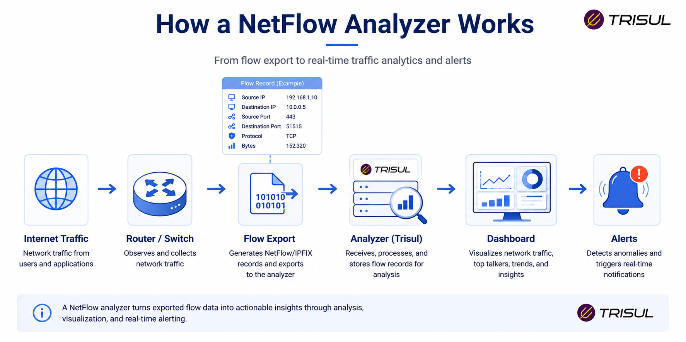
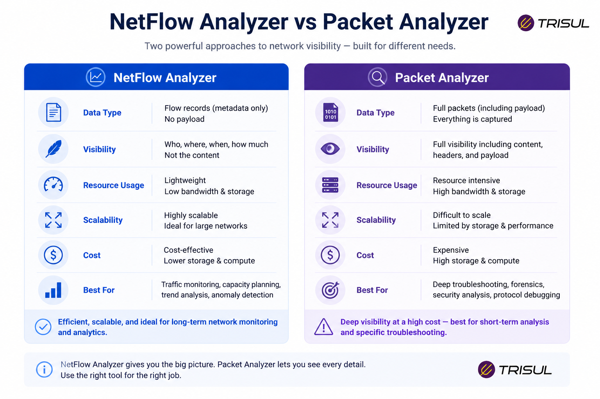

# What is a NetFlow Analyzer?

A NetFlow Analyzer is a network monitoring tool that collects, processes, and analyzes flow records exported by network devices such as routers, switches, and firewalls. It provides visibility into bandwidth usage, traffic patterns, applications, top talkers, and network anomalies without requiring full packet capture.

---

## NetFlow Analyzer In Simple Terms

Think of a NetFlow Analyzer as the dashboard for your network traffic.

If NetFlow records are the raw data, the analyzer is what turns that data into useful insights.

Instead of reading thousands of flow records manually, a NetFlow Analyzer helps you answer questions like:

- Who is using the most bandwidth?
- Which application is consuming traffic?
- Where is traffic going?
- Is there abnormal behavior?

It transforms raw network flow logs into readable charts, alerts, and reports.

---

## Technical Explanation

A NetFlow Analyzer receives flow records from flow-exporting devices and processes them into structured analytics.

It typically performs:

- Flow parsing  
- Traffic aggregation  
- Application classification  
- Historical storage  
- Real-time analytics  
- Threshold-based alerting  

Most analyzers support multiple flow technologies such as [NetFlow, IPFIX, sFlow, J-Flow, and NetStream](/flow-protocols)  

The analyzer builds indexed datasets for reporting and forensic analysis.

---

## How a NetFlow Analyzer Works

1. Network devices export flow records  
2. The analyzer collects and stores the flow data  
3. Traffic is classified by IP, port, protocol, and application  
4. Data is visualized in dashboards and reports  
5. Alerts are generated when anomalies are detected  

This allows network teams to monitor live and historical traffic patterns.

  

---

## What Does a NetFlow Analyzer Show?

A NetFlow Analyzer can show:

| Metric | Description |
|---|---|
| Top Talkers | Highest bandwidth-consuming hosts |
| Top Applications | Most active applications |
| Top Conversations | Communication between endpoints |
| Traffic Volume | Total bytes and packets |
| Protocol Usage | TCP, UDP, ICMP breakdown |
| Interface Utilization | Per-interface traffic analysis |
| ASN Analytics | Traffic by autonomous systems |
| Historical Trends | Long-term traffic patterns |

  

---

## Why Use a NetFlow Analyzer?

A NetFlow Analyzer helps organizations:

- ### Monitor bandwidth usage

Find out where bandwidth is being consumed.

- ### Troubleshoot performance issues

Identify congestion and abnormal traffic behavior.

- ### Improve security visibility

Detect scans, DDoS attacks, and suspicious traffic patterns.

- ### Plan network capacity

Track growth and forecast infrastructure needs.

- ### Reduce troubleshooting time

Quickly isolate traffic issues.

---

## Common NetFlow Analyzer Use Cases

- Bandwidth monitoring  
- Application traffic analysis  
- ISP traffic analytics  
- DDoS detection  
- Top talker identification  
- WAN troubleshooting  
- Peering analysis  
- Capacity planning  

---

## NetFlow Analyzer vs Packet Analyzer

| Feature | NetFlow Analyzer | Packet Analyzer |
|---|---|---|
| Payload inspection | No | Yes |
| Storage usage | Low | High |
| Scalability | High | Moderate |
| Historical retention | Long-term | Short-term |
| Traffic visibility | High-level | Deep-level |

A NetFlow Analyzer provides scalable traffic visibility, while packet analyzers provide detailed payload inspection.

  

---

## Features to Look for in a NetFlow Analyzer

When evaluating a NetFlow Analyzer, look for:

- Multi-vendor flow support  
- Real-time dashboards  
- Historical reporting  
- Top talker analysis  
- Threshold alerts  
- DDoS detection  
- ASN analytics  
- Multi-tenancy  
- Traffic investigation tools  
- API integration  

Not every analyzer offers all of these.

---

## How Trisul Works as a NetFlow Analyzer

Trisul Network Analytics functions as a high-performance NetFlow Analyzer by ingesting NetFlow, IPFIX, and sFlow records at scale.

It provides:

- Top-K analytics  
- Threshold bands for anomaly detection  
- Flow stitching  
- ASN analytics  
- Historical retro analysis  
- DDoS visibility  
- Multi-tenant flow analytics  

This allows enterprises and service providers to convert raw flow telemetry into actionable operational intelligence.

---

## Frequently Asked Questions

1) ### Is a NetFlow Analyzer the same as NetFlow?

No. NetFlow is the protocol that exports flow records. A NetFlow Analyzer is the tool that analyzes those records.

---

2) ### Can a NetFlow Analyzer detect DDoS attacks?

Yes. It can identify traffic spikes, attack patterns, and abnormal flow behavior.

---

3) ### Does a NetFlow Analyzer capture packet contents?

No. It analyzes metadata only, not full packet payloads.

---

4) ### Which devices can send data to a NetFlow Analyzer?

Routers, switches, firewalls, and other devices that support NetFlow, IPFIX, or sFlow.

---
