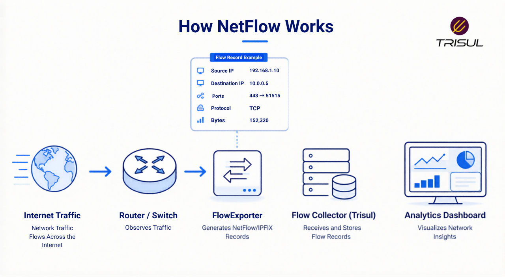
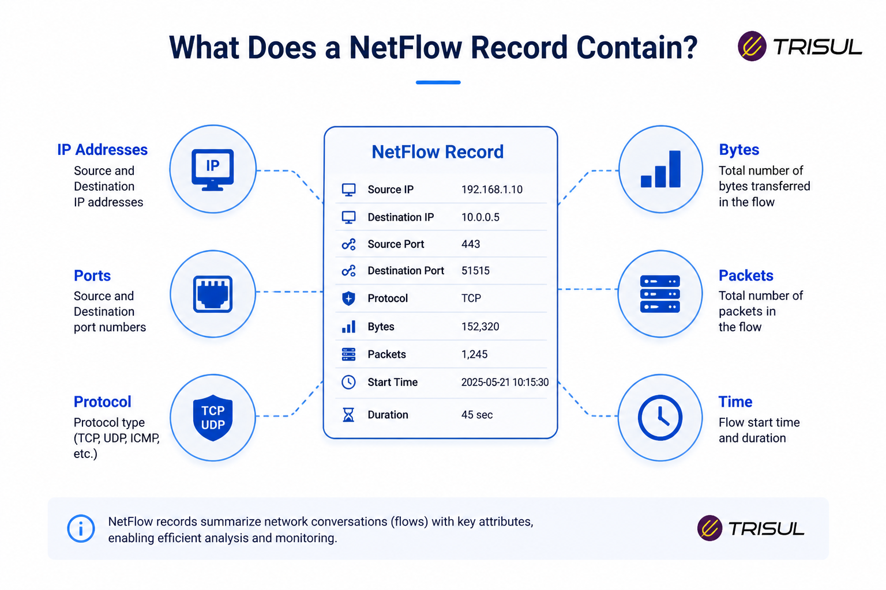
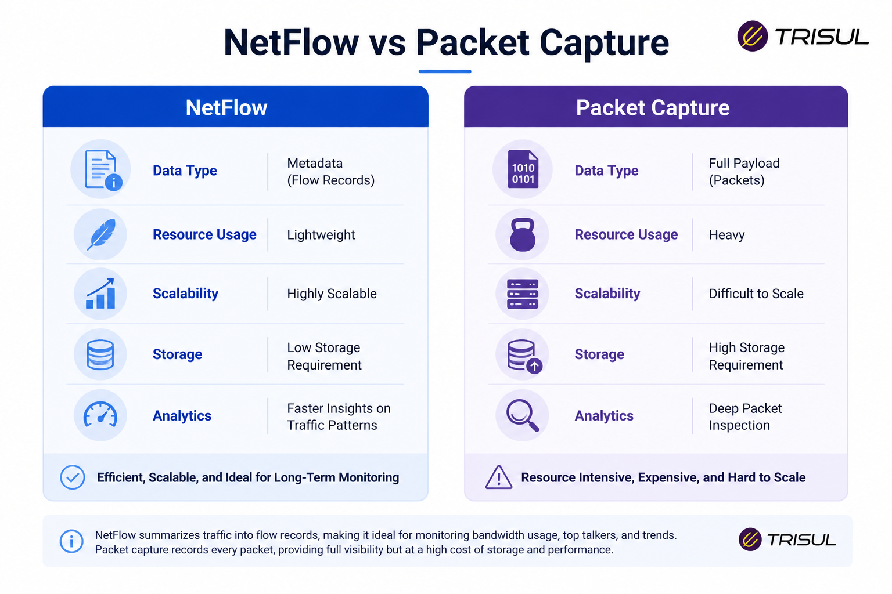

# What is NetFlow?

NetFlow is a network flow monitoring protocol developed by Cisco Systems that exports metadata about IP traffic flows from network devices such as routers, switches, and firewalls. It helps network teams monitor bandwidth usage, analyze traffic behavior, identify top talkers, detect anomalies, and troubleshoot performance issues without capturing full packet payloads.

---

## NetFlow In Simple Terms

Think of NetFlow like a call log for your network.

It doesn’t record the conversation itself, but it records:
- who communicated  
- when the communication started  
- how long it lasted  
- how much data was exchanged  

For example:

If a user downloads a large file, NetFlow won’t show the file contents, but it will show:
- who downloaded it  
- where it came from  
- how much data was transferred  
- how long the transfer lasted  

---

## Technical Explanation

NetFlow works by aggregating packets into flows.

A flow is a unidirectional stream of packets sharing common attributes, typically identified by:

- Source IP address  
- Destination IP address  
- Source port  
- Destination port  
- Protocol type  

These attributes are commonly called the **5-tuple**.

When traffic matches these parameters, the device creates a flow record and exports it to a flow collector for analysis.

---

## How NetFlow Works

1. Traffic passes through a network device (router, switch, or firewall)  
2. The device groups packets into flows  
3. Flow records are created  
4. Records are exported to a collector (via UDP)  
5. The collector analyzes and visualizes the data  

    

---

## What Does a NetFlow Record Contain?

| Field | Description |
|------|------------|
| Source IP | Sender IP address |
| Destination IP | Receiver IP address |
| Source Port | Sending application port |
| Destination Port | Receiving application port |
| Protocol | TCP, UDP, ICMP |
| Bytes | Total data transferred |
| Packets | Total packet count |
| Start Time | Flow start timestamp |
| End Time | Flow end timestamp |
| Interface | Input/output interface |

    

---

## Why NetFlow Matters

- Monitor bandwidth usage  
- Identify top talkers  
- Troubleshoot performance issues  
- Detect anomalies and threats  
- Plan network capacity  

---

## Common NetFlow Use Cases

- Bandwidth monitoring  
- Application traffic analysis  
- DDoS detection  
- Network troubleshooting  
- Traffic forensics  
- Capacity planning  

---

## NetFlow vs Packet Capture

| Feature | NetFlow | Packet Capture |
|--------|--------|----------------|
| Stores payload | No | Yes |
| Storage overhead | Low | High |
| Historical retention | Long-term | Limited |
| Performance impact | Low | Higher |
| Visibility depth | Moderate | Deep |

  

---

## NetFlow vs IPFIX vs sFlow

| Feature | NetFlow | IPFIX | sFlow |
|--------|--------|-------|-------|
| Standard | Cisco proprietary | IETF standard | InMon |
| Data model | Flow-based | Flow-based | Sample-based |
| Flexibility | Moderate | High | Moderate |
| Accuracy | High | High | Sampling dependent |

---

## How Trisul Uses NetFlow

Trisul Network Analytics ingests NetFlow, IPFIX, and sFlow data at high speed and converts flow records into real-time and historical insights.

With Trisul, teams can:
- monitor top talkers  
- analyze application traffic  
- detect DDoS attacks  
- investigate traffic patterns  
- monitor ASN behavior  
- perform retro analysis  

  

---

## Frequently Asked Questions

1) ### Does NetFlow capture packet payloads?
No. NetFlow captures metadata only, not packet contents.

2) ### Which devices support NetFlow?
Most enterprise routers, switches, and firewalls support NetFlow, especially Cisco, Juniper, and Palo Alto devices.

3) ### What is the difference between NetFlow and IPFIX?
IPFIX is a standardized and more flexible version of NetFlow v9.

4) ### Is NetFlow useful for security?
Yes. It helps detect anomalies, scanning activity, and suspicious traffic patterns.

---
