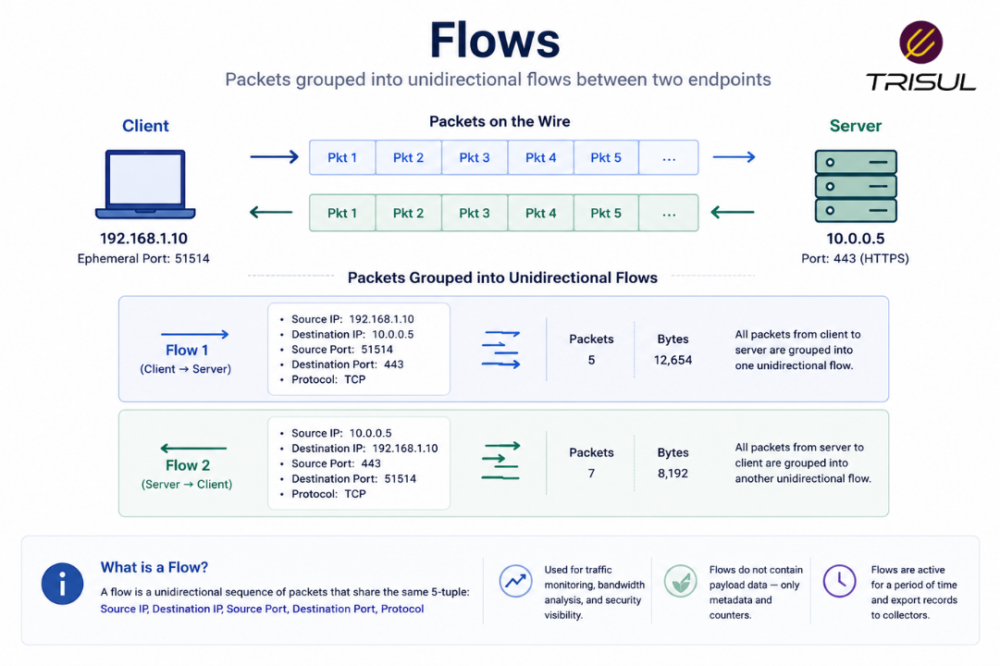
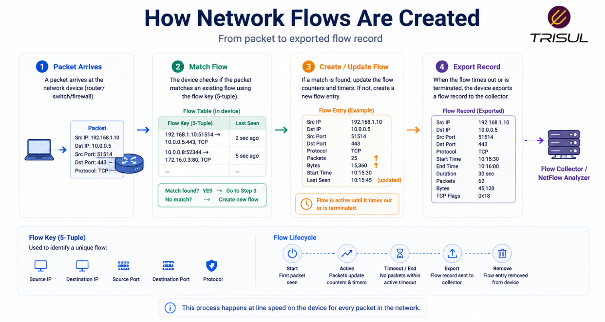
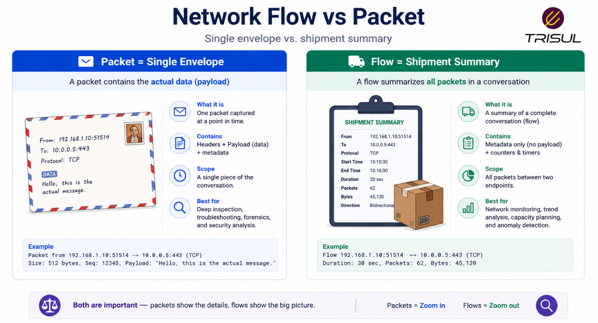

# What is a Network Flow?

A network flow is a sequence of packets sent between two endpoints that share common attributes such as source IP, destination IP, ports, and protocol. Network devices group these related packets into a flow so traffic can be monitored, analyzed, and measured efficiently.

---

## Network Flow In Simple Terms

Think of a network flow like a conversation.

If two devices exchange multiple packets as part of the same communication session, that collection of packets is treated as one flow.

For example:

When you open a website, your browser sends multiple packets to the web server and receives multiple packets back.

Together, those packets form a network flow.

Instead of analyzing each packet separately, flow-based monitoring groups them together. Less noise, more signal.

  

---

## Technical Explanation

A network flow is typically defined using the **5-tuple**:

- Source IP address  
- Destination IP address  
- Source port  
- Destination port  
- Protocol  

Packets matching the same 5-tuple are considered part of the same flow.

A flow is usually **unidirectional**, meaning:

Traffic from A → B is one flow  
Traffic from B → A is another flow

Flow records summarize the communication without storing packet payloads.

---

## How Network Flows Are Created

1. A packet enters a network device  
2. The device checks flow attributes  
3. If no matching flow exists, a new flow is created  
4. Subsequent matching packets are added to that flow  
5. When the flow ends or times out, a flow record is exported  

This allows network devices to summarize traffic behavior efficiently.

  

---

## What Identifies a Network Flow?

A network flow is identified by:

| Attribute | Description |
|---|---|
| Source IP | Sender address |
| Destination IP | Receiver address |
| Source Port | Sending application port |
| Destination Port | Receiving application port |
| Protocol | TCP, UDP, ICMP |

This is commonly called the **5-tuple flow key**.

Some systems extend this with:

- VLAN ID  
- Interface ID  
- TCP Flags  
- Type of Service (ToS)  

for deeper traffic classification.

---

## What Does a Flow Record Contain?

A flow record usually includes:

| Field | Description |
|---|---|
| Flow Key | Unique identifiers |
| Packet Count | Number of packets |
| Byte Count | Total bytes transferred |
| Start Time | Flow start time |
| End Time | Flow end time |
| Interface | Input/output interface |
| TCP Flags | Session flags |

These records help reconstruct traffic patterns.

---

## Why Network Flows Matter

- ### Efficient traffic visibility

Provides network insights without packet payload storage.

- ### Lower storage requirements

Flow records are much smaller than packet captures.

- ### Faster troubleshooting

Quickly identify traffic patterns and bottlenecks.

- ### Better scalability

Suitable for large networks and ISPs.

- ### Security visibility

Helps detect scans, anomalies, and suspicious communication.

---

## Common Use Cases of Network Flow Data

- Bandwidth monitoring  
- Application traffic analysis  
- Security monitoring  
- Top talker analysis  
- Capacity planning  
- Traffic engineering  
- DDoS detection  
- User behavior analysis  

---

## Network Flow vs Packet

| Feature | Network Flow | Packet |
|---|---|---|
| Unit | Session summary | Individual data unit |
| Payload included | No | Yes |
| Storage overhead | Low | High |
| Scalability | High | Moderate |
| Visibility depth | Traffic-level | Packet-level |

A network flow summarizes traffic, while packets contain the actual data.

  

---

## Network Flow vs Session

| Feature | Network Flow | Session |
|---|---|---|
| Direction | Usually unidirectional | Usually bidirectional |
| Scope | Traffic summary | Full communication context |
| Tracking | Metadata-focused | Connection-focused |

Flows and sessions are related, but not identical.

---

## How Trisul Uses Network Flows

Trisul processes network flows from NetFlow, IPFIX, and sFlow exporters and converts them into structured analytics.

This enables:

- Top-K analytics  
- Application traffic visibility  
- ASN analytics  
- Threshold anomaly detection  
- Historical traffic analysis  
- Security investigation  

This transforms raw flow records into actionable network intelligence.

---

## Frequently Asked Questions

1) ### Is a network flow the same as a packet?

No. A packet is a single unit of data. A flow is a collection of related packets.

---

2) ### Are network flows bidirectional?

Usually no. Most flow technologies treat each direction as a separate flow.

---

3) ### Does a flow contain packet payload?

No. Flow records contain metadata only.

---

4) ### What creates a network flow?

Network devices such as routers, switches, and firewalls create flow records when they observe matching traffic.

---
