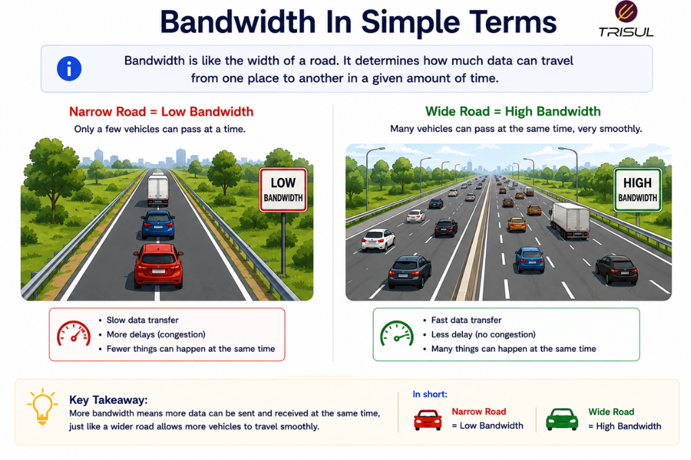
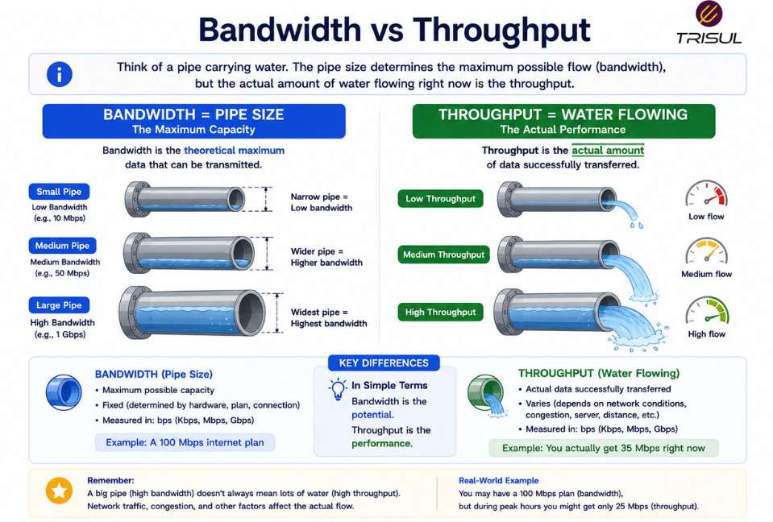

# What is Bandwidth?

Bandwidth is the maximum amount of data that can be transmitted over a network connection in a given amount of time. It represents the capacity of a network link and is usually measured in bits per second (bps).

---

## Bandwidth In Simple Terms

Bandwidth is like the width of a highway.

A wider highway allows more cars to travel at the same time.

Similarly:

More bandwidth allows more data to travel across a network at the same time.

Bandwidth measures capacity, not actual speed.

A wide road can still be jammed. A lesson applicable to cities and networks alike.

  

---

## Technical Explanation

In networking, bandwidth refers to the maximum theoretical transmission capacity of a communication channel.

It determines how much data can pass through a link per second.

Bandwidth is commonly measured in:

- bps (bits per second)  
- Kbps (Kilobits per second)  
- Mbps (Megabits per second)  
- Gbps (Gigabits per second)  
- Tbps (Terabits per second)  

Bandwidth defines the upper limit of data transfer.

Actual delivered data may be lower due to:

- congestion  
- packet loss  
- protocol overhead  
- latency  

---

## How Bandwidth Works

1. A network link is provisioned with a capacity  
2. Data is transmitted over the link  
3. Multiple applications share available bandwidth  
4. Network devices manage traffic flow  
5. Utilization changes based on demand  

Bandwidth acts as the pipe size for traffic movement.

---

## How is Bandwidth Measured?

Bandwidth is measured in bits per second:

| Unit | Value |
|---|---|
| 1 Kbps | 1,000 bits/sec |
| 1 Mbps | 1,000,000 bits/sec |
| 1 Gbps | 1,000,000,000 bits/sec |
| 1 Tbps | 1,000,000,000,000 bits/sec |

Higher bandwidth means greater transmission capacity.

---

## Why Bandwidth Matters

### Supports application performance

Applications need sufficient bandwidth to function well.

### Improves user experience

More bandwidth reduces congestion.

### Enables scalability

Supports more users and applications.

### Helps capacity planning

Bandwidth trends guide infrastructure upgrades.

### Improves traffic engineering

Helps optimize resource allocation.

---

## Common Bandwidth Use Cases

- Internet connectivity  
- WAN links  
- Data center interconnects  
- Video streaming  
- Cloud applications  
- VoIP communications  
- Enterprise networking  
- ISP backbone traffic  

---

## Bandwidth vs Throughput

| Feature | Bandwidth | Throughput |
|---|---|---|
| Meaning | Maximum capacity | Actual delivered data |
| Type | Theoretical | Real-world |
| Measurement | Bits per second | Bits per second |

Bandwidth is capacity. Throughput is actual performance.

A gym may have capacity for 200 people. That does not mean 200 are lifting. Usually three are.

  

---

## Bandwidth vs Speed

| Feature | Bandwidth | Speed |
|---|---|---|
| Meaning | Data capacity | Rate of movement |
| Focus | Capacity | Performance |

Bandwidth affects speed, but they are not the same.

---

## Bandwidth vs Latency

| Feature | Bandwidth | Latency |
|---|---|---|
| Measures | Capacity | Delay |
| Unit | bps | milliseconds |

Bandwidth determines how much can move. Latency determines how fast it starts moving.

---

## Factors Affecting Bandwidth

Bandwidth availability can be affected by:

- link capacity  
- congestion  
- packet loss  
- protocol overhead  
- hardware limitations  
- application demand  

Understanding these factors improves network performance.

---

## How Trisul Monitors Bandwidth

Trisul monitors bandwidth usage using flow data and packet analytics to provide visibility into:

- top bandwidth consumers  
- application bandwidth usage  
- interface utilization  
- historical traffic trends  
- threshold alerts  
- anomaly detection  

This helps organizations optimize network capacity and performance.

---

## Frequently Asked Questions

### Is bandwidth the same as internet speed?

No. Bandwidth is the maximum capacity, while speed often refers to actual throughput.

---

### Does more bandwidth mean faster internet?

Not always. Other factors such as latency and congestion also affect performance.

---

### How much bandwidth do I need?

It depends on the number of users, applications, and traffic volume.

---

### Can bandwidth be monitored?

Yes. Network monitoring tools can measure and analyze bandwidth usage.

---

