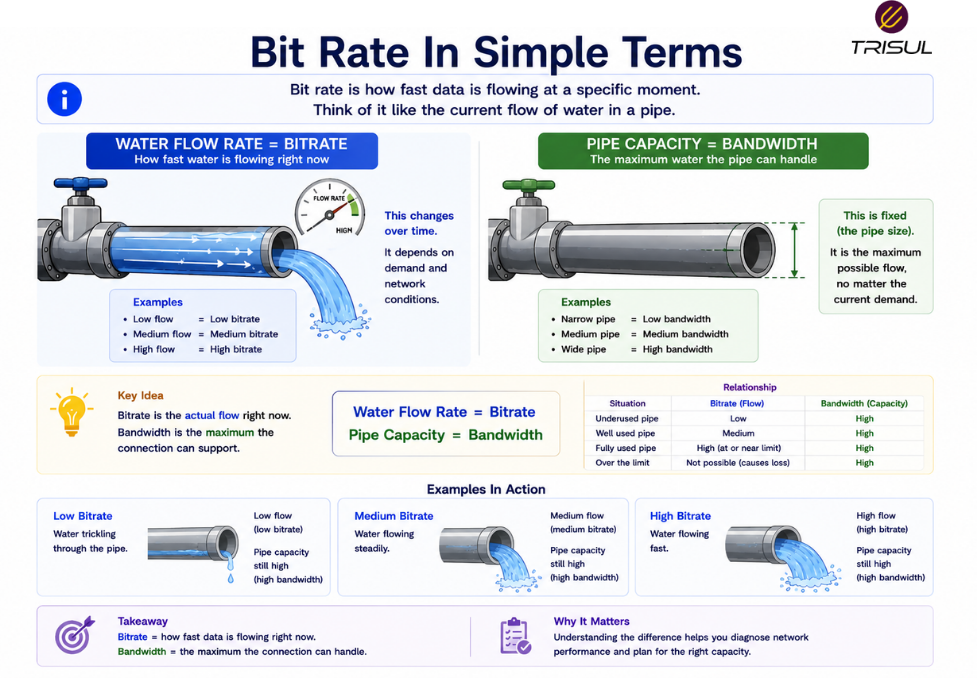

# What is Bitrate?

Bitrate is the amount of data transmitted or processed per unit of time, usually measured in **bits per second (bps)**. It represents the data generation or transmission rate of a stream, file, or communication channel.

---

## Bitrate In Simple Terms

Bitrate is like the speed at which water is being poured into a pipe.

It tells you how much data is being produced or sent every second.

For example:

A video stream at **5 Mbps** means the stream generates **5 megabits of data every second**.

Higher bitrate usually means:

- better quality  
- more detail  
- more bandwidth consumption  

Higher quality, higher cost. The universe insists on this.

 

---

## Technical Explanation

Bitrate measures the amount of bits transmitted or encoded over time.

It is calculated as:

```text
Total Bits / Time
```

Bitrate is commonly used in:

- network transmission  
- video streaming  
- audio streaming  
- file transfer analysis  
- VoIP communications  

Common bitrate units include:

- bps (bits per second)  
- Kbps  
- Mbps  
- Gbps  

Bitrate defines how much data is being generated or sent, not necessarily how much is successfully received.

---

## How Bitrate Works

1. Data is generated by an application or encoder  
2. The data is divided into bits  
3. Bits are transmitted over a network  
4. The transmission rate is measured over time  

This creates the bitrate value.

---

## How is Bitrate Measured?

Bitrate is measured as:

```text
Total Bits / Time
```

### Example

If **100 megabits** are transmitted in **20 seconds**:

```text
Bitrate = 5 Mbps
```

This represents the transmission rate.

---

## Why Bitrate Matters

### Determines data quality

Higher bitrate often improves media quality.

### Affects bandwidth usage

Higher bitrate consumes more network capacity.

### Impacts streaming performance

Insufficient bandwidth can cause buffering.

### Helps capacity planning

Supports traffic forecasting.

### Improves traffic visibility

Shows how much data applications generate.

---

## Common Bitrate Use Cases

- Video streaming  
- Audio streaming  
- VoIP calls  
- Live broadcasting  
- File transfers  
- Application traffic analysis  
- WAN planning  

---

## Bitrate vs Bandwidth

| Feature | Bitrate | Bandwidth |
|---|---|---|
| Meaning | Data transmission rate | Maximum capacity |
| Focus | Actual data generation | Maximum possible transfer |

Bitrate is how fast data is sent.  
Bandwidth is how much the network can carry.

---

## Bitrate vs Throughput

| Feature | Bitrate | Throughput |
|---|---|---|
| Meaning | Sent data rate | Successfully delivered data rate |
| Focus | Transmission | Delivery |

Bitrate measures what is sent.  
Throughput measures what arrives.

---

## Bitrate vs Packet Rate

| Feature | Bitrate | Packet Rate |
|---|---|---|
| Measures | Number of bits | Number of packets |
| Unit | bps | PPS |

Bitrate measures volume.  
Packet rate measures count.

---

## Types of Bitrate

### Constant Bitrate (CBR)

The bitrate remains fixed.

Useful for predictable bandwidth usage.

---

### Variable Bitrate (VBR)

The bitrate changes based on content complexity.

Useful for efficiency and quality optimization.

---

## Factors Affecting Bitrate

Bitrate depends on:

- application type  
- encoding quality  
- traffic patterns  
- media complexity  
- protocol overhead  

Understanding bitrate helps optimize performance.

---

## How Trisul Monitors Bitrate

Trisul monitors bitrate using packet analytics and flow telemetry to provide visibility into:

- application bitrate  
- interface bitrate  
- traffic trends  
- bandwidth usage  
- high-volume applications  
- traffic anomalies  

This helps organizations understand data generation patterns.

---

## Frequently Asked Questions

### Is bitrate the same as bandwidth?

No. Bitrate is the data transmission rate, while bandwidth is the maximum network capacity.

### Can bitrate be higher than throughput?

Yes. If packets are lost or retransmitted, throughput may be lower.

### Does higher bitrate mean better quality?

Usually yes, especially in media streaming.

### Can bitrate affect buffering?

Yes. High bitrate streams require sufficient bandwidth and throughput.

---

