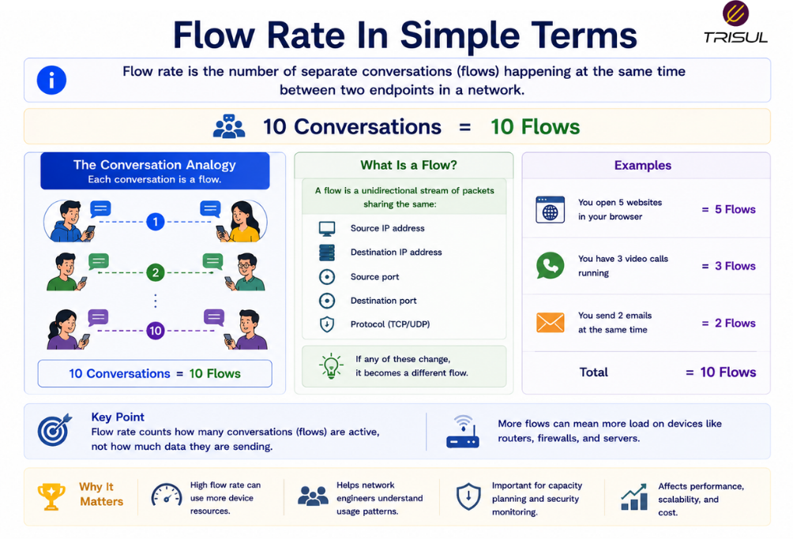

# What is Flow Rate?

Flow rate is the number of network flows created, observed, or exported over a given period of time. It is commonly measured in **Flows Per Second (FPS)** and helps measure connection activity, traffic behavior, and network intensity.

---

## Flow Rate In Simple Terms

Flow rate is like counting how many conversations are happening every second.

It does not measure:

- how much data is being transferred  
- how many packets are sent  

It measures:

- how many separate communication sessions are occurring  

For example:

A thousand short conversations and ten long conversations may use similar bandwidth but very different flow rates.

Quantity of conversations matters. Ask any support desk.

 

---

## Technical Explanation

A network flow is a group of packets sharing common attributes such as:

- Source IP  
- Destination IP  
- Source Port  
- Destination Port  
- Protocol  

Flow rate measures how many of these unique flows are observed over time.

It is calculated as:

```text
Total Flows / Time
```

Flow rate is important because it reflects connection density and traffic behavior.

High flow rates may indicate:

- busy applications  
- heavy user activity  
- scanning behavior  
- DDoS attacks  
- connection bursts  

---

## How Flow Rate Works

1. Traffic enters a network device  
2. Packets are grouped into flows  
3. New flows are created when unique sessions begin  
4. Flow counts are tracked over time  
5. Flow rate is calculated  

This helps measure connection intensity.

---

## How is Flow Rate Measured?

Flow rate is measured as:

```text
Total Flows / Time
```

### Example

If **10,000 flows** are created in **10 seconds**:

```text
Flow Rate = 1,000 FPS
```

This measures connection activity.

---

## Why Flow Rate Matters

### Measures connection density

Shows how many active communication sessions exist.

### Detects scanning activity

Port scans often generate high flow rates.

### Helps identify DDoS attacks

Some attacks generate massive numbers of short flows.

### Supports capacity planning

Helps size collectors and exporters.

### Improves traffic analysis

Provides behavioral insight beyond bandwidth.

---

## Common Flow Rate Use Cases

- Flow monitoring  
- DDoS detection  
- Security analysis  
- Port scan detection  
- ISP traffic analysis  
- Application behavior analysis  
- Capacity planning  

---

## Flow Rate vs Packet Rate

| Feature | Flow Rate | Packet Rate |
|---|---|---|
| Measures | Number of flows | Number of packets |
| Unit | FPS | PPS |
| Focus | Connection count | Packet count |

Flow rate measures sessions.  
Packet rate measures packets.

---

## Flow Rate vs Bandwidth

| Feature | Flow Rate | Bandwidth |
|---|---|---|
| Measures | Number of flows | Amount of data |
| Unit | FPS | bps |

Flow rate measures activity count.  
Bandwidth measures data capacity.

---

## Flow Rate vs Throughput

| Feature | Flow Rate | Throughput |
|---|---|---|
| Measures | Connection volume | Delivered data volume |
| Unit | FPS | bps |

Flow rate measures session activity.  
Throughput measures successful data delivery.

---

## Why High Flow Rate Can Be a Problem

High flow rates can:

- overload flow exporters  
- increase collector load  
- increase storage requirements  
- create analysis overhead  
- indicate suspicious activity  

Many short-lived flows can overwhelm monitoring systems even with moderate bandwidth.

A thousand handshakes can be more exhausting than one long conversation. Socially and technically.

---

## Factors Affecting Flow Rate

Flow rate depends on:

- number of users  
- application behavior  
- session duration  
- protocol behavior  
- attack traffic  
- connection patterns  

Short-lived sessions increase flow rate faster.

---

## How Trisul Monitors Flow Rate

Trisul monitors flow rate using NetFlow, IPFIX, and sFlow telemetry to provide visibility into:

- flows per second  
- new connection bursts  
- top flow-generating hosts  
- scan detection  
- DDoS activity  
- connection trends  

This helps organizations monitor traffic behavior and detect abnormal connection activity.

---

## Frequently Asked Questions

### Is flow rate the same as packet rate?

No. Flow rate counts flows, while packet rate counts packets.

### Can high flow rate exist with low bandwidth?

Yes. Many short flows may consume little bandwidth.

### Why is flow rate useful for security?

High flow rates can indicate scanning, bot activity, or DDoS attacks.

### What is a normal flow rate?

It depends on network size, users, and applications.

---

