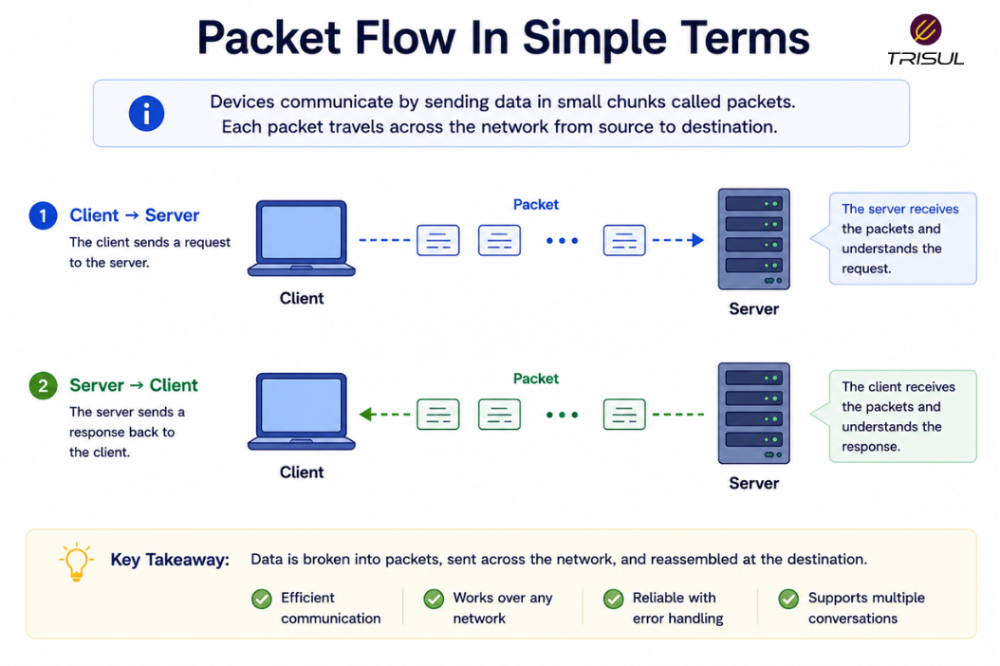
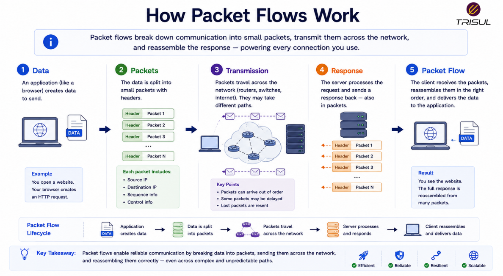

# What is a Packet Flow?

A packet flow is the sequence of related packets exchanged between two endpoints during a communication session. These packets follow a common path or communication pattern and together represent the actual movement of data across a network.

---

## Packet Flow In Simple Terms

A packet flow is like a conversation made up of many sentences.

Each sentence is like a packet.

The full conversation, made up of all those sentences exchanged in sequence, is the packet flow.

For example:

When you open a website:

- your device sends requests  
- the server responds  
- multiple packets move back and forth  

Together, those packets form a packet flow.

Communication on networks is rarely a single packet. Like human arguments, it usually takes several exchanges.

  

---

## Technical Explanation

A packet flow refers to the stream of packets exchanged between communicating endpoints.

These packets usually share:

- Source IP address  
- Destination IP address  
- Source port  
- Destination port  
- Protocol  

This grouping is commonly identified using the **5-tuple**.

Packet flows represent the actual packet-level communication before being summarized into flow records by technologies such as NetFlow or IPFIX.

Unlike flow records, packet flows contain the actual packet payloads.

---

## How Packet Flows Work

1. An application generates data  
2. The data is split into packets  
3. Packets are transmitted across the network  
4. Packets arrive at the destination  
5. Responses generate return packets  
6. The full exchange forms a packet flow  

This creates bidirectional communication between endpoints.

  

---

## What Defines a Packet Flow?

A packet flow is typically identified by:

| Attribute | Description |
|---|---|
| Source IP | Sender address |
| Destination IP | Receiver address |
| Source Port | Sending application port |
| Destination Port | Receiving application port |
| Protocol | Communication protocol |

These attributes help group packets into communication streams.

---

## Why Packet Flows Matter

### Understand communication behavior

Shows how applications communicate.

### Improve troubleshooting

Helps identify packet loss, delays, or retransmissions.

### Support traffic analysis

Provides detailed communication visibility.

### Improve security investigations

Helps analyze suspicious traffic behavior.

### Build flow records

Packet flows are the source for flow telemetry.

---

## Common Packet Flow Use Cases

- Application troubleshooting  
- Traffic analysis  
- Packet capture analysis  
- Security investigations  
- Performance analysis  
- Session analysis  
- Protocol debugging  

---

## Packet Flow vs Network Flow

| Feature | Packet Flow | Network Flow |
|---|---|---|
| Data type | Actual packets | Summarized metadata |
| Payload visibility | Yes | No |
| Granularity | Detailed | Aggregated |
| Storage overhead | High | Low |

A packet flow is the real packet stream. A network flow is the summarized representation.

---

## Packet Flow vs Packet Capture

| Feature | Packet Flow | Packet Capture |
|---|---|---|
| Concept | Packet stream | Recording of packets |
| Purpose | Communication itself | Storage and analysis |
| Scope | Live traffic | Stored traffic |

Packet flow is the traffic itself. Packet capture stores that traffic.

---

## Packet Flow vs Flow Record

| Feature | Packet Flow | Flow Record |
|---|---|---|
| Data | Actual packets | Metadata summary |
| Size | Larger | Smaller |
| Analysis type | Deep inspection | Traffic analytics |

Flow records summarize packet flows.

---

## How Trisul Uses Packet Flows

Trisul analyzes live packet flows and converts them into structured flow records, traffic analytics, and application intelligence.

This enables:

- Traffic investigation  
- Packet analysis  
- Flow generation  
- Application visibility  
- Security analytics  
- Historical traffic analysis  

This bridges packet-level visibility and flow-level analytics.

---

## Frequently Asked Questions

### Is a packet flow the same as a network flow?

Not exactly. A packet flow refers to the actual packet stream, while a network flow is the summarized metadata representation.

---

### Does a packet flow include payloads?

Yes. Packet flows contain the actual transmitted data.

---

### Can packet flows be analyzed for security?

Yes. Packet-level visibility is useful for deep investigations.

---

### Are packet flows bidirectional?

Usually yes, because communication involves request and response traffic.

---

