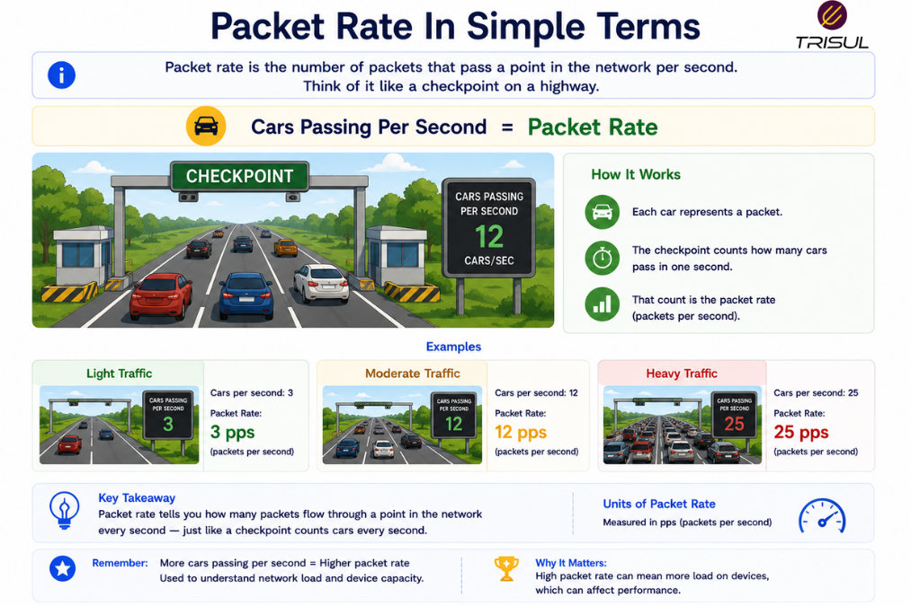
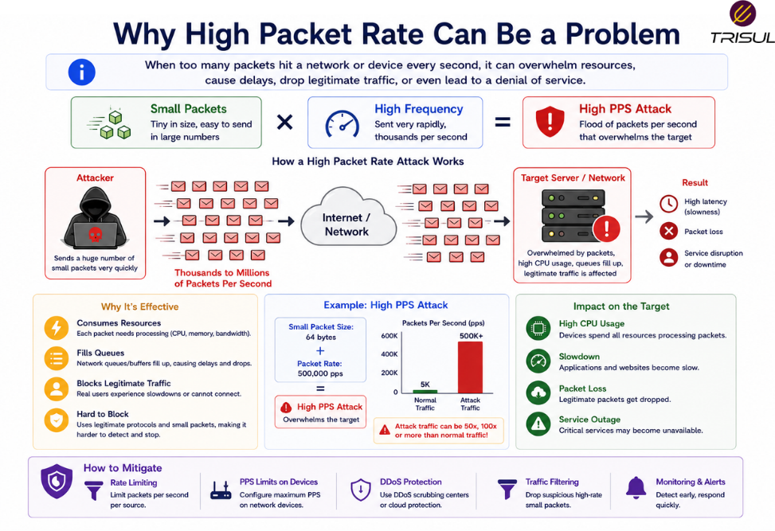

# What is Packet Rate?


Packet rate is the number of packets transmitted or received over a network in a given amount of time. It is typically measured in **Packets Per Second (PPS)** and helps measure traffic intensity, processing load, and network behavior.

---

## Packet Rate In Simple Terms

Packet rate is like counting how many vehicles pass a checkpoint every second.

It does not matter how big the vehicles are.

It only matters how many pass.

In networking:

- **Bandwidth** tells you how much data is moving.
- **Packet rate** tells you how many individual packets are moving.

A million tiny packets can hurt more than a few large ones.

  

---

## Technical Explanation

Packet rate measures packet volume over time.

It is calculated as:

```text
Packets Transmitted / Time
```

Packet rate is important because network devices process packets individually.

Even if bandwidth usage is low, high packet rates can increase:

- CPU load  
- forwarding pressure  
- interrupt processing  
- buffer usage  

Packet rate is commonly measured in:

- PPS (Packets Per Second)  
- Kpps (Thousand Packets Per Second)  
- Mpps (Million Packets Per Second)  

---

## How Packet Rate Works

1. Packets are generated by applications  
2. Packets are transmitted across the network  
3. Network devices process each packet  
4. Packet counts are measured over time  
5. Packet rate is calculated  

This helps monitor traffic intensity.

---

## How is Packet Rate Measured?

Packet rate is measured as:

```text
Total Packets / Time
```

### Example

If **500,000 packets** are sent in **10 seconds**:

```text
Packet Rate = 50,000 PPS
```

This measures traffic frequency.

---

## Why Packet Rate Matters

### Measures processing load

Network devices process packets individually.

### Detects attack patterns

Many attacks generate high PPS.

### Improves capacity planning

Helps estimate device processing needs.

### Supports troubleshooting

Helps identify bursts or traffic anomalies.

### Improves performance analysis

Shows traffic intensity beyond bandwidth.

---

## Common Packet Rate Use Cases

- DDoS detection  
- Firewall sizing  
- Router capacity planning  
- Traffic engineering  
- Performance monitoring  
- ISP backbone analysis  
- Packet processing optimization  

---

## Packet Rate vs Bandwidth

| Feature | Packet Rate | Bandwidth |
|---|---|---|
| Measures | Number of packets | Amount of data |
| Unit | PPS | bps |
| Focus | Packet count | Data volume |

Packet rate measures frequency.  
Bandwidth measures volume.

---

## Packet Rate vs Throughput

| Feature | Packet Rate | Throughput |
|---|---|---|
| Measures | Packet count | Delivered data volume |
| Unit | PPS | bps |

Packet rate measures quantity of packets.  
Throughput measures quantity of delivered data.

---

## Packet Rate vs Bitrate

| Feature | Packet Rate | Bitrate |
|---|---|---|
| Measures | Number of packets | Number of bits |
| Unit | PPS | bps |

Packet rate counts packets.  
Bitrate counts bits.

---

## Factors Affecting Packet Rate

Packet rate varies based on:

- application behavior  
- packet size  
- protocol type  
- traffic patterns  
- attack traffic  
- user activity  

Small packets increase packet rate faster than large packets.

---

## Why High Packet Rate Can Be a Problem

High packet rates can:

- overload routers  
- overwhelm firewalls  
- increase CPU usage  
- trigger DDoS conditions  
- create forwarding bottlenecks  

Packet processing limits are often hit before bandwidth limits.

  

---

## How Trisul Monitors Packet Rate

Trisul monitors packet rate in real time using packet analytics and flow telemetry to provide visibility into:

- packets per second  
- traffic bursts  
- DDoS attacks  
- interface PPS  
- top packet-generating hosts  
- packet behavior trends  

This helps organizations detect high-intensity traffic patterns quickly.

---

## Frequently Asked Questions

### Is packet rate the same as bandwidth?

No. Packet rate counts packets, while bandwidth measures data volume.

### Why is packet rate important for DDoS detection?

Many DDoS attacks use extremely high packet rates to overwhelm infrastructure.

### Can high packet rate exist with low bandwidth?

Yes. Small packets can generate high PPS while consuming less bandwidth.

### What is a normal packet rate?

It depends on network size, applications, and traffic patterns.

---
