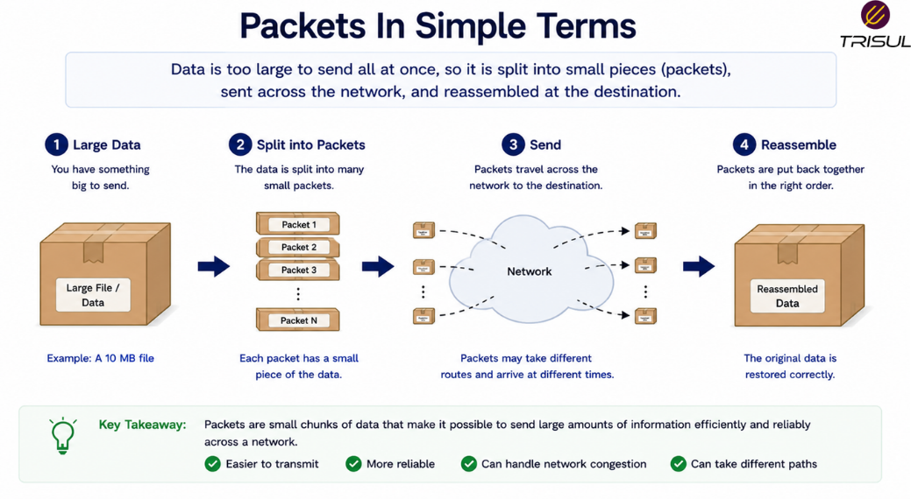

# What is a Packet?

A packet is a small unit of data transmitted over a network. When data such as a web page, email, or video is sent across a network, it is broken into packets, transmitted separately, and reassembled at the destination.

---

## Packet In Simple Terms

A packet is like a parcel in the mail.

If you want to send a large item, you break it into smaller boxes.

Each box contains:

- the contents  
- the destination address  
- the sender address  
- instructions for delivery  

That is how packets work.

Large data is broken into smaller pieces so it can travel efficiently across networks.

The internet is basically a global shipping system, except the packages are invisible and everyone complains when they’re delayed.

  

---

## Technical Explanation

In packet-switched networks, data is divided into packets before transmission.

Each packet contains:

- Header  
- Payload  
- Trailer (in some protocols)

The header includes metadata such as:

- Source IP address  
- Destination IP address  
- Protocol information  
- Sequence numbers  

The payload contains the actual data being transmitted.

At the receiving end, packets are reassembled into the original data.

---

## How Packets Work

1. Data is created by an application  
2. The data is split into packets  
3. Each packet is assigned headers  
4. Packets travel independently across the network  
5. Packets arrive at the destination  
6. The destination reassembles the data  

This allows efficient and flexible data transmission.

---

## What Does a Packet Contain?

A packet typically contains:

| Component | Description |
|---|---|
| Header | Routing and control information |
| Payload | Actual data being carried |
| Trailer | Error checking (if applicable) |

Common header fields include:

- Source IP  
- Destination IP  
- Protocol  
- Sequence number  
- Checksum  
- TTL (Time to Live)  

These fields help packets reach the correct destination.

---

## Why Packets Matter

### Efficient data transmission

Large data can be sent in manageable units.

### Better routing flexibility

Packets can take different paths to reach the destination.

### Reliable communication

Protocols can retransmit lost packets.

### Supports internet scalability

Packet switching enables massive network growth.

### Enables traffic analysis

Packets provide visibility into communication behavior.

---

## Common Packet Use Cases

Packets are used in:

- Web browsing  
- Email delivery  
- Video streaming  
- File transfers  
- Online gaming  
- Voice over IP (VoIP)  
- Cloud applications  
- Network monitoring  

Basically everything on a network depends on packets. The glamorous backbone of ordinary digital chaos.

---

## Packet vs Frame

| Feature | Packet | Frame |
|---|---|---|
| Layer | Network layer (Layer 3) | Data link layer (Layer 2) |
| Purpose | Routing across networks | Delivery across local links |
| Address type | IP address | MAC address |

A packet exists at Layer 3. A frame carries the packet at Layer 2.

---

## Packet vs Flow

| Feature | Packet | Flow |
|---|---|---|
| Unit | Individual data unit | Group of related packets |
| Granularity | Fine | Aggregated |
| Visibility | Detailed | Summarized |

A flow is built from packets.

---

## Common Packet Fields

Typical packet headers include:

- Source IP address  
- Destination IP address  
- Source port  
- Destination port  
- Protocol  
- Sequence number  
- TTL  
- Checksum  

These fields help route and validate packet delivery.

---

## How Trisul Uses Packet Data

Trisul analyzes packets directly and converts them into flow records, traffic analytics, and network intelligence.

This enables:

- Packet analysis  
- Flow generation  
- Traffic investigation  
- Application visibility  
- Security monitoring  
- Historical traffic analysis  

This turns raw packets into meaningful operational insights.

---

## Frequently Asked Questions

### Is a packet the same as a frame?

No. A frame is a Layer 2 structure, while a packet is a Layer 3 structure.

---

### Does every network use packets?

Most modern digital networks use packet switching.

---

### Can packets take different paths?

Yes. Different packets from the same communication can travel different routes.

---

### What happens if a packet is lost?

Protocols such as TCP can retransmit lost packets.

---

