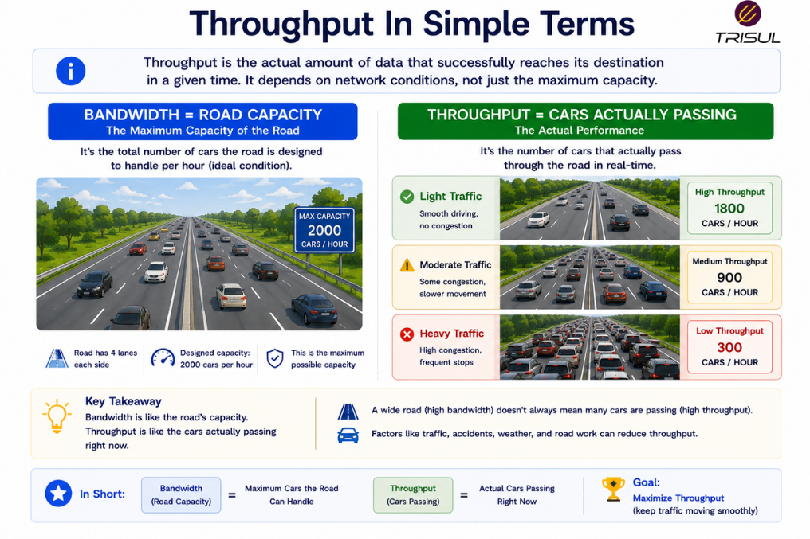
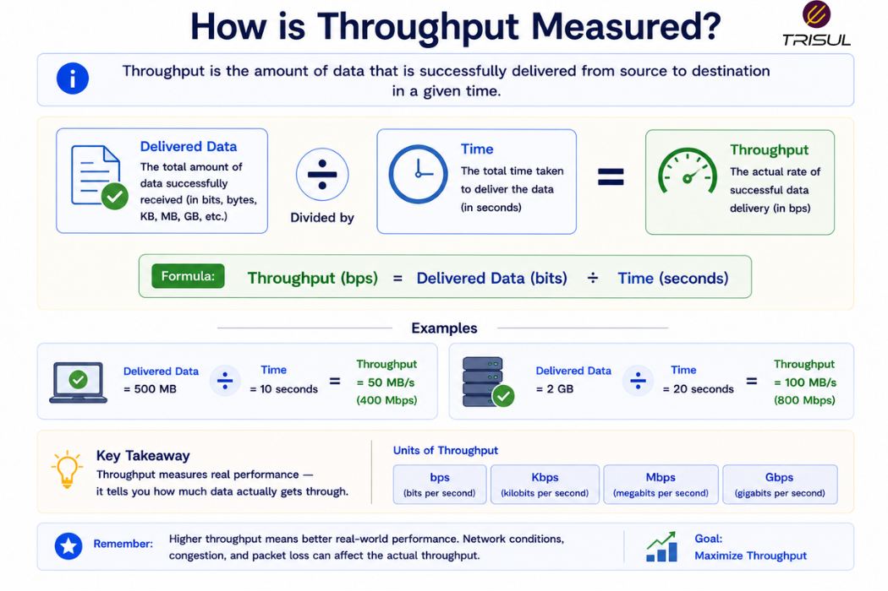

# What is Throughput?

Throughput is the actual amount of data successfully transmitted over a network in a given amount of time. It measures real-world network performance and is usually expressed in bits per second (bps).

---

## Throughput In Simple Terms

Throughput is like the number of cars that actually make it through a highway.

Bandwidth tells you how many cars *could* fit.

Throughput tells you how many *actually* passed.

If the road is wide but traffic is slow, throughput is lower than bandwidth.

Potential and reality. The eternal gap.

  

---

## Technical Explanation

Throughput measures the effective delivery of data across a network.

Unlike bandwidth, which is theoretical capacity, throughput reflects actual data transfer after accounting for:

- protocol overhead  
- congestion  
- packet loss  
- retransmissions  
- latency  
- hardware limitations  

Throughput is the practical measurement of usable network performance.

It is commonly measured in:

- bps (bits per second)  
- Kbps  
- Mbps  
- Gbps  

---

## How Throughput Works

1. Data is transmitted across a network link  
2. Network conditions affect transmission  
3. Some packets may be delayed or lost  
4. Protocols may retransmit lost packets  
5. Successfully delivered data is measured  

The resulting successful delivery rate is throughput.

---

## How is Throughput Measured?

Throughput is measured as:

Total Successfully Delivered Data / Time

Example:

If 500 MB of data is delivered in 10 seconds:

Throughput = 50 MB/s

This represents actual transfer performance.

  

## Why Throughput Matters

### Measures real performance

Shows actual network delivery capability.

### Helps troubleshoot performance issues

Identifies bottlenecks and delivery problems.

### Improves user experience

Higher throughput improves application performance.

### Supports capacity planning

Helps identify upgrade needs.

### Optimizes application delivery

Shows how efficiently applications use network resources.

## Common Throughput Use Cases

- Internet performance testing
- Application performance monitoring
- File transfer analysis
- WAN optimization
- Video streaming performance
- Data center traffic analysis
- Cloud performance monitoring

## Throughput vs Bandwidth
|Feature | Throughput | Bandwidth |
|--------|------------|-----------|
|Meaning | Actual delivered data | Maximum capacity |
|Type |  Real-world |  Theoretical |
| Performance indicator | Practical | Potential |

Bandwidth is the limit. Throughput is the reality.

A gym may allow 100 people. Only 40 showing up is throughput. Human commitment levels, quantified.

## Throughput vs Bitrate

|Feature Throughput  Bitrate
|--------|------------|-----------|
| Meaning | Actual delivery rate |  Intended transmission rate |
| Focus | Successful delivery  | Data generation rate |

Bitrate defines how fast data is produced. Throughput measures how much arrives.

## Throughput vs Latency

Feature Throughput  Latency
|--------|------------|-----------|
| Measures  | Data delivery rate  | Delay
| Unit  | bps | milliseconds

Throughput measures volume. Latency measures time delay.

## Factors Affecting Throughput

Throughput can be reduced by:

- congestion
- packet loss
- retransmissions
- protocol overhead
- insufficient bandwidth
- hardware bottlenecks
- latency

Understanding these factors helps improve performance.

## How Trisul Monitors Throughput

Trisul monitors throughput using packet analytics and flow telemetry to provide visibility into:

- application throughput
- interface throughput
- traffic trends
- bandwidth utilization
- top traffic consumers
- performance anomalies

This helps organizations measure real network performance.

## Frequently Asked Questions

### Is throughput the same as bandwidth?

No. Bandwidth is maximum capacity, throughput is actual delivered data.

### Can throughput be higher than bandwidth?

No. Throughput cannot exceed bandwidth.

### Why is throughput lower than bandwidth?

Because of protocol overhead, congestion, and network conditions.

### Is throughput important for application performance?

Yes. Throughput directly affects user experience and application efficiency.