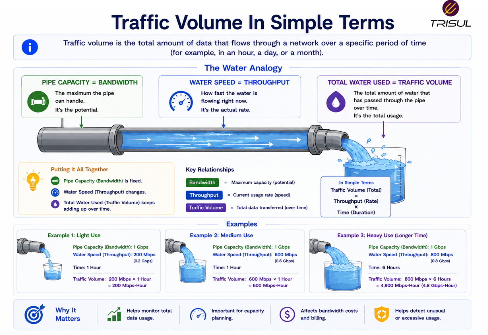

# What is Traffic Volume?

Traffic volume is the total amount of data transmitted or received across a network over a specific period of time. It measures cumulative data transfer and helps understand overall network usage.

---

## Traffic Volume In Simple Terms

Traffic volume is like the total amount of water that flowed through a pipe over a day.

It does not measure:

- how fast the water flowed  
- how wide the pipe is  

It measures:

- how much water passed in total  

In networking:

Traffic volume tells you the total data moved over time.

Not speed. Not capacity. Just the total amount.

A monthly internet bill understands this concept very well.

 

---

## Technical Explanation

Traffic volume measures the cumulative quantity of data transferred across a network during a time period.

It is typically calculated using:

```text
Total Bytes Transferred
```

or

```text
Total Bits Transferred
```

Traffic volume can be measured over:

- seconds  
- minutes  
- hours  
- days  
- months  

It helps measure overall network usage patterns.

---

## How Traffic Volume Works

1. Data is transmitted across the network  
2. Packets carry the data  
3. Devices count bytes transferred  
4. Total bytes are accumulated over time  
5. Traffic volume is calculated  

This provides total usage visibility.

---

## How is Traffic Volume Measured?

Traffic volume is commonly measured in:

| Unit | Description |
|---|---|
| Bytes | Basic data unit |
| KB | Kilobytes |
| MB | Megabytes |
| GB | Gigabytes |
| TB | Terabytes |

### Example

If a network transfers:

- 200 GB in one day  
- 6 TB in one month  

That is the traffic volume.

It measures accumulation, not speed.

---

## Why Traffic Volume Matters

### Capacity planning

Helps forecast infrastructure growth.

### Bandwidth management

Shows total network consumption.

### Billing and metering

Useful for ISP usage accounting.

### Traffic analysis

Helps identify usage patterns.

### Security visibility

Unexpected traffic spikes can indicate attacks.

---

## Common Traffic Volume Use Cases

- Monthly usage reporting  
- ISP billing  
- Capacity planning  
- Historical traffic analysis  
- Data center monitoring  
- Cloud traffic accounting  
- Security investigations  

---

## Traffic Volume vs Bandwidth

| Feature | Traffic Volume | Bandwidth |
|---|---|---|
| Measures | Total data transferred | Maximum capacity |
| Type | Cumulative | Theoretical |
| Unit | Bytes or bits | bps |

Traffic volume is total usage.  
Bandwidth is maximum possible transfer.

---

## Traffic Volume vs Throughput

| Feature | Traffic Volume | Throughput |
|---|---|---|
| Measures | Total accumulated data | Actual delivery rate |
| Unit | Bytes | bps |

Traffic volume measures total data over time.  
Throughput measures speed of delivery.

---

## Traffic Volume vs Bitrate

| Feature | Traffic Volume | Bitrate |
|---|---|---|
| Measures | Total data amount | Data transfer rate |
| Unit | Bytes | bps |

Traffic volume is accumulation.  
Bitrate is rate.

---

## Traffic Volume vs Packet Rate

| Feature | Traffic Volume | Packet Rate |
|---|---|---|
| Measures | Total data transferred | Number of packets |
| Unit | Bytes | PPS |

Traffic volume measures data size.  
Packet rate measures packet frequency.

---

## Factors Affecting Traffic Volume

Traffic volume depends on:

- number of users  
- application usage  
- streaming activity  
- file transfers  
- backups  
- cloud workloads  
- attack traffic  

Higher usage increases traffic volume.

Predictably. Humans do tend to use what they build.

---

## Why Traffic Volume Matters for Security

Traffic volume helps detect:

- traffic spikes  
- data exfiltration  
- DDoS attacks  
- abnormal transfer patterns  

Volume anomalies often reveal operational or security issues.

Big numbers are rarely boring in network security.

---

## How Trisul Monitors Traffic Volume

Trisul monitors traffic volume using packet analytics and flow telemetry to provide visibility into:

- total bytes transferred  
- historical traffic trends  
- interface traffic volume  
- application usage volume  
- ASN traffic volume  
- abnormal traffic spikes  

This helps organizations understand total network consumption over time.

---

## Frequently Asked Questions

### Is traffic volume the same as bandwidth?

No. Traffic volume measures total transferred data, while bandwidth measures capacity.

### Can traffic volume be high with low bandwidth?

Yes. Over a long enough period, even low bandwidth can produce high traffic volume.

### Why is traffic volume important?

It helps measure usage, plan capacity, and detect anomalies.

### Is traffic volume useful for billing?

Yes. ISPs often use traffic volume for usage accounting.

---

